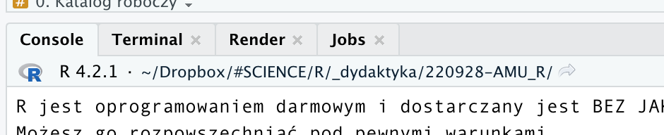
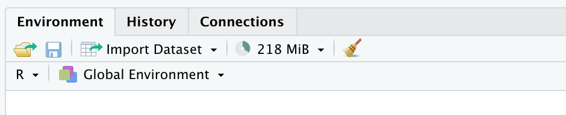

-   [Zanim zaczniemy](#zanim-zaczniemy)
    -   [0. Przydatne zasoby pomocowe w pracy z R - część
        pierwsza](#0-przydatne-zasoby-pomocowe-w-pracy-z-r---część-pierwsza)
    -   [0. Katalog roboczy](#0-katalog-roboczy)
-   [A. Podstawy składni `R`](#a.-podstawy-składni-r)
    -   [1. R działa w oparciu o funkcje](#r-działa-w-oparciu-o-funkcje)
    -   [2. Skąd wiedzieć jakie argumenty ma
        funkcja?](#skąd-wiedzieć-jakie-argumenty-ma-funkcja)
    -   [3. Istotne cechy składni języka
        `R`](#istotne-cechy-składni-języka-r)
    -   [4. R to kalkulator na sterydach](#r-to-kalkulator-na-sterydach)
-   [B. Zapisywanie pracy](#b.-zapisywanie-pracy)
-   [C. Zmienne i struktury danych](#c.-zmienne-i-struktury-danych)
    -   [1. Tworzenie zmiennych](#tworzenie-zmiennych)
    -   [2. Wektory i ich tworzenie](#wektory-i-ich-tworzenie)
    -   [3. Indeksowanie wektorów](#indeksowanie-wektorów)
    -   [4. Ładowanie danych do R. Typy
        danych](#ładowanie-danych-do-r.-typy-danych)
    -   [5. Dane jako macierz -
        indeksowanie](#dane-jako-macierz---indeksowanie)
    -   [6. Filtrowanie danych](#filtrowanie-danych)
    -   [7. Brakujące dane](#brakujące-dane)

# Zanim zaczniemy

## 0. Przydatne zasoby pomocowe w pracy z R - część pierwsza

-   [RStudio
    cheat-sheet](https://raw.githubusercontent.com/rstudio/cheatsheets/main/rstudio-ide.pdf)
-   [RMarkdown
    cheat-sheet](https://raw.githubusercontent.com/rstudio/cheatsheets/main/rmarkdown.pdf)
-   [Ściąga z podstawowych funkcji
    R](http://github.com/rstudio/cheatsheets/blob/main/base-r.pdf)
-   [Szybki GitHub dla
    RStudio](https://raw.githubusercontent.com/rstudio/cheatsheets/main/git-github.pdf)
-   [Porównanie stylów
    kodowania](https://raw.githubusercontent.com/rstudio/cheatsheets/main/syntax.pdf)
-   [Książka online “Intro to R”](https://intro2r.com)
-   [Zbiory użytecznych funkcji wg tematu - CRAN Task
    Views](https://cran.r-project.org/web/views/)

------------------------------------------------------------------------

## 0. Katalog roboczy

By móc pracować w `R` - potrzebujemy tzw. katalogu roboczego. Po
uruchomieniu `R` katalog roboczy ustawiany jest automatycznie - możemy
podejrzeć go w belce terminala, obok numeru wersji `R`.



Znacznie lepiej jest samodzielnie zdecydować, gdzie taki folder powinien
się znajdować. Stosowanie folderów roboczych osobnych dla każdego
projektu/analizy jest dobrą praktyką pozwalającą utrzymać porządek w
plikach.

Aby ustawić katalog roboczy (*working directory*) możemy dokonać tego w
menu w panelu **Files** (menu **More**) - po przejściu do wybranego
folderu w przeglądarce plików panelu **Files**. Druga możliwość to
użycie funkcji `setwd()`:

1.Upewnij się, że folder który chcesz wykorzystać fizycznie istnieje na
Twoim dysku - jeśli nie: utwórz go;

2.W terminalu wykonaj instrukcję

    setwd("~/Dropbox/#SCIENCE/R/_dydaktyka/220928-AMU_R")

wpisując wewnątrz funkcji ścieżkę do wybranego przez siebie folderu.

Wybrany folder powinien pojawić się w belce terminala `R` - możemy też
sprawdzić wybór folderu za pomocą funkcji `getwd()`:

``` r
getwd()
```

    ## [1] "/Users/szymek/Dropbox/#SCIENCE/R/_dydaktyka/220928-AMU_R"

------------------------------------------------------------------------

# A. Podstawy składni `R`

## 1. R działa w oparciu o funkcje

“Funkcja” to rodzaj makra, które wykonuje określone instrukcje. Mogą one
być bardzo proste, ale mogą też mieć wiele złożonych właściwości. W `R`
funkcja zawsze ma podobną strukturę:

``` r
pewna_funkcja(argument1 = 50, argument2 = "opcja1", argument3 = T)
```

Funkcja zawsze ma nazwę (`pewna_funckja`), po której następuje `()`.
Nawias ujmuje argumenty funkcji, w parach zawierających nazwę argumentu
oraz jego wartość. Wartości mogą być liczbowe, mogą być to instrukcje
tekstowe, mogą to być też wartości logiczne (prawda/fałsz, oznaczane w
`R` jako `T` oraz `F`, ewentualnie `TRUE` oraz `FALSE` - obydwie
konwencje są poprawne).

Warto pamiętać o kilku istotnych rzeczach:

-   `opcja1` to nie to samo co `"opcja1"`. Pierwsza wersja oznacza
    obiekt w `R` o nazwie `opcja1` (co to dokładnie oznacza - za
    chwilę). Druga oznacza tekst zawierający ciąg znaków “opcja1”;
-   `T` wpisujemy bez `""` ponieważ nie jest to tekst, ale wartość
    logiczna “prawda”; wpisanie `"T"` oznacza po prostu podanie wielkiej
    litery “T”;
-   wartości logiczne są równoznaczne z zerem i jedynką (to znaczy
    `T == 1` oraz `F == 0`).

Choć argumenty zawsze mają swoje nazwy, możemy je często pominąć, jeśli
ich wartości podajemy w odpowiedniej kolejności (takiej, jak
zdefiniowana przez autora funkcji), lub też kiedy funkcja ma tylko 1
argument. Na przykład funkcja `sqrt` oblicza pierwiastek kwadratowy i
przyjmuje tylko jeden argument `x` oznaczający zmienną, którą chcemy
pierwiastkować.

**Zadanie** Spróbuj wywołać tę funkcję korzystając z nazwy jej argumentu
oraz go pomijając. Spierwiastkuj w tych dwóch wywołaniach liczbę 2 oraz
6.

**Spodziewany wynik**

``` r
sqrt(x = 2)
```

    ## [1] 1.414214

``` r
sqrt(6)
```

    ## [1] 2.44949

**Zadanie** Funkcja `round()` przyjmuje argumenty `x` (wartość do
zaokrąglenia) oraz `digits` (liczba miejsc dziesiętnych, do których
chcemy zaokrąglić). Stosując tą funkcję do liczby 4.246813579 wykonaj ją
w kilku wersjach, zaokrąglając wynik do 3 miejsc po przecinku: podając
nazwy argumentów; nie podając ich ale zakładając, że ich kolejność to
`x` `digits`; wreszcie - nie podając nazw i zakładając, że kolejność
jest osobna. Co się stanie, gdy pominiesz drugi argument (`digits`)?

**Spodziewany wynik**

*Podając nazwy argumentów*

``` r
round(x = 4.246813579, digits = 3)
```

    ## [1] 4.247

*Bez nazw, w kolejności `x digits`*

``` r
round(4.246813579, 3)
```

    ## [1] 4.247

*Bez nazw, w kolejności `digits x`*

``` r
round(3, 4.246813579)
```

    ## [1] 3

*Bez podania drugiego argumentu*

``` r
round(4.246813579)
```

    ## [1] 4

◼

## 2. Skąd wiedzieć jakie argumenty ma funkcja?

Aby dowiedzieć się czegoś o funkcji, której nazwę znamy wystarczy
wywołać jej plik pomocy. Robimy to poprzez komendę `?nazwa_funkcji`.

**Zadanie** Podejrzyj pomoc dla funkcji `round` oraz `sqrt` - czy
zgadzają się z tym, co obserwowaliśmy wcześniej?

**Zadanie** Co wyświetli polecenie `??"square root"`? Czym różni się ten
wynik od poprzedniego rezultatu?

◼

## 3. Istotne cechy składni języka `R`

-   Tzw. *white spaces* nie maja w kodzie znaczenia - zapis
    `round(3, digits = 4)` jest równoznaczny zapisowi
    `round(3,digits=4)`, czy też `round(3,digits     = 4` - warto jednak
    stosować białe znaki dla zwiększenia czytelności kodu. Dotyczy to
    nie tylko spacji ale też tabulatorów, którymi dobrze jest zaznaczać
    wcięcia oznaczające integralne części kodu (zobaczymy to nieco
    później). *RStudio* samodzielnie wprowadza wcięcia pomagając nam
    wyizolować fragmenty ujęte np. w jeden nawias:

<!-- -->

    round(4.7654, digits = 2)
    round(4.7654,
          digits = 2)

-   W `R` możemy stosować 2 rodzaje cudzysłowu: podwójny `""` oraz
    pojedynczy `''`. Stosowane osobno są równorzędne, możemy więc
    napisać `pewna_funkcja(argument2 = "opcja1")`, jak również
    `pewna_funkcja(argument2 = 'opcja1')`. Jeśli jednak cudzysłów ma być
    częścią wprowadzanego ciągu znaków, zewnętrznym cudzysłowem musi być
    `''`: `pewna_funkcja(argument2 = '"opcja1"')`.

-   Wprowadzenie znaków “zakazanych” w ciągu tekstowym (np. `'`) wymaga
    zastosowania tzw. *escape* (np.
    `"\`“`). *Escape* wykorzystuje się również by wprowadzić np. znak nowej linii`”“\`:

``` r
cat("Pierwsza linia\nDruga linia")
```

    ## Pierwsza linia
    ## Druga linia

Zastosowana powyżej funkcja `cat()` służy do wyświetlania ciągów znaków
w konsoli.

-   Jeśli zapomnimy zamknąć jakiś nawias lub cudzysłów i zatwierdzimy
    linijkę kodu - znak zachęty `>` zmieni się w `+` - co oznacza
    oczekiwanie konsoli na dokończenie/zamknięcie wprowadzania
    instrukcji:

<!-- -->

    >
    > round(4.7654, digits = 2
    +
    )
    >

-   Kolejność działań w `R` jest zgodna z zasadami matematyki (działania
    w nawiasie, potem `^`, potem \*`i`/`, potem`+`i`-\`) ale dla
    zachowania czytelności zawsze lepiej używać (nawet nadmiarowych)
    nawiasów).
-   `R` rozróżnia małe litery tak więc `ZmiennA` ≠ `zmienna`.
-   Linie kodu rozpoczynające się od `#` stają się komentarzami i nie są
    uruchamiane:

``` r
# tutaj zaokrąglam liczbę do 4 miejsc po przecinku
round(pi, 4)
```

    ## [1] 3.1416

``` r
# przy okazji poznajemy jedną ze zmiennych wewnętrznych w R
# przechowującą wartość liczby 'pi'
```

-   Na dawne obiektom `R` nazwy nie mogą zaczynać się od cyfr, nie mogą
    zawierać znaków specjalnych (`;:'",<>?/!+-*&|[]{}()^%$#@`), unikajmy
    również używania w nich kropki `.` (w niektórych kontekstach oznacza
    ona konkretny rodzaj obiektu w `R`); najlepiej stosować konwencję
    rozdzielania słów w nazwach za pomocą “\_” (`zmienna_pierwsza`) lub
    wielkich liter (`zmiennaPierwsza`).

## 4. R to kalkulator na sterydach

`R` to język programowania wykonywany w linii poleceń, w *czasie
rzeczywistym*. Oznacza to, że to co wpiszemy w konsoli terminala `R`
zostanie wykonane od razu, i od razu zobaczymy wyniki naszych obliczeń.

Z `R` można również pracować inaczej - za pomocą skryptów. Są to pliki
tekstowe (najcześciej z rozszerzeniem `.R`), które R może uruchomić i
wykonać w całości.

**Zadanie** Za pomocą funkcji `source()` spróbuj uruchomić przykładowy
skrypt `class1_script.R`. **Spodziewany wynik**

``` r
source('class1_script.R')
```

    ## [1] "Hello World!"

Pracując w konsoli poeksploruj funkcje obliczeniowe R.

**Zadanie** Zsumuj liczby całkowite od -4 do 7.

**Spodziewany wynik**

``` r
-4+-3+-2+-1+1+2+3+4+5+6+7
```

    ## [1] 18

**Zadanie** Sprawdź do czego służą operatory arytmetyczne `%%` oraz
`%/%`. Jaki wynik daje operacja `82%%9` oraz `82%/%9`? Korzystając z
jednej z tych funkcji - jak sprawdzisz czy liczba 87654 podzielna jest
przez 7?

``` r
87654 %% 7 # podzielna przez 7 bo wynik == 0
87654 %/% 7 # 7 mieści się w liczbie 12522 razy, ? czy jest podzielna
```

> Wiele operacji ma swoje własne funkcje - np.: `abs()` - wartość
> bezwzględna; `sin()`, `cos()`, `tan()` - operacje trygonometryczne
> (uwaga - kąty podajemy w radianach); `log10()`, `log2()`, `log()` -
> logarytmy, o podstawie 10, 2 oraz *e* (naturalny); `exp()` - eksponent
> (odwrotność logarytmy naturalnego, czyli *e*<sup>*x*</sup>);
> `sqrt()` - pierwiastek kwadratowy; `factorial()` - silnia (*x*!).

**Zadanie** Czy logarytm dziesiętny z liczby 100 oraz logarytm naturalny
z liczby *e*<sup>1</sup> dają spodziewany wynik?

``` r
log10(100) # powinno być 2
log(exp(1)) # powinno być 1
```

W trakcie pracy w `R` możemy napotkać na wartości na pierwszy rzut oka
dziwne. **Zadanie** Zobacz co się stanie, gdy spróbujesz podzielić
liczbę dodatnią i ujemną przez zero.

**Spodziewany wynik**

``` r
10/0
```

    ## [1] Inf

``` r
-3/0
```

    ## [1] -Inf

`Inf` oznacza “nieskończoność”. Choć formalnie nie możemy podzielić
liczby przez zero, `R` próbuje wybrnąć z sytuacji i traktuje wyrażenie
tak, jak w analizie matematycznej (skoro nie potrafi obliczyć wartości,
próbuje znaleźć wartość graniczną wyrażenia i tutaj jest to
±nieskończoność). Jakie jeszcze operacje matematyczne mogą wywołać
nieoczekiwane rezultaty?

``` r
log(-10)
factorial(-9)
sqrt(-9)

# ale:

sqrt(-9+0i)
```

> `R` zawiera trzy typy “nieliczbowych” wartości, które bedą pojawiać
> się w naszej pracy: \* `NA` - wartość brakująca, “wypełniacz” w danych
> wskazujący, że formalnie w danym miejscu brakuje wartości \* `NaN` -
> *not-a-number* - wartość nienumeryczna, `R` nie wie co z taką liczbą
> zrobić \* `±Inf` - nieskończoność (ostrożnie, bo może ona zniszczyć
> inne operacje - zob. np. `10+Inf` lub `50*(-Inf)`)

------------------------------------------------------------------------

# B. Zapisywanie pracy

`R` oferuje kilka różnych sposobów zapisywania pracy oraz jej postępów.

-   **R project** - jest to rodzaj “folderu” - lub archiwum -
    przechowującego wszystkie elementy projektu, nad którym pracujemy.
    Najlepiej sprawdzają się one, gdy korzystamy z danego folderu jako
    zarezerwowanego dla konkretnego projektu (tzn. jest on dla tego
    projektu zawsze folderem roboczym). Tworzenie projektu polega na
    wybraniu **File** \> **New project…** i selekcji odpowiedniej opcji.
    W folderze roboczym pojawi się plik z rozszerzeniem `.Rproj` który
    będzie od tej pory przechowywać istotne informacje o naszym
    projekcie.

-   **Skrypt R** - jest to plik tekstowy z rozszerzeniem `.R`
    przechowujący tekstową wersję instrukcji, które chcemy wykonać w
    `R`. Powinien zawierać tylko to, co może zostać wprowadzone i
    uruchomione w konsoli.

-   **Dokument RMarkdown** - dokumenty tego typu są skryptami `R` “na
    sterydach”. Tworzymy je poprzez **File** \> **New File** \> **R
    Markdown…** - powstaje wtedy szkielet dokumentu. Tego typu pliki
    zawierają tekst oraz specjalne *tagi* pozwalające formatować i
    definiować tekst o określonych parametrach. Zawierają one również
    kawałki kodu `R`, które mogą być na bieżąco, w takim dokumencie,
    uruchamiane, a ich wyniki wstawiane w określonym miejscu. Do
    działania RMarkdown konieczny jest pakiet `rmarkdown`. Dobry
    przewodnik po RMarkdown znajduje się wśród plików na górze tej
    instrukcji.

-   **Przestrzeń robocza** - to to, co wyświetla się w panelu
    **Environment**. Zawiera ona wszystkie obiekty i funkcje stworzone w
    naszej aktualnej sesji R. Możemy zapisać ją do pliku dzięki funkcji
    `save.image(file = "nazwa_pliku.Rdata")`, oraz odtworzyć ją za
    pomocą `load(file = "nazwa_pliku.Rdata")`. Pominięcie nazwy pliku
    spowoduje, że zapisana zostanie “ukryta” wersja przestrzeni, nazwana
    `.Rdata` - do takiego pliku RStudio próbuje również zapisać
    przestrzeń roboczą gdy zamykamy program.

> Zamiast korzystać z komend terminala - możemy skorzystać z ikony
> folderu (`load`) i dyskietki (`save`) w panelu **Environment**.



> Uwaga: jeśli w `R` podajemy nazwy plików bez pełnej ścieżki - `R`
> zapisuje je (oraz przy próbie odczytu poszukuje ich) w aktualnym
> katalogu roboczym.

Stwórzmy w naszej (ciągle pustej przestrzeni roboczej) 2 obiekty (więcej
o tworzeniu obiektów dowiemy się za chwilę):

``` r
zmienna1 <- 1000
zmienna_2 <- "my_text"
```

**Zadanie** Zapisz aktualną przestrzeń roboczą do pliku `wdir.Rdata`.
Wyczyść przestrzeń za pomocą `rm(list = ls())`. Załaduj zachowaną
przestrzeń z powrotem.

``` r
save.image(file = "wdir.Rdata")
rm(list = ls())
load(file = "wdir.Rdata")
```

**Zadanie** Co robi sama funkcja `ls()`?

------------------------------------------------------------------------

# C. Zmienne i struktury danych

## 1. Tworzenie zmiennych

Zmienne tworzymy za pomocą operatora przypisania (*assignment*) `<-`.
Podobny skutek ma użycie znanego z innych języków operatora `=` (oraz
użycie operatora przypisania “w drugą stronę, zamieniając jego
argumenty: `->`) - ale sposoby te nie są rekomendowane, ponieważ
zmniejszają one czytelność kodu. Przypisanie działa tak:

    nazwa_zmiennej <- wartość_zmiennej
    # np. x <- 6

**Zadanie** Przypisz do zmiennej `x` wartość 10, a do zmiennej `y`
wartość 66. Wywołaj je po ich nazwie.

**Spodziewany wynik**

``` r
x <- 10
y <- 66
x
```

    ## [1] 10

``` r
y
```

    ## [1] 66

**Zadanie** Przypisz do zmiennej `z` wartość sumy `x` i `y`,
powiększonej o 45%. Wywołaj `z`.

**Spodziewany wynik**

``` r
z <- (x + y)*1.45
# lub np. z <- (x + y) + 0.45*(x + y)
z
```

    ## [1] 110.2

  
  

> Wyświetlając nawet pojedynczą liczbę, `R` na początku linijki wyrzuca
> `[1]`. Jest to sygnał wskazujący, że obiekt wyświetlany na ekranie nie
> jest prostą jednostkową wartością liczbową (jak powiedziałby
> matematyk - nie jest *skalarem*), ale jest jednoelementowym wektorem.
> Wektor to w zasadzie lista liczb, obiekt mający jeden wymiar
> (długość):

    [ x y z ...]

> Skalar jest szczególnym rodzajem wektora o długości 1:

    [ x ]

> Jeśli takiemu obiektowi nadamy drugi wymiar (szerokość) dostaniemy
> coś, co będzie miało zarówno wiersze, jak i kolumny: tablicę liczb,
> czyli macierz.

    | x y z ... |
    | a b c ... |
    | i j k ... |
    | . . . ... |

◼

## 2. Wektory i ich tworzenie

Do tworzenia wektorów służy funkcja `c()`.

**Zadanie** Stwórz i wyświetl wektor o nazwie “vec” zawierający liczby
parzyste od 2 do 10.

**Spodziewany wynik**

``` r
vec <- c(2, 4, 6, 8, 10)
vec
```

    ## [1]  2  4  6  8 10

**Zadanie** Jakiego rodzaju wynik dostaniemy, jeśli zastosujemy w
stosunku do tego wektora funkcje: `length()`, `sqrt()`, `sum()`,
`mean()`, `sd()`? Co stanie się, gdy do wektora “dodamy” liczbę 100?

**Spodziewany wynik**

``` r
length(vec)
```

    ## [1] 5

``` r
sqrt(vec)
```

    ## [1] 1.414214 2.000000 2.449490 2.828427 3.162278

``` r
sum(vec)
```

    ## [1] 30

``` r
mean(vec)
```

    ## [1] 6

``` r
sd(vec)
```

    ## [1] 3.162278

``` r
vec + 100
```

    ## [1] 102 104 106 108 110

Aby ułatwić sobie życie możemy tworzyć wektory zawierające wiele
wartości w prosty sposób. Sekwencję liczb “od-do” możemy wygenerować za
pomocą operatora `:`. Podobnie (ale mając więcej kontroli nad sekwencją)
działa funkcja `seq()`. Podejrzyj pomoc do funkcji `seq()` oraz `rep()`.

**Zadanie** Stwórz trzy wektory: `vec1` za pomocą operatora `:`
zawierający liczby od 30 do 75, `vec2` zawierający liczby od -5 do 80
dodawane co 4 (`seq`) oraz `vec3` zawierający 156 powtórzeń liczby 6
(`rep`). Wyświetl te wektory. Co stanie się, gdy dodasz `vec1` i `vec3`?

**Spodziewany wynik**

``` r
vec1 <- 30:75
vec2 <- seq(-5, 80, by = 4)
vec3 <- rep(6, 156)

vec1
```

    ##  [1] 30 31 32 33 34 35 36 37 38 39 40 41 42 43 44 45 46 47 48 49 50 51 52 53 54 55 56 57 58 59 60 61 62 63 64
    ## [36] 65 66 67 68 69 70 71 72 73 74 75

``` r
vec2
```

    ##  [1] -5 -1  3  7 11 15 19 23 27 31 35 39 43 47 51 55 59 63 67 71 75 79

``` r
vec3
```

    ##   [1] 6 6 6 6 6 6 6 6 6 6 6 6 6 6 6 6 6 6 6 6 6 6 6 6 6 6 6 6 6 6 6 6 6 6 6 6 6 6 6 6 6 6 6 6 6 6 6 6 6 6 6 6
    ##  [53] 6 6 6 6 6 6 6 6 6 6 6 6 6 6 6 6 6 6 6 6 6 6 6 6 6 6 6 6 6 6 6 6 6 6 6 6 6 6 6 6 6 6 6 6 6 6 6 6 6 6 6 6
    ## [105] 6 6 6 6 6 6 6 6 6 6 6 6 6 6 6 6 6 6 6 6 6 6 6 6 6 6 6 6 6 6 6 6 6 6 6 6 6 6 6 6 6 6 6 6 6 6 6 6 6 6 6 6

``` r
vec1 + vec3
```

    ## Warning in vec1 + vec3: długość dłuszego obiektu nie jest wielokrotnością długości krótszego obiektu

    ##   [1] 36 37 38 39 40 41 42 43 44 45 46 47 48 49 50 51 52 53 54 55 56 57 58 59 60 61 62 63 64 65 66 67 68 69 70
    ##  [36] 71 72 73 74 75 76 77 78 79 80 81 36 37 38 39 40 41 42 43 44 45 46 47 48 49 50 51 52 53 54 55 56 57 58 59
    ##  [71] 60 61 62 63 64 65 66 67 68 69 70 71 72 73 74 75 76 77 78 79 80 81 36 37 38 39 40 41 42 43 44 45 46 47 48
    ## [106] 49 50 51 52 53 54 55 56 57 58 59 60 61 62 63 64 65 66 67 68 69 70 71 72 73 74 75 76 77 78 79 80 81 36 37
    ## [141] 38 39 40 41 42 43 44 45 46 47 48 49 50 51 52 53

Przydatne funkcje mające zastosowanie do wektorów:

| Nazwa                    | Działanie                                                          |
|--------------------------|--------------------------------------------------------------------|
| `median()`               | mediana wartości                                                   |
| `mean()`                 | średnia                                                            |
| `sd()`                   | odchylenie standardowe                                             |
| `min()` i `max()`        | minimum i maximum                                                  |
| `length()`               | liczba elementów wektora                                           |
| `prod()` i `sum()`       | iloczyn i suma elementów                                           |
| `cumsum()` i `cumprod()` | jw., ale skumulowane                                               |
| `sort()`                 | sortowanie wektora (`rev(sort())` - w porządku malejącym)          |
| `unique()`               | zwraca tylko unikatowe elementy z danego wektora (usuwa duplikaty) |

◼

## 3. Indeksowanie wektorów

Aby dostać się do konkretnego elementu wektora, stosujemy notację
“indeksową”: `[indeks]`.

**Zadanie** Wyświetl następujące elementy wektora `vec1`: dwunasty; od
trzeciego do jedenastego; siódmy, drugi i trzydziesty.

**Spodziewany wynik**

``` r
vec1[12]
```

    ## [1] 41

``` r
vec1[3:11]
```

    ## [1] 32 33 34 35 36 37 38 39 40

``` r
vec1[c(7, 2, 30)]
```

    ## [1] 36 31 59

**Zadanie** Czy wektor może zawierać wartości różnego typu? Stwórz 2
wektory, jeden zawierający liczbę 2, wartość logiczną TRUE oraz liczbę
siedem, i drugi zawierający liczbę 11, słowo “dwa” i liczbę *π* z
dokładnością do 3 miejsc po przecinku. Co oznacza wynik tych działań?

**Spodziewany wynik**

``` r
v1 <- c(2, T, 7)
v1
```

    ## [1] 2 1 7

``` r
v2 <- c(11, "dwa", round(pi, digits = 3))
v2
```

    ## [1] "11"    "dwa"   "3.142"

◼

## 4. Ładowanie danych do R. Typy danych

Aby załadować do R realne dane może skorzystać z funkcji `read.table()`,
podając w niej pochodzenie danych (`file`), separator oddzielający w
danych kolumny od siebie (`sep`) oraz sposób potraktowania zmiennych
tekstowych (`stringsAsFactors`). Musimy również dodać (opcja `header`)
czy pierwszy wiersz pliku zawiera nazwy kolumn.

**Zadanie** Załaduj dane z pliku `BTdata.csv` do R, do obiektu o nazwie
`dane` - skorzystaj z operatora przypisania `<-`. Opcji
`stringsAsFactors` nadaj wartość `T`. Ładowany plik to CSV - kolumny są
w nim porozdzielane za pomocą przecinków. Następnie wyświetl za pomocą
funkcji `head()` kilka pierwszych wierszy obiektu `dane`.

**Spodziewany rezultat**

``` r
dane <- read.table(file = "BTdata.csv",
                   sep = ",", header = T,
                   stringsAsFactors = T)
head(dane)
```

    ##        tarsus       back  animal     dam fosternest  hatchdate  sex
    ## 1 -1.89229718  1.1464212 R187142 R187557      F2102 -0.6874021  Fem
    ## 2  1.13610981 -0.7596521 R187154 R187559      F1902 -0.6874021 Male
    ## 3  0.98468946  0.1449373 R187341 R187568       A602 -0.4279814 Male
    ## 4  0.37900806  0.2555847 R046169 R187518      A1302 -1.4656641 Male
    ## 5 -0.07525299 -0.3006992 R046161 R187528      A2602 -1.4656641  Fem
    ## 6 -1.13519543  1.5577219 R187409 R187945      C2302  0.3502805  Fem

**Zadanie** Strukturę złożonych obiektów w `R` możemy poznać dzięki
funkcji `str()`. Podejrzyj strukturę obiektu `dane`. Co stanie się, gdy
wyświetlisz go za pomocą `View(dane)`?

**Spodziewany rezultat**

``` r
str(dane)
```

    ## 'data.frame':    828 obs. of  7 variables:
    ##  $ tarsus    : num  -1.8923 1.1361 0.9847 0.379 -0.0753 ...
    ##  $ back      : num  1.146 -0.76 0.145 0.256 -0.301 ...
    ##  $ animal    : Factor w/ 828 levels "R046110","R046111",..: 207 219 395 46 38 455 550 102 16 134 ...
    ##  $ dam       : Factor w/ 106 levels "Fem2","Fem20",..: 56 57 61 38 43 94 3 23 37 40 ...
    ##  $ fosternest: Factor w/ 104 levels "A1002","A102",..: 74 72 16 4 12 38 35 34 42 28 ...
    ##  $ hatchdate : num  -0.687 -0.687 -0.428 -1.466 -1.466 ...
    ##  $ sex       : Factor w/ 3 levels "Fem","Male","UNK": 1 2 2 2 1 1 2 1 1 1 ...

**Zadanie** Wyświetl podsumowanie obiektu `dane` za pomocą funkcji
`summary()`. Dlaczego zmienne `sex`, `habitat` i kilka innych mają inny
typ podsumowania niż np. `tarsus`?

**Spodziewany wynik**

``` r
summary(dane)
```

    ##      tarsus              back              animal         dam        fosternest    hatchdate         sex     
    ##  Min.   :-3.86076   Min.   :-2.71547   R046110:  1   R187926: 15   G402   : 15   Min.   :-1.9845   Fem :373  
    ##  1st Qu.:-0.68093   1st Qu.:-0.69795   R046111:  1   R187517: 13   A2602  : 12   1st Qu.:-0.6874   Male:408  
    ##  Median : 0.07617   Median :-0.06672   R046112:  1   R187518: 12   A602   : 12   Median :-0.1686   UNK : 47  
    ##  Mean   : 0.00000   Mean   : 0.00000   R046113:  1   R187559: 12   F2102  : 12   Mean   : 0.0000             
    ##  3rd Qu.: 0.53043   3rd Qu.: 0.68921   R046114:  1   Fem20  : 11   A1602  : 11   3rd Qu.: 0.6097             
    ##  Max.   : 4.61878   Max.   : 3.47181   R046115:  1   R187030: 11   B202   : 11   Max.   : 2.4256             
    ##                                        (Other):822   (Other):754   (Other):755

Nasz zestaw danych zawiera nowy rodzaj zmiennej: kategoryczną
(`factor`). Znamy już więc wszystkie potrzebne nam typy danych w `R`:

-   zmienne liczbowe (`numeric`) - mogą one mieć charakter całkowity,
    lub zmiennoprzecinkowy (z częścią dziesiętną)
-   zmienne tekstowe (`character`) - podczas wprowadzania zawsze
    ujmujemy je w cudzysłów (np. `x <- "nowy_tekst"`)
-   zmienne logiczne (`logical`) - możliwe są tylko 2 wartości: `TRUE`
    oraz `FALSE`
-   zmienne kategoryczne (`factor`) - kodują one przynależność do
    określonych kategorii, potrzebne są np. w analizie wariancji, gdzie
    zmienna niezależna ma charakter jakościowy (grupująca zmienna
    kategoryczna).

> Może zawsze testować typ zmiennej za pomocą funkcji z rodziny
> `is....`, a także przekształcać zmienne w inne typy za pomocą funkcji
> z rodziny `as....`. Np. `is.numeric(x)` sprawdza, czy `x` jest typu
> liczbowego (w odpowiedzi dostaniemy `TRUE` lub `FALSE`). Z kolei
> `y <- as.character(x)` tworzy zmienną `y`, w krtórej zapisujemy
> zmienną `x` po jej zamianie na typ tekstowy. Pamiętajmy, że nie
> wszystkie typy możemy zamieniać w dowolny inny typ (np. zamiana
> zmiannej tekstowej w liczbową nie ma większego sensu, chyba że tekst
> zawiera liczbę):

``` r
as.numeric("text")
```

    ## Warning: pojawiły się wartości NA na skutek przekształcenia

    ## [1] NA

``` r
#ale

as.numeric("2")
```

    ## [1] 2

**Zadanie** Za pomocą funkcji `ncol()` oraz `nrow()` ustal wymiary
tabeli `dane`. Czy wynik działania `ncol()` zgadza się z rezultatem
funkcji `names(dane)` - zwracającej nazwy kolumn w tabeli danych?

**Spodziewany wynik**

``` r
ncol(dane)
```

    ## [1] 7

``` r
nrow(dane)
```

    ## [1] 828

``` r
names(dane)
```

    ## [1] "tarsus"     "back"       "animal"     "dam"        "fosternest" "hatchdate"  "sex"

◼

## 5. Dane jako macierz - indeksowanie

W przypadku wektora indeksowanie odbywało się z użyciem `[indeks]`.
Załadowane dane to tzw. `dataframe` i jest to w zasadzie macierz
(tablica) wartości o określonej liczbie wierszy i kolumn. Potrzebujemy
więc 2 indeksów, by się do nich dostać:
`[indeks_wiersza, indeks_kolumny]`. Oto przykłady możliwości:

-   `[3, 4]` - zwróć wartość z 3. wiersza i 4. kolumny
-   `[, 5]` - zwróć całą piątą kolumnę
-   `[2:10, 1]` - zwróć wiersze od 2 do 10 z 1. kolumny
-   `[c(10, 20:25), ]` - zwróć wiersze 10 oraz od 20 do 25 dla
    wszystkich kolumn
-   `[,]` - zwróć wszystkie wiersze i wszystkie kolumny

**Zadanie** Zwróć i wyświetl dla obiektu `dane`: wiersze 1:10; wiersze
2, 20 i 200 dla kolumn od 1 do 5; wszystkie wiersze dla kolumny drugiej.
(W tym ostatnim przypadku użyj funkcji head, by ograniczyć wynik do
kilku pierwszych obserwacji).

**Spodziewany wynik**

``` r
dane[1:10,]
```

    ##         tarsus        back  animal     dam fosternest  hatchdate  sex
    ## 1  -1.89229718  1.14642115 R187142 R187557      F2102 -0.6874021  Fem
    ## 2   1.13610981 -0.75965209 R187154 R187559      F1902 -0.6874021 Male
    ## 3   0.98468946  0.14493726 R187341 R187568       A602 -0.4279814 Male
    ## 4   0.37900806  0.25558470 R046169 R187518      A1302 -1.4656641 Male
    ## 5  -0.07525299 -0.30069922 R046161 R187528      A2602 -1.4656641  Fem
    ## 6  -1.13519543  1.55772186 R187409 R187945      C2302  0.3502805  Fem
    ## 7  -1.13519543 -0.42682438 R187507    Fem3      C1902 -0.4279814 Male
    ## 8   1.89321156 -1.34076258 R187028 R187030      C1302 -0.9468227  Fem
    ## 9  -0.37809369  0.06748154 R046128 R187517       C602 -1.9845054  Fem
    ## 10 -0.07525299 -0.12306917 R187061 R187523      B2202 -0.9468227  Fem

``` r
dane[c(2, 20, 200), 1:5]
```

    ##         tarsus       back  animal     dam fosternest
    ## 2    1.1361098 -0.7596521 R187154 R187559      F1902
    ## 20  -2.1951379 -0.8250012 R187165 R187588      F2402
    ## 200 -0.6809344 -1.3917731 R187857 R186907       C102

``` r
head(dane[, 2])
```

    ## [1]  1.1464212 -0.7596521  0.1449373  0.2555847 -0.3006992  1.5577219

Kolumn w macierzy możemy również indeksować po ich nazwie, korzystając
zarówno z konwencji `[]`, jak i ze specjalnego operatora `$` (np.
`tabela$zmienna1`).

**Zadanie** Korzystając z indeksowania za pomocą `[]` wyświetl wiersze
33 do 66 zmiennej `sex`. Korzystając z `$` wyświetl wartości 55 do 77
zmiennej `tarsus`.

**Spodziewany wynik**

``` r
dane[33:66, "sex"]
```

    ##  [1] Fem  Fem  Male Male Fem  Male Fem  Male Fem  Fem  Fem  Male Male Male Male Fem  UNK  Fem  Fem  Male Fem 
    ## [22] Male Fem  Male Fem  UNK  Fem  Male Male Fem  Male Fem  Male Male
    ## Levels: Fem Male UNK

``` r
dane$tarsus[55:77]
```

    ##  [1]  0.22758771 -0.07525299 -0.83235474  1.74179121  0.37900806  0.07616736  1.43895051  0.53042841
    ##  [9] -0.83235474 -0.07525299  0.37900806  0.75755893  1.59037086 -0.83235474 -0.07525299  0.37900806
    ## [17]  0.22758771 -0.07525299 -1.58945648  0.22758771 -0.52951404  0.53042841  1.21181998

Kolumny danych możemy zapisywać do nowych zmiennych. Możemy również
tworzyć nowe kolumny danych - “odwołując się” za pomocą `$` do kolumny o
nieistniejącej w danych nazwie.

**Zadanie** Zapisz kolumnę `back` do nowej zmiennej `kolor_plaszcza`.
Następnie utwórz w `dane` nową kolumnę `nowa` zawierającą same jedynki.
Wyświetl pierwszych 50 wartości nowej zmiennej `kolor_plaszcza` oraz
kilka pierwszych wierszy `dane` po modyfikacji (za pomocą `head()`).

**Spodziewany rezultat**

``` r
kolor_plaszcza <- dane$back
kolor_plaszcza[1:50]
```

    ##  [1]  1.146421150 -0.759652092  0.144937259  0.255584701 -0.300699223  1.557721860 -0.426824377 -1.340762577
    ##  [9]  0.067481541 -0.123069168 -1.883070899 -0.846056470  0.993343535 -0.604736731 -1.357703390  0.993443134
    ## [17]  1.255468218 -0.208845070  1.989460032 -0.825001198 -1.207106497  0.766027900 -1.008310317 -0.276133305
    ## [25] -0.963783874 -1.412137686 -0.569866300 -0.762465538  0.314937803 -0.471234203  0.009270028 -0.212901530
    ## [33]  1.213088558  1.303988550 -0.799165782 -0.557163864 -0.398484536  0.447143743  0.214996281 -0.354907522
    ## [41] -0.184153871  3.471808239 -0.280928511 -0.258231198 -0.253053462 -1.441179012  0.299606577 -2.312733340
    ## [49]  1.319629171 -1.086462596

``` r
dane$nowa <- 1
head(dane)
```

    ##        tarsus       back  animal     dam fosternest  hatchdate  sex nowa
    ## 1 -1.89229718  1.1464212 R187142 R187557      F2102 -0.6874021  Fem    1
    ## 2  1.13610981 -0.7596521 R187154 R187559      F1902 -0.6874021 Male    1
    ## 3  0.98468946  0.1449373 R187341 R187568       A602 -0.4279814 Male    1
    ## 4  0.37900806  0.2555847 R046169 R187518      A1302 -1.4656641 Male    1
    ## 5 -0.07525299 -0.3006992 R046161 R187528      A2602 -1.4656641  Fem    1
    ## 6 -1.13519543  1.5577219 R187409 R187945      C2302  0.3502805  Fem    1

**Zadanie** Korzystając z `as.character` utwórz kolumnę `dam_text`,
zawierającą wersję tekstową zmiennej `dam` (oryginalnie typu `factor`).
Wyświetl podsumowanie `dane`.

**Spodziewany wynik**

``` r
dane$dam_text <- as.character(dane$dam)
summary(dane)
```

    ##      tarsus              back              animal         dam        fosternest    hatchdate         sex     
    ##  Min.   :-3.86076   Min.   :-2.71547   R046110:  1   R187926: 15   G402   : 15   Min.   :-1.9845   Fem :373  
    ##  1st Qu.:-0.68093   1st Qu.:-0.69795   R046111:  1   R187517: 13   A2602  : 12   1st Qu.:-0.6874   Male:408  
    ##  Median : 0.07617   Median :-0.06672   R046112:  1   R187518: 12   A602   : 12   Median :-0.1686   UNK : 47  
    ##  Mean   : 0.00000   Mean   : 0.00000   R046113:  1   R187559: 12   F2102  : 12   Mean   : 0.0000             
    ##  3rd Qu.: 0.53043   3rd Qu.: 0.68921   R046114:  1   Fem20  : 11   A1602  : 11   3rd Qu.: 0.6097             
    ##  Max.   : 4.61878   Max.   : 3.47181   R046115:  1   R187030: 11   B202   : 11   Max.   : 2.4256             
    ##                                        (Other):822   (Other):754   (Other):755                               
    ##       nowa     dam_text        
    ##  Min.   :1   Length:828        
    ##  1st Qu.:1   Class :character  
    ##  Median :1   Mode  :character  
    ##  Mean   :1                     
    ##  3rd Qu.:1                     
    ##  Max.   :1                     
    ## 

◼

## 6. Filtrowanie danych

Korzystając z notacji “indeksowej” `[]` możemy również dane filtrować,
wyświetlając ich różne podzbiory. Korzystamy wtedy bardzo często z
szeregu operatorów logicznych:

-   `<` oraz `>` - mniejszy niż, większy niż
-   `<=` oraz `>=` - mniejszy lub równy, większy lub równy
-   `==` - równy (zwróć uwagę, że `==` to nie to samo to `=`!)
-   `!=` - nierówny, inny niż
-   `&` - ORAZ
-   `|` - LUB
-   `!` - “NIE” (zaprzeczenie - np. `!(A==B)` oznacza, że A *nie* jest
    równe B (a zatem to składnia równoważna dla `A!=B`))

Działanie operatorów logicznych skutkuje zawsze powstaniem wartości
`TRUE`/`FALSE` - zależnie, czy warunek jest spełniony, czy nie.

``` r
2 == 3
```

    ## [1] FALSE

``` r
4 < 1
```

    ## [1] FALSE

``` r
8 != 8.0001
```

    ## [1] TRUE

``` r
!(9 > 5.5)
```

    ## [1] FALSE

Wymagany warunek umieszczamy w miejscu indeksu wierszy (bo filtrując
chcemy wybrać lub odfiltrować konkretne *wiersze* danych).

**Zadanie** Wyświetl wiersze danych, gdzie `weight` ma wartość powyżej
3.

**Spodziewany wynik**

``` r
dane[dane$weight > 3, ]
```

    ## [1] tarsus     back       animal     dam        fosternest hatchdate  sex        nowa       dam_text  
    ## <0 wierszy> (lub 'row.names' o zerowej długości)

**Zadanie** Wyświetl wiersze danych, gdzie `weight` ma wartość powyżej
2.5, i jednocześnie ptak pochodzi z lasu (`habitat == "forest"`).

**Spodziewany wynik**

``` r
dane[dane$weight > 2.5 & dane$habitat == "forest", ]
```

    ## [1] tarsus     back       animal     dam        fosternest hatchdate  sex        nowa       dam_text  
    ## <0 wierszy> (lub 'row.names' o zerowej długości)

**Zadanie** Wyświetl wiersze danych, dany osobnik pochodzi z gniazda
(`fosternest`) nr H102 lub D402.

**Spodziewany wynik**

``` r
dane[dane$fosternest == "H102" | dane$fosternest == "D402", ]
```

    ##          tarsus       back  animal     dam fosternest  hatchdate  sex nowa dam_text
    ## 135  0.07616736  3.1477683 R187680 R187940       D402  0.6097012  Fem    1  R187940
    ## 221  1.28753016  2.7764171 R187676 R187940       D402  0.6097012 Male    1  R187940
    ## 313  0.37900806  0.4200235 R187674 R187940       D402  0.6097012 Male    1  R187940
    ## 358  0.83326911 -0.2661547 R187008 R187009       H102 -0.9468227 Male    1  R187009
    ## 371  0.22758771  1.9370362 R187682 R187927       D402  0.6097012  UNK    1  R187927
    ## 381  0.53042841  0.7918046 R187681 R187927       D402  0.6097012  Fem    1  R187927
    ## 385 -0.07525299  0.8443118 R187561 R187001       H102 -0.9468227 Male    1  R187001
    ## 396 -0.22667334  1.4642266 R187679 R187927       D402  0.6097012  Fem    1  R187927
    ## 416 -0.22667334  0.6895368 R187007 R187001       H102 -0.9468227  Fem    1  R187001
    ## 473 -1.13519543  0.5636210 R187006 R187001       H102 -0.9468227 Male    1  R187001
    ## 509  0.83326911  2.0430601 R187677 R187927       D402  0.6097012 Male    1  R187927
    ## 548 -0.07525299  1.6728352 R187005 R187001       H102 -0.9468227  Fem    1  R187001
    ## 591 -0.22667334  0.6898516 R187675 R187927       D402  0.6097012  Fem    1  R187927
    ## 634 -0.52951404 -0.6302735 R187004 R187001       H102 -0.9468227  Fem    1  R187001
    ## 679  1.89321156  0.6220518 R187673 R187927       D402  0.6097012 Male    1  R187927
    ## 729 -0.98377508  0.8971217 R187003 R187001       H102 -0.9468227  Fem    1  R187001
    ## 774  0.68184876  1.3825499 R187672 R187927       D402  0.6097012 Male    1  R187927
    ## 828  0.83326911 -1.4387425 R187002 R187001       H102 -0.9468227 Male    1  R187001

**Zadanie** Wyświetl wiersze danych, gdzie dany osobnik pochodzi z
gniazda (`fosternest`) nr H102 lub D402, i jednocześnie usuń wszystkie
ptaki o płci męskiej (`Male` w `sex`).

**Spodziewany wynik**

``` r
dane[(dane$fosternest == "H102" | dane$fosternest == "D402") & dane$sex != "Male", ]
```

    ##          tarsus       back  animal     dam fosternest  hatchdate sex nowa dam_text
    ## 135  0.07616736  3.1477683 R187680 R187940       D402  0.6097012 Fem    1  R187940
    ## 371  0.22758771  1.9370362 R187682 R187927       D402  0.6097012 UNK    1  R187927
    ## 381  0.53042841  0.7918046 R187681 R187927       D402  0.6097012 Fem    1  R187927
    ## 396 -0.22667334  1.4642266 R187679 R187927       D402  0.6097012 Fem    1  R187927
    ## 416 -0.22667334  0.6895368 R187007 R187001       H102 -0.9468227 Fem    1  R187001
    ## 548 -0.07525299  1.6728352 R187005 R187001       H102 -0.9468227 Fem    1  R187001
    ## 591 -0.22667334  0.6898516 R187675 R187927       D402  0.6097012 Fem    1  R187927
    ## 634 -0.52951404 -0.6302735 R187004 R187001       H102 -0.9468227 Fem    1  R187001
    ## 729 -0.98377508  0.8971217 R187003 R187001       H102 -0.9468227 Fem    1  R187001

**Zadanie** Jak wyżej, ale interesują Cię tylko kolumny `animal` oraz
`dam`.

**Spodziewany wynik**

``` r
dane[(dane$fosternest == "H102" | dane$fosternest == "D402") & dane$sex != "Male",
     c("animal", "dam")]
```

    ##      animal     dam
    ## 135 R187680 R187940
    ## 371 R187682 R187927
    ## 381 R187681 R187927
    ## 396 R187679 R187927
    ## 416 R187007 R187001
    ## 548 R187005 R187001
    ## 591 R187675 R187927
    ## 634 R187004 R187001
    ## 729 R187003 R187001

Zamiast używać konwencji indeksowania (`[]`) możemy wykorzystać funkcję
`subset()`. Poza nazwą filtrowanego obiektu, podajemy w niej potrzebne
warunki logiczne, tyle że możemy pominąć wskazywanie zestawu danych i
`$`.

**Zadanie** Za pomocą `subset()`, wybierz wiersze danych, gdzie dany
osobnik pochodzi z gniazda (`fosternest`) nr H102 lub D402, i
jednocześnie usuń wszystkie ptaki o płci męskiej (`Male` w `sex`), a
następnie zapisz je w nowej zmiennej `dane2`. Wyświetl tą nową tabelę
danych.

**Spodziewany wynik**

``` r
dane2 <- subset(dane,
       (fosternest == "H102" | fosternest == "D402") & sex != "Male")
dane2
```

    ##          tarsus       back  animal     dam fosternest  hatchdate sex nowa dam_text
    ## 135  0.07616736  3.1477683 R187680 R187940       D402  0.6097012 Fem    1  R187940
    ## 371  0.22758771  1.9370362 R187682 R187927       D402  0.6097012 UNK    1  R187927
    ## 381  0.53042841  0.7918046 R187681 R187927       D402  0.6097012 Fem    1  R187927
    ## 396 -0.22667334  1.4642266 R187679 R187927       D402  0.6097012 Fem    1  R187927
    ## 416 -0.22667334  0.6895368 R187007 R187001       H102 -0.9468227 Fem    1  R187001
    ## 548 -0.07525299  1.6728352 R187005 R187001       H102 -0.9468227 Fem    1  R187001
    ## 591 -0.22667334  0.6898516 R187675 R187927       D402  0.6097012 Fem    1  R187927
    ## 634 -0.52951404 -0.6302735 R187004 R187001       H102 -0.9468227 Fem    1  R187001
    ## 729 -0.98377508  0.8971217 R187003 R187001       H102 -0.9468227 Fem    1  R187001

**Zadanie** Za pomocą `subset()`, wybierz wiersze danych z `dane` z
samicami, które mają najdłuższy i najkrótszy skok (`tarsus`).

**Spodziewany wynik**

``` r
subset(dane,
       tarsus == max(dane$tarsus) | tarsus == min(dane$tarsus))
```

    ##        tarsus       back  animal     dam fosternest  hatchdate  sex nowa dam_text
    ## 15   4.618778 -1.3577034 R187255 R187545      D1002 -0.4279814 Male    1  R187545
    ## 121 -3.860762  0.9653002 R187822 R186908      B1602  1.9068045  Fem    1  R186908

◼

## 7. Brakujące dane

Wartości `NA` oznaczają “brakujące” (puste) obserwacje. Zobaczmy jak
możemy się ich pozbyć z naszego zestawu danych. Najpierw wprowadźmy do
naszych nowych danych `dane2` kilka brakujących obserwacji w wierszach
3, 5 i 7 kolumny nr 2, oraz w wierszu 1 kolumny 3:

``` r
dane2[c(3, 5, 7), 2] <- NA
dane2[1, 3] <- NA
dane2
```

    ##          tarsus       back  animal     dam fosternest  hatchdate sex nowa dam_text
    ## 135  0.07616736  3.1477683    <NA> R187940       D402  0.6097012 Fem    1  R187940
    ## 371  0.22758771  1.9370362 R187682 R187927       D402  0.6097012 UNK    1  R187927
    ## 381  0.53042841         NA R187681 R187927       D402  0.6097012 Fem    1  R187927
    ## 396 -0.22667334  1.4642266 R187679 R187927       D402  0.6097012 Fem    1  R187927
    ## 416 -0.22667334         NA R187007 R187001       H102 -0.9468227 Fem    1  R187001
    ## 548 -0.07525299  1.6728352 R187005 R187001       H102 -0.9468227 Fem    1  R187001
    ## 591 -0.22667334         NA R187675 R187927       D402  0.6097012 Fem    1  R187927
    ## 634 -0.52951404 -0.6302735 R187004 R187001       H102 -0.9468227 Fem    1  R187001
    ## 729 -0.98377508  0.8971217 R187003 R187001       H102 -0.9468227 Fem    1  R187001

``` r
summary(dane2)
```

    ##      tarsus              back             animal       dam      fosternest   hatchdate          sex   
    ##  Min.   :-0.98378   Min.   :-0.6303   R187003:1   R187001:4   D402   :5    Min.   :-0.94682   Fem :8  
    ##  1st Qu.:-0.22667   1st Qu.: 1.0389   R187004:1   R187927:4   H102   :4    1st Qu.:-0.94682   Male:0  
    ##  Median :-0.22667   Median : 1.5685   R187005:1   R187940:1   A1002  :0    Median : 0.60970   UNK :1  
    ##  Mean   :-0.15938   Mean   : 1.4148   R187007:1   Fem2   :0   A102   :0    Mean   :-0.08209           
    ##  3rd Qu.: 0.07617   3rd Qu.: 1.8710   R187675:1   Fem20  :0   A1202  :0    3rd Qu.: 0.60970           
    ##  Max.   : 0.53043   Max.   : 3.1478   (Other):3   Fem3   :0   A1302  :0    Max.   : 0.60970           
    ##                     NA's   :3         NA's   :1   (Other):0   (Other):0                               
    ##       nowa     dam_text        
    ##  Min.   :1   Length:9          
    ##  1st Qu.:1   Class :character  
    ##  Median :1   Mode  :character  
    ##  Mean   :1                     
    ##  3rd Qu.:1                     
    ##  Max.   :1                     
    ## 

**Zadanie** Użyj funkcji `is.na()` na danych z kolumny 2.

**Spodziewany wynik**

``` r
is.na(dane2[, 2])
```

    ## [1] FALSE FALSE  TRUE FALSE  TRUE FALSE  TRUE FALSE FALSE

Funkcja ta testuje czy dana wartość (lub elementy wektora) są
wartościami brakującymi. Możemy wykorzystać filtrowanie zestawów danych,
by wyświetlić tylko te wiersze, gdzie dana zmienna nie ma wartości
brakujących:

``` r
subset(dane2, !is.na(back))
```

    ##          tarsus       back  animal     dam fosternest  hatchdate sex nowa dam_text
    ## 135  0.07616736  3.1477683    <NA> R187940       D402  0.6097012 Fem    1  R187940
    ## 371  0.22758771  1.9370362 R187682 R187927       D402  0.6097012 UNK    1  R187927
    ## 396 -0.22667334  1.4642266 R187679 R187927       D402  0.6097012 Fem    1  R187927
    ## 548 -0.07525299  1.6728352 R187005 R187001       H102 -0.9468227 Fem    1  R187001
    ## 634 -0.52951404 -0.6302735 R187004 R187001       H102 -0.9468227 Fem    1  R187001
    ## 729 -0.98377508  0.8971217 R187003 R187001       H102 -0.9468227 Fem    1  R187001

**Zadanie** Szybszym sposobem jest użycie funkcji `na.omit()` dla całej
tabeli danych. Spróbuj tego sposobu z naszymi danymi `dane2`.

**Spodziewany wynik**

``` r
na.omit(dane2)
```

    ##          tarsus       back  animal     dam fosternest  hatchdate sex nowa dam_text
    ## 371  0.22758771  1.9370362 R187682 R187927       D402  0.6097012 UNK    1  R187927
    ## 396 -0.22667334  1.4642266 R187679 R187927       D402  0.6097012 Fem    1  R187927
    ## 548 -0.07525299  1.6728352 R187005 R187001       H102 -0.9468227 Fem    1  R187001
    ## 634 -0.52951404 -0.6302735 R187004 R187001       H102 -0.9468227 Fem    1  R187001
    ## 729 -0.98377508  0.8971217 R187003 R187001       H102 -0.9468227 Fem    1  R187001

Zauważ, że pozbyliśmy się \*\*wszystkich\* wierszy zawierających choć
jedną wartość `NA`. Często dokładnie o to nam chodzi, ale pamiętajmy, że
czasem usunięcie `NA` z jakiejś zmiennej może nas nie interesować -
jednocześnie jednak może prowadzić do pozbycia się wartościowych danych.

**Zadanie** Spróbuj policzyć średnią (`mean()`) kolumny `back` z tabeli
`dane2`. Co oznacza wynik? Czy jesteś w stanie, czytając `?mean`,
znaleźć rozwiązanie pozwalające na obliczenie prawidłowej wartości
średniej?

**Spodziewany wynik**

``` r
mean(dane2$back)
```

    ## [1] NA

``` r
mean(dane2$back, na.rm = T)
```

    ## [1] 1.414786

Dokładnie ten sam problem (i to samo rozwiązanie) dotyczy takich
funkcji, jak `min()`, `max()`, `sd()`, `median()` czy `var()`.

◼
