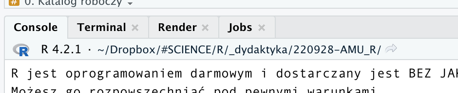
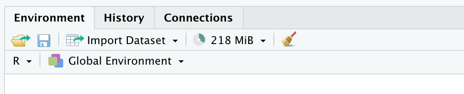

-   [Zanim zaczniemy](#zanim-zaczniemy)
    -   [0. Przydatne zasoby pomocowe w pracy z `R` - część
        pierwsza](#0-przydatne-zasoby-pomocowe-w-pracy-z-r---część-pierwsza)
    -   [0. Katalog roboczy](#0-katalog-roboczy)
-   [A. Podstawy składni `R`](#a-podstawy-składni-r)
    -   [1. `R` działa w oparciu o
        funkcje](#1-r-działa-w-oparciu-o-funkcje)
    -   [2. Skąd wiedzieć jakie argumenty ma
        funkcja?](#2-skąd-wiedzieć-jakie-argumenty-ma-funkcja)
    -   [3. Istotne cechy składni języka
        `R`](#3-istotne-cechy-składni-języka-r)
    -   [4. R to kalkulator na sterydach](#4-r-to-kalkulator-na-sterydach)
-   [B. Zapisywanie pracy](#b-zapisywanie-pracy)
-   [C. Zmienne i struktury danych](#c-zmienne-i-struktury-danych)
    -   [1. Tworzenie zmiennych](#1-tworzenie-zmiennych)
    -   [2. Wektory i ich tworzenie](#2-wektory-i-ich-tworzenie)
    -   [3. Indeksowanie wektorów](#3-indeksowanie-wektorów)
    -   [4. Ładowanie danych do `R`. Typy
        danych](#4-ładowanie-danych-do-r.-typy-danych)
    -   [5. Dane jako macierz -
        indeksowanie](#5-dane-jako-macierz---indeksowanie)
    -   [6. Filtrowanie danych](#6-filtrowanie-danych)
    -   [7. Brakujące dane](#7-brakujące-dane)

# Zanim zaczniemy

## 0. Przydatne zasoby pomocowe w pracy z `R` - część pierwsza

-   [RStudio
    cheat-sheet](https://raw.githubusercontent.com/rstudio/cheatsheets/main/rstudio-ide.pdf)
-   [RMarkdown
    cheat-sheet](https://raw.githubusercontent.com/rstudio/cheatsheets/main/rmarkdown.pdf)
-   [RMarkdown book](https://bookdown.org/yihui/rmarkdown/)
-   [Ściąga z podstawowych funkcji
    R](http://github.com/rstudio/cheatsheets/blob/main/base-r.pdf)
-   [Szybki GitHub dla
    RStudio](https://raw.githubusercontent.com/rstudio/cheatsheets/main/git-github.pdf)
-   [Porównanie stylów
    kodowania](https://raw.githubusercontent.com/rstudio/cheatsheets/main/syntax.pdf)
-   [Książka online “Intro to R”](https://intro2r.com)
-   [Zbiory użytecznych funkcji wg tematu - CRAN Task
    Views](https://cran.r-project.org/web/views/)

------------------------------------------------------------------------

## 0. Katalog roboczy

By móc pracować w `R` - potrzebujemy tzw. katalogu roboczego. Po
uruchomieniu `R` katalog roboczy ustawiany jest automatycznie - możemy
podejrzeć go w belce terminala, obok numeru wersji `R`.



Znacznie lepiej jest samodzielnie zdecydować, gdzie taki folder powinien
się znajdować. Stosowanie folderów roboczych osobnych dla każdego
projektu/analizy jest dobrą praktyką pozwalającą utrzymać porządek w
plikach.

Aby ustawić katalog roboczy (*working directory*) możemy dokonać tego w
menu w panelu **Files** (menu **More**) - po przejściu do wybranego
folderu w przeglądarce plików panelu **Files**. Druga możliwość to
użycie funkcji `setwd()`:

1.Upewnij się, że folder który chcesz wykorzystać fizycznie istnieje na
Twoim dysku - jeśli nie: utwórz go;

2.W terminalu wykonaj instrukcję

    setwd("~/Dropbox/#SCIENCE/R/_dydaktyka/220928-AMU_R")

wpisując wewnątrz funkcji ścieżkę do wybranego przez siebie folderu.

Wybrany folder powinien pojawić się w belce terminala `R` - możemy też
sprawdzić wybór folderu za pomocą funkcji `getwd()`:

``` r
getwd()
```

    [1] "/Users/szymek/Dropbox/#SCIENCE/R/_dydaktyka/220928-AMU_R"

------------------------------------------------------------------------

# A. Podstawy składni `R`

## 1. `R` działa w oparciu o funkcje

“Funkcja” to rodzaj makra, które wykonuje określone instrukcje. Mogą one
być bardzo proste, ale mogą też mieć wiele złożonych właściwości. W `R`
funkcja zawsze ma podobną strukturę:

``` r
pewna_funkcja(argument1 = 50, argument2 = "opcja1", argument3 = T)
```

Funkcja zawsze ma nazwę (`pewna_funckja`), po której następuje `()`.
Nawias ujmuje argumenty funkcji, w parach zawierających nazwę argumentu
oraz jego wartość. Wartości mogą być liczbowe, mogą być to instrukcje
tekstowe, mogą to być też wartości logiczne (prawda/fałsz, oznaczane w
`R` jako `T` oraz `F`, ewentualnie `TRUE` oraz `FALSE` - obydwie
konwencje są poprawne).

Warto pamiętać o kilku istotnych rzeczach:

-   `opcja1` to nie to samo co `"opcja1"`. Pierwsza wersja oznacza
    obiekt w `R` o nazwie `opcja1` (co to dokładnie oznacza - za
    chwilę). Druga oznacza tekst zawierający ciąg znaków “opcja1”;
-   `T` wpisujemy bez `""` ponieważ nie jest to tekst, ale wartość
    logiczna “prawda”; wpisanie `"T"` oznacza po prostu podanie wielkiej
    litery “T”;
-   wartości logiczne są równoznaczne z zerem i jedynką (to znaczy
    `T == 1` oraz `F == 0`).

Choć argumenty zawsze mają swoje nazwy, możemy je często pominąć, jeśli
ich wartości podajemy w odpowiedniej kolejności (takiej, jak
zdefiniowana przez autora funkcji), lub też kiedy funkcja ma tylko 1
argument. Na przykład funkcja `sqrt` oblicza pierwiastek kwadratowy i
przyjmuje tylko jeden argument `x` oznaczający zmienną, którą chcemy
pierwiastkować.

**Zadanie** Spróbuj wywołać tę funkcję korzystając z nazwy jej argumentu
oraz go pomijając. Spierwiastkuj w tych dwóch wywołaniach liczbę 2 oraz
6.

**Spodziewany wynik**

    [1] 1.414214

    [1] 2.44949

**Zadanie** Funkcja `round()` przyjmuje argumenty `x` (wartość do
zaokrąglenia) oraz `digits` (liczba miejsc dziesiętnych, do których
chcemy zaokrąglić). Stosując tą funkcję do liczby 4.246813579 wykonaj ją
w kilku wersjach, zaokrąglając wynik do 3 miejsc po przecinku: podając
nazwy argumentów; nie podając ich ale zakładając, że ich kolejność to
`x` `digits`; wreszcie - nie podając nazw i zakładając, że kolejność
jest osobna. Co się stanie, gdy pominiesz drugi argument (`digits`)?

**Spodziewany wynik**

*Podając nazwy argumentów*

    [1] 4.247

*Bez nazw, w kolejności `x digits`*

    [1] 4.247

*Bez nazw, w kolejności `digits x`*

    [1] 3

*Bez podania drugiego argumentu*

    [1] 4

◼

## 2. Skąd wiedzieć jakie argumenty ma funkcja?

Aby dowiedzieć się czegoś o funkcji, której nazwę znamy wystarczy
wywołać jej plik pomocy. Robimy to poprzez komendę `?nazwa_funkcji`.

**Zadanie** Podejrzyj pomoc dla funkcji `round` oraz `sqrt` - czy
zgadzają się z tym, co obserwowaliśmy wcześniej?

**Zadanie** Co wyświetli polecenie `??"square root"`? Czym różni się ten
wynik od poprzedniego rezultatu?

◼

## 3. Istotne cechy składni języka `R`

-   Tzw. *white spaces* nie maja w kodzie znaczenia - zapis
    `round(3, digits = 4)` jest równoznaczny zapisowi
    `round(3,digits=4)`, czy też `round(3,digits     = 4` - warto jednak
    stosować białe znaki dla zwiększenia czytelności kodu. Dotyczy to
    nie tylko spacji ale też tabulatorów, którymi dobrze jest zaznaczać
    wcięcia oznaczające integralne części kodu (zobaczymy to nieco
    później). *RStudio* samodzielnie wprowadza wcięcia pomagając nam
    wyizolować fragmenty ujęte np. w jeden nawias:

<!-- -->

    round(4.7654, digits = 2)
    round(4.7654,
          digits = 2)

-   W `R` możemy stosować 2 rodzaje cudzysłowu: podwójny `""` oraz
    pojedynczy `''`. Stosowane osobno są równorzędne, możemy więc
    napisać `pewna_funkcja(argument2 = "opcja1")`, jak również
    `pewna_funkcja(argument2 = 'opcja1')`. Jeśli jednak cudzysłów ma być
    częścią wprowadzanego ciągu znaków, zewnętrznym cudzysłowem musi być
    `''`: `pewna_funkcja(argument2 = '"opcja1"')`.

-   Wprowadzenie znaków “zakazanych” w ciągu tekstowym (np. `'`) wymaga
    zastosowania tzw. *escape* (np. `"\'"`). *Escape* wykorzystuje się
    również by wprowadzić np. znak nowej linii `"\n"`:

``` r
cat("Pierwsza linia\nDruga linia")
```

    Pierwsza linia
    Druga linia

Zastosowana powyżej funkcja `cat()` służy do wyświetlania ciągów znaków
w konsoli.

-   Jeśli zapomnimy zamknąć jakiś nawias lub cudzysłów i zatwierdzimy
    linijkę kodu - znak zachęty `>` zmieni się w `+` - co oznacza
    oczekiwanie konsoli na dokończenie/zamknięcie wprowadzania
    instrukcji:

<!-- -->

    >
    > round(4.7654, digits = 2
    +
    )
    >

-   Kolejność działań w `R` jest zgodna z zasadami matematyki (działania
    w nawiasie, potem `^`, potem `*` i `/`, potem `+` i `-`), ale dla
    zachowania czytelności zawsze lepiej używać (nawet nadmiarowych)
    nawiasów).
-   `R` rozróżnia małe litery tak więc `ZmiennA` ≠ `zmienna`.
-   Linie kodu rozpoczynające się od `#` stają się komentarzami i nie są
    uruchamiane:

<!-- -->

    [1] 3.1416

-   Na dawne obiektom `R` nazwy nie mogą zaczynać się od cyfr, nie mogą
    zawierać znaków specjalnych (`;:'",<>?/!+-*&|[]{}()^%$#@`), unikajmy
    również używania w nich kropki `.` (w niektórych kontekstach oznacza
    ona konkretny rodzaj obiektu w `R`); najlepiej stosować konwencję
    rozdzielania słów w nazwach za pomocą “\_” (`zmienna_pierwsza`) lub
    wielkich liter (`zmiennaPierwsza`).

## 4. R to kalkulator na sterydach

`R` to język programowania wykonywany w linii poleceń, w *czasie
rzeczywistym*. Oznacza to, że to co wpiszemy w konsoli terminala `R`
zostanie wykonane od razu, i od razu zobaczymy wyniki naszych obliczeń.

Z `R` można również pracować inaczej - za pomocą skryptów. Są to pliki
tekstowe (najcześciej z rozszerzeniem `.R`), które R może uruchomić i
wykonać w całości.

**Zadanie** Za pomocą funkcji `source()` spróbuj uruchomić przykładowy
skrypt `class1_script.R`. **Spodziewany wynik**

    [1] "Hello World!"

Pracując w konsoli poeksploruj funkcje obliczeniowe R.

**Zadanie** Zsumuj liczby całkowite od -4 do 7.

**Spodziewany wynik**

    [1] 18

**Zadanie** Sprawdź do czego służą operatory arytmetyczne `%%` oraz
`%/%`. Jaki wynik daje operacja `82%%9` oraz `82%/%9`? Korzystając z
jednej z tych funkcji - jak sprawdzisz czy liczba 87654 podzielna jest
przez 7?

Wiele operacji ma swoje własne funkcje - np.:

-   `abs()` - wartość bezwzględna
-   `sin()`, `cos()`, `tan()` - operacje trygonometryczne (uwaga - kąty
    podajemy w radianach)
-   `log10()`, `log2()`, `log()` - logarytmy, o podstawie 10, 2 oraz *e*
    (naturalny)
-   `exp()` - eksponent (odwrotność logarytmy naturalnego, czyli
    *e*<sup>*x*</sup>)
-   `sqrt()` - pierwiastek kwadratowy
-   `factorial()` - silnia (*x*!).

**Zadanie** Czy logarytm dziesiętny z liczby 100 oraz logarytm naturalny
z liczby *e*<sup>1</sup> dają spodziewany wynik?

W trakcie pracy w `R` możemy napotkać na wartości na pierwszy rzut oka
dziwne. **Zadanie** Zobacz co się stanie, gdy spróbujesz podzielić
liczbę dodatnią i ujemną przez zero.

**Spodziewany wynik**

    [1] Inf

    [1] -Inf

`Inf` oznacza “nieskończoność”. Choć formalnie nie możemy podzielić
liczby przez zero, `R` próbuje wybrnąć z sytuacji i traktuje wyrażenie
tak, jak w analizie matematycznej (skoro nie potrafi obliczyć wartości,
próbuje znaleźć wartość graniczną wyrażenia i tutaj jest to
±nieskończoność). Jakie jeszcze operacje matematyczne mogą wywołać
nieoczekiwane rezultaty?

`R` zawiera trzy typy “nieliczbowych” wartości, które bedą pojawiać się
w naszej pracy:

-   `NA` - wartość brakująca, “wypełniacz” w danych wskazujący, że
    formalnie w danym miejscu brakuje wartości
-   `NaN` - *not-a-number* - wartość nienumeryczna, `R` nie wie co z
    taką liczbą zrobić
-   `±Inf` - nieskończoność (ostrożnie, bo może ona zniszczyć inne
    operacje - zob. np. `10+Inf` lub `50*(-Inf)`)

------------------------------------------------------------------------

# B. Zapisywanie pracy

`R` oferuje kilka różnych sposobów zapisywania pracy oraz jej postępów.

-   **R project** - jest to rodzaj “folderu” - lub archiwum -
    przechowującego wszystkie elementy projektu, nad którym pracujemy.
    Najlepiej sprawdzają się one, gdy korzystamy z danego folderu jako
    zarezerwowanego dla konkretnego projektu (tzn. jest on dla tego
    projektu zawsze folderem roboczym). Tworzenie projektu polega na
    wybraniu **File** \> **New project…** i selekcji odpowiedniej opcji.
    W folderze roboczym pojawi się plik z rozszerzeniem `.Rproj` który
    będzie od tej pory przechowywać istotne informacje o naszym
    projekcie.

-   **Skrypt R** - jest to plik tekstowy z rozszerzeniem `.R`
    przechowujący tekstową wersję instrukcji, które chcemy wykonać w
    `R`. Powinien zawierać tylko to, co może zostać wprowadzone i
    uruchomione w konsoli.

-   **Dokument RMarkdown** - dokumenty tego typu są skryptami `R` “na
    sterydach”. Tworzymy je poprzez **File** \> **New File** \> **R
    Markdown…** - powstaje wtedy szkielet dokumentu. Tego typu pliki
    zawierają tekst oraz specjalne *tagi* pozwalające formatować i
    definiować tekst o określonych parametrach. Zawierają one również
    kawałki kodu `R`, które mogą być na bieżąco, w takim dokumencie,
    uruchamiane, a ich wyniki wstawiane w określonym miejscu. Do
    działania RMarkdown konieczny jest pakiet `rmarkdown`. Dobry
    przewodnik po RMarkdown znajduje się wśród plików na górze tej
    instrukcji.

-   **Przestrzeń robocza** - to to, co wyświetla się w panelu
    **Environment**. Zawiera ona wszystkie obiekty i funkcje stworzone w
    naszej aktualnej sesji R. Możemy zapisać ją do pliku dzięki funkcji
    `save.image(file = "nazwa_pliku.Rdata")`, oraz odtworzyć ją za
    pomocą `load(file = "nazwa_pliku.Rdata")`. Pominięcie nazwy pliku
    spowoduje, że zapisana zostanie “ukryta” wersja przestrzeni, nazwana
    `.Rdata` - do takiego pliku RStudio próbuje również zapisać
    przestrzeń roboczą gdy zamykamy program.

> Zamiast korzystać z komend terminala - możemy skorzystać z ikony
> folderu (`load`) i dyskietki (`save`) w panelu **Environment**.



> Uwaga: jeśli w `R` podajemy nazwy plików bez pełnej ścieżki - `R`
> zapisuje je (oraz przy próbie odczytu poszukuje ich) w aktualnym
> katalogu roboczym.

Stwórzmy w naszej (ciągle pustej przestrzeni roboczej) 2 obiekty (więcej
o tworzeniu obiektów dowiemy się za chwilę):

**Zadanie** Zapisz aktualną przestrzeń roboczą do pliku `wdir.Rdata`.
Wyczyść przestrzeń za pomocą `rm(list = ls())`. Załaduj zachowaną
przestrzeń z powrotem.

**Zadanie** Co robi sama funkcja `ls()`?

------------------------------------------------------------------------

# C. Zmienne i struktury danych

## 1. Tworzenie zmiennych

Zmienne tworzymy za pomocą operatora przypisania (*assignment*) `<-`.
Podobny skutek ma użycie znanego z innych języków operatora `=` (oraz
użycie operatora przypisania “w drugą stronę, zamieniając jego
argumenty: `->`) - ale sposoby te nie są rekomendowane, ponieważ
zmniejszają one czytelność kodu. Przypisanie działa tak:

    nazwa_zmiennej <- wartość_zmiennej
    # np. x <- 6

**Zadanie** Przypisz do zmiennej `x` wartość 10, a do zmiennej `y`
wartość 66. Wywołaj je po ich nazwie.

**Spodziewany wynik**

    [1] 10

    [1] 66

**Zadanie** Przypisz do zmiennej `z` wartość sumy `x` i `y`,
powiększonej o 45%. Wywołaj `z`.

**Spodziewany wynik**

    [1] 110.2

  
  

> Wyświetlając nawet pojedynczą liczbę, `R` na początku linijki wyrzuca
> `[1]`. Jest to sygnał wskazujący, że obiekt wyświetlany na ekranie nie
> jest prostą jednostkową wartością liczbową (jak powiedziałby
> matematyk - nie jest *skalarem*), ale jest jednoelementowym wektorem.
> Wektor to w zasadzie lista liczb, obiekt mający jeden wymiar
> (długość):

    [ x y z ...]

> Skalar jest szczególnym rodzajem wektora o długości 1:

    [ x ]

> Jeśli takiemu obiektowi nadamy drugi wymiar (szerokość) dostaniemy
> coś, co będzie miało zarówno wiersze, jak i kolumny: tablicę liczb,
> czyli macierz.

    | x y z ... |
    | a b c ... |
    | i j k ... |
    | . . . ... |

◼

## 2. Wektory i ich tworzenie

Do tworzenia wektorów służy funkcja `c()`.

**Zadanie** Stwórz i wyświetl wektor o nazwie “vec” zawierający liczby
parzyste od 2 do 10.

**Spodziewany wynik**

    [1]  2  4  6  8 10

**Zadanie** Jakiego rodzaju wynik dostaniemy, jeśli zastosujemy w
stosunku do tego wektora funkcje: `length()`, `sqrt()`, `sum()`,
`mean()`, `sd()`? Co stanie się, gdy do wektora “dodamy” liczbę 100?

**Spodziewany wynik**

    [1] 5

    [1] 1.414214 2.000000 2.449490 2.828427 3.162278

    [1] 30

    [1] 6

    [1] 3.162278

    [1] 102 104 106 108 110

Aby ułatwić sobie życie możemy tworzyć wektory zawierające wiele
wartości w prosty sposób. Sekwencję liczb “od-do” możemy wygenerować za
pomocą operatora `:`. Podobnie (ale mając więcej kontroli nad sekwencją)
działa funkcja `seq()`. Podejrzyj pomoc do funkcji `seq()` oraz `rep()`.

**Zadanie** Stwórz trzy wektory: `vec1` za pomocą operatora `:`
zawierający liczby od 30 do 75, `vec2` zawierający liczby od -5 do 80
dodawane co 4 (`seq`) oraz `vec3` zawierający 156 powtórzeń liczby 6
(`rep`). Wyświetl te wektory. Co stanie się, gdy dodasz `vec1` i `vec3`?

**Spodziewany wynik**

     [1] 30 31 32 33 34 35 36 37 38 39 40 41 42 43 44 45 46 47 48 49 50 51 52 53 54 55 56 57 58 59 60
    [32] 61 62 63 64 65 66 67 68 69 70 71 72 73 74 75

     [1] -5 -1  3  7 11 15 19 23 27 31 35 39 43 47 51 55 59 63 67 71 75 79

      [1] 6 6 6 6 6 6 6 6 6 6 6 6 6 6 6 6 6 6 6 6 6 6 6 6 6 6 6 6 6 6 6 6 6 6 6 6 6 6 6 6 6 6 6 6 6 6
     [47] 6 6 6 6 6 6 6 6 6 6 6 6 6 6 6 6 6 6 6 6 6 6 6 6 6 6 6 6 6 6 6 6 6 6 6 6 6 6 6 6 6 6 6 6 6 6
     [93] 6 6 6 6 6 6 6 6 6 6 6 6 6 6 6 6 6 6 6 6 6 6 6 6 6 6 6 6 6 6 6 6 6 6 6 6 6 6 6 6 6 6 6 6 6 6
    [139] 6 6 6 6 6 6 6 6 6 6 6 6 6 6 6 6 6 6

    Warning in vec1 + vec3: długość dłuszego obiektu nie jest wielokrotnością długości krótszego
    obiektu

      [1] 36 37 38 39 40 41 42 43 44 45 46 47 48 49 50 51 52 53 54 55 56 57 58 59 60 61 62 63 64 65 66
     [32] 67 68 69 70 71 72 73 74 75 76 77 78 79 80 81 36 37 38 39 40 41 42 43 44 45 46 47 48 49 50 51
     [63] 52 53 54 55 56 57 58 59 60 61 62 63 64 65 66 67 68 69 70 71 72 73 74 75 76 77 78 79 80 81 36
     [94] 37 38 39 40 41 42 43 44 45 46 47 48 49 50 51 52 53 54 55 56 57 58 59 60 61 62 63 64 65 66 67
    [125] 68 69 70 71 72 73 74 75 76 77 78 79 80 81 36 37 38 39 40 41 42 43 44 45 46 47 48 49 50 51 52
    [156] 53

Przydatne funkcje mające zastosowanie do wektorów:

| Nazwa                    | Działanie                                                          |
|--------------------------|--------------------------------------------------------------------|
| `median()`               | mediana wartości                                                   |
| `mean()`                 | średnia                                                            |
| `sd()`                   | odchylenie standardowe                                             |
| `min()` i `max()`        | minimum i maximum                                                  |
| `length()`               | liczba elementów wektora                                           |
| `prod()` i `sum()`       | iloczyn i suma elementów                                           |
| `cumsum()` i `cumprod()` | jw., ale skumulowane                                               |
| `sort()`                 | sortowanie wektora (`rev(sort())` - w porządku malejącym)          |
| `unique()`               | zwraca tylko unikatowe elementy z danego wektora (usuwa duplikaty) |

◼

## 3. Indeksowanie wektorów

Aby dostać się do konkretnego elementu wektora, stosujemy notację
“indeksową”: `[indeks]`.

**Zadanie** Wyświetl następujące elementy wektora `vec1`: dwunasty; od
trzeciego do jedenastego; siódmy, drugi i trzydziesty.

**Spodziewany wynik**

    [1] 41

    [1] 32 33 34 35 36 37 38 39 40

    [1] 36 31 59

**Zadanie** Czy wektor może zawierać wartości różnego typu? Stwórz 2
wektory, jeden zawierający liczbę 2, wartość logiczną TRUE oraz liczbę
siedem, i drugi zawierający liczbę 11, słowo “dwa” i liczbę *π* z
dokładnością do 3 miejsc po przecinku. Co oznacza wynik tych działań?

**Spodziewany wynik**

    [1] 2 1 7

    [1] "11"    "dwa"   "3.142"

◼

## 4. Ładowanie danych do `R`. Typy danych

Aby załadować do `R` realne dane może skorzystać z funkcji
`read.table()`, podając w niej pochodzenie danych (`file`), separator
oddzielający w danych kolumny od siebie (`sep`) oraz sposób
potraktowania zmiennych tekstowych (`stringsAsFactors`). Musimy również
dodać (opcja `header`) czy pierwszy wiersz pliku zawiera nazwy kolumn.

**Zadanie** Załaduj dane z pliku `BTdata.csv` do `R`, do obiektu o
nazwie `dane` - skorzystaj z operatora przypisania `<-`. Opcji
`stringsAsFactors` nadaj wartość `T`. Ładowany plik to CSV - kolumny są
w nim porozdzielane za pomocą przecinków. Następnie wyświetl za pomocą
funkcji `head()` kilka pierwszych wierszy obiektu `dane`.

**Spodziewany rezultat**

      tarsus     back     dam fosternest hatchdate  sex weight habitat bill_length bill_depth
    1  13.55 551.3757 R187557      F2102        47  Fem    8.9    park      10.885      0.597
    2  15.07 549.0884 R187559      F1902        47 Male   10.5  forest      12.056      0.682
    3  14.99 550.1739 R187568       A602        47 Male    9.9  forest      12.000      0.673
    4  14.69 550.3067 R187518      A1302        45 Male    9.7  forest      11.733      0.639
    5  14.46 549.6392 R187528      A2602        45  Fem    9.7  forest      11.565      0.631
    6  13.93 551.8693 R187945      C2302        49  Fem    9.3  forest      11.165      0.626

**Zadanie** Strukturę złożonych obiektów w `R` możemy poznać dzięki
funkcji `str()`. Podejrzyj strukturę obiektu `dane`. Co stanie się, gdy
wyświetlisz go za pomocą `View(dane)`?

**Spodziewany rezultat**

    'data.frame':   828 obs. of  10 variables:
     $ tarsus     : num  13.6 15.1 15 14.7 14.5 ...
     $ back       : num  551 549 550 550 550 ...
     $ dam        : Factor w/ 106 levels "Fem2","Fem20",..: 56 57 61 38 43 94 3 23 37 40 ...
     $ fosternest : Factor w/ 104 levels "A1002","A102",..: 74 72 16 4 12 38 35 34 42 28 ...
     $ hatchdate  : int  47 47 47 45 45 49 47 46 44 46 ...
     $ sex        : Factor w/ 3 levels "Fem","Male","UNK": 1 2 2 2 1 1 2 1 1 1 ...
     $ weight     : num  8.9 10.5 9.9 9.7 9.7 9.3 9.3 10.2 9.5 9.6 ...
     $ habitat    : Factor w/ 2 levels "forest","park": 2 1 1 1 1 1 2 1 2 1 ...
     $ bill_length: num  10.9 12.1 12 11.7 11.6 ...
     $ bill_depth : num  0.597 0.682 0.673 0.639 0.631 0.626 0.591 0.675 0.629 0.609 ...

**Zadanie** Wyświetl podsumowanie obiektu `dane` za pomocą funkcji
`summary()`. Dlaczego zmienne `sex`, `habitat` i kilka innych mają inny
typ podsumowania niż np. `tarsus`?

**Spodziewany wynik**

         tarsus           back            dam        fosternest    hatchdate      sex     
     Min.   :12.57   Min.   :546.7   R187926: 15   G402   : 15   Min.   :44.0   Fem :392  
     1st Qu.:14.16   1st Qu.:549.2   R187517: 13   A2602  : 12   1st Qu.:47.0   Male:391  
     Median :14.54   Median :549.9   R187518: 12   A602   : 12   Median :48.0   UNK : 45  
     Mean   :14.50   Mean   :550.0   R187559: 12   F2102  : 12   Mean   :48.4             
     3rd Qu.:14.77   3rd Qu.:550.8   Fem20  : 11   A1602  : 11   3rd Qu.:50.0             
     Max.   :16.81   Max.   :554.2   R187030: 11   B202   : 11   Max.   :55.0             
                                     (Other):754   (Other):755                            
         weight         habitat     bill_length      bill_depth    
     Min.   : 8.600   forest:418   Min.   :10.07   Min.   :0.5130  
     1st Qu.: 9.500   park  :410   1st Qu.:11.32   1st Qu.:0.6130  
     Median : 9.800                Median :11.64   Median :0.6380  
     Mean   : 9.789                Mean   :11.60   Mean   :0.6375  
     3rd Qu.:10.000                3rd Qu.:11.84   3rd Qu.:0.6650  
     Max.   :11.400                Max.   :13.40   Max.   :0.7970  
                                                                   

Nasz zestaw danych zawiera nowy rodzaj zmiennej: kategoryczną
(`factor`). Znamy już więc wszystkie potrzebne nam typy danych w `R`:

-   zmienne liczbowe (`numeric`) - mogą one mieć charakter całkowity,
    lub zmiennoprzecinkowy (z częścią dziesiętną)
-   zmienne tekstowe (`character`) - podczas wprowadzania zawsze
    ujmujemy je w cudzysłów (np. `x <- "nowy_tekst"`)
-   zmienne logiczne (`logical`) - możliwe są tylko 2 wartości: `TRUE`
    oraz `FALSE`
-   zmienne kategoryczne (`factor`) - kodują one przynależność do
    określonych kategorii, potrzebne są np. w analizie wariancji, gdzie
    zmienna niezależna ma charakter jakościowy (grupująca zmienna
    kategoryczna).

> Może zawsze testować typ zmiennej za pomocą funkcji z rodziny
> `is....`, a także przekształcać zmienne w inne typy za pomocą funkcji
> z rodziny `as....`. Np. `is.numeric(x)` sprawdza, czy `x` jest typu
> liczbowego (w odpowiedzi dostaniemy `TRUE` lub `FALSE`). Z kolei
> `y <- as.character(x)` tworzy zmienną `y`, w krtórej zapisujemy
> zmienną `x` po jej zamianie na typ tekstowy. Pamiętajmy, że nie
> wszystkie typy możemy zamieniać w dowolny inny typ (np. zamiana
> zmiannej tekstowej w liczbową nie ma większego sensu, chyba że tekst
> zawiera liczbę):

    Warning: pojawiły się wartości NA na skutek przekształcenia

    [1] NA

    [1] 2

**Zadanie** Za pomocą funkcji `ncol()` oraz `nrow()` ustal wymiary
tabeli `dane`. Czy wynik działania `ncol()` zgadza się z rezultatem
funkcji `names(dane)` - zwracającej nazwy kolumn w tabeli danych?

**Spodziewany wynik**

    [1] 10

    [1] 828

     [1] "tarsus"      "back"        "dam"         "fosternest"  "hatchdate"   "sex"        
     [7] "weight"      "habitat"     "bill_length" "bill_depth" 

◼

## 5. Dane jako macierz - indeksowanie

W przypadku wektora indeksowanie odbywało się z użyciem `[indeks]`.
Załadowane dane to tzw. `dataframe` i jest to w zasadzie macierz
(tablica) wartości o określonej liczbie wierszy i kolumn. Potrzebujemy
więc 2 indeksów, by się do nich dostać:
`[indeks_wiersza, indeks_kolumny]`. Oto przykłady możliwości:

-   `[3, 4]` - zwróć wartość z 3. wiersza i 4. kolumny
-   `[, 5]` - zwróć całą piątą kolumnę
-   `[2:10, 1]` - zwróć wiersze od 2 do 10 z 1. kolumny
-   `[c(10, 20:25), ]` - zwróć wiersze 10 oraz od 20 do 25 dla
    wszystkich kolumn
-   `[,]` - zwróć wszystkie wiersze i wszystkie kolumny

**Zadanie** Zwróć i wyświetl dla obiektu `dane`: wiersze 1:10; wiersze
2, 20 i 200 dla kolumn od 1 do 5; wszystkie wiersze dla kolumny drugiej.
(W tym ostatnim przypadku użyj funkcji head, by ograniczyć wynik do
kilku pierwszych obserwacji).

**Spodziewany wynik**

       tarsus     back     dam fosternest hatchdate  sex weight habitat bill_length bill_depth
    1   13.55 551.3757 R187557      F2102        47  Fem    8.9    park      10.885      0.597
    2   15.07 549.0884 R187559      F1902        47 Male   10.5  forest      12.056      0.682
    3   14.99 550.1739 R187568       A602        47 Male    9.9  forest      12.000      0.673
    4   14.69 550.3067 R187518      A1302        45 Male    9.7  forest      11.733      0.639
    5   14.46 549.6392 R187528      A2602        45  Fem    9.7  forest      11.565      0.631
    6   13.93 551.8693 R187945      C2302        49  Fem    9.3  forest      11.165      0.626
    7   13.93 549.4878    Fem3      C1902        47 Male    9.3    park      11.154      0.591
    8   15.45 548.3911 R187030      C1302        46  Fem   10.2  forest      12.348      0.675
    9   14.31 550.0810 R187517       C602        44  Fem    9.5    park      11.434      0.629
    10  14.46 549.8523 R187523      B2202        46  Fem    9.6  forest      11.564      0.609

        tarsus     back     dam fosternest hatchdate
    2    15.07 549.0884 R187559      F1902        47
    20   13.40 549.0100 R187588      F2402        47
    200  14.16 548.3299 R186907       C102        53

    [1] 551.3757 549.0884 550.1739 550.3067 549.6392 551.8693

Kolumn w macierzy możemy również indeksować po ich nazwie, korzystając
zarówno z konwencji `[]`, jak i ze specjalnego operatora `$` (np.
`tabela$zmienna1`).

**Zadanie** Korzystając z indeksowania za pomocą `[]` wyświetl wiersze
33 do 66 zmiennej `sex`. Korzystając z `$` wyświetl wartości 55 do 77
zmiennej `tarsus`.

**Spodziewany wynik**

     [1] Fem  Fem  Male Male Fem  Male Fem  Male Fem  Fem  Fem  Male Fem  Fem  Male Fem  Fem  Fem 
    [19] Fem  Male Fem  Male Fem  Fem  Fem  UNK  Fem  Male Male Fem  Male Fem  Male Male
    Levels: Fem Male UNK

     [1] 14.61 14.46 14.08 15.37 14.69 14.54 15.22 14.77 14.08 14.46 14.69 14.88 15.30 14.08 14.46
    [16] 14.69 14.61 14.46 13.71 14.61 14.24 14.77 15.11

Kolumny danych możemy zapisywać do nowych zmiennych. Możemy również
tworzyć nowe kolumny danych - “odwołując się” za pomocą `$` do kolumny o
nieistniejącej w danych nazwie.

**Zadanie** Zapisz kolumnę `back` do nowej zmiennej `kolor_plaszcza`.
Następnie utwórz w `dane` nową kolumnę `nowa` zawierającą same jedynki.
Wyświetl pierwszych 50 wartości nowej zmiennej `kolor_plaszcza` oraz
kilka pierwszych wierszy `dane` po modyfikacji (za pomocą `head()`).

**Spodziewany rezultat**

     [1] 551.3757 549.0884 550.1739 550.3067 549.6392 551.8693 549.4878 548.3911 550.0810 549.8523
    [11] 547.7403 548.9847 551.1920 549.2743 548.3708 551.1921 551.5066 549.7494 552.3874 549.0100
    [21] 548.5515 550.9192 548.7900 549.6686 548.8435 548.3054 549.3162 549.0850 550.3779 549.4345
    [31] 550.0111 549.7445 551.4557 551.5648 549.0410 549.3314 549.5218 550.5366 550.2580 549.5741
    [41] 549.7790 554.1662 549.6629 549.6901 549.6963 548.2706 550.3595 547.2247 551.5836 548.6962

      tarsus     back     dam fosternest hatchdate  sex weight habitat bill_length bill_depth nowa
    1  13.55 551.3757 R187557      F2102        47  Fem    8.9    park      10.885      0.597    1
    2  15.07 549.0884 R187559      F1902        47 Male   10.5  forest      12.056      0.682    1
    3  14.99 550.1739 R187568       A602        47 Male    9.9  forest      12.000      0.673    1
    4  14.69 550.3067 R187518      A1302        45 Male    9.7  forest      11.733      0.639    1
    5  14.46 549.6392 R187528      A2602        45  Fem    9.7  forest      11.565      0.631    1
    6  13.93 551.8693 R187945      C2302        49  Fem    9.3  forest      11.165      0.626    1

**Zadanie** Korzystając z `as.character` utwórz kolumnę `dam_text`,
zawierającą wersję tekstową zmiennej `dam` (oryginalnie typu `factor`).
Wyświetl podsumowanie `dane`.

**Spodziewany wynik**

         tarsus           back            dam        fosternest    hatchdate      sex     
     Min.   :12.57   Min.   :546.7   R187926: 15   G402   : 15   Min.   :44.0   Fem :392  
     1st Qu.:14.16   1st Qu.:549.2   R187517: 13   A2602  : 12   1st Qu.:47.0   Male:391  
     Median :14.54   Median :549.9   R187518: 12   A602   : 12   Median :48.0   UNK : 45  
     Mean   :14.50   Mean   :550.0   R187559: 12   F2102  : 12   Mean   :48.4             
     3rd Qu.:14.77   3rd Qu.:550.8   Fem20  : 11   A1602  : 11   3rd Qu.:50.0             
     Max.   :16.81   Max.   :554.2   R187030: 11   B202   : 11   Max.   :55.0             
                                     (Other):754   (Other):755                            
         weight         habitat     bill_length      bill_depth          nowa     dam_text        
     Min.   : 8.600   forest:418   Min.   :10.07   Min.   :0.5130   Min.   :1   Length:828        
     1st Qu.: 9.500   park  :410   1st Qu.:11.32   1st Qu.:0.6130   1st Qu.:1   Class :character  
     Median : 9.800                Median :11.64   Median :0.6380   Median :1   Mode  :character  
     Mean   : 9.789                Mean   :11.60   Mean   :0.6375   Mean   :1                     
     3rd Qu.:10.000                3rd Qu.:11.84   3rd Qu.:0.6650   3rd Qu.:1                     
     Max.   :11.400                Max.   :13.40   Max.   :0.7970   Max.   :1                     
                                                                                                  

◼

## 6. Filtrowanie danych

Korzystając z notacji “indeksowej” `[]` możemy również dane filtrować,
wyświetlając ich różne podzbiory. Korzystamy wtedy bardzo często z
szeregu operatorów logicznych:

-   `<` oraz `>` - mniejszy niż, większy niż
-   `<=` oraz `>=` - mniejszy lub równy, większy lub równy
-   `==` - równy (zwróć uwagę, że `==` to nie to samo to `=`!)
-   `!=` - nierówny, inny niż
-   `&` - ORAZ
-   `|` - LUB
-   `!` - “NIE” (zaprzeczenie - np. `!(A==B)` oznacza, że A *nie* jest
    równe B (a zatem to składnia równoważna dla `A!=B`))

Działanie operatorów logicznych skutkuje zawsze powstaniem wartości
`TRUE`/`FALSE` - zależnie, czy warunek jest spełniony, czy nie.

    [1] FALSE

    [1] FALSE

    [1] TRUE

    [1] FALSE

Wymagany warunek umieszczamy w miejscu indeksu wierszy (bo filtrując
chcemy wybrać lub odfiltrować konkretne *wiersze* danych).

**Zadanie** Wyświetl wiersze danych, gdzie `weight` ma wartość powyżej
3.

**Spodziewany wynik**

        tarsus     back     dam fosternest hatchdate  sex weight habitat bill_length bill_depth nowa
    15   16.81 548.3708 R187545      D1002        47  Fem   11.4    park      13.399      0.797    1
    745  15.98 549.7797 R187537      A2702        47 Male   10.8    park      12.828      0.690    1
    794  15.60 550.4936 R187155      F2402        47 Male   11.2    park      12.477      0.696    1
    823  15.45 547.8379   Fem20      H1302        48 Male   10.8    park      12.389      0.728    1
        dam_text
    15   R187545
    745  R187537
    794  R187155
    823    Fem20

**Zadanie** Wyświetl wiersze danych, gdzie `weight` ma wartość powyżej
10.5, i jednocześnie ptak pochodzi z lasu (`habitat == "forest"`).

**Spodziewany wynik**

        tarsus     back     dam fosternest hatchdate  sex weight habitat bill_length bill_depth nowa
    162  15.14 550.3606 R187598      G1602        49 Male   10.6  forest      12.116      0.630    1
    288  15.45 549.9689 R187030      C1302        46 Male   10.6  forest      12.324      0.706    1
    685  15.30 549.7819 R187948      E1702        51 Male   10.6  forest      12.308      0.697    1
    701  15.37 550.9644 R187964      F1502        53 Male   10.7  forest      12.233      0.665    1
        dam_text
    162  R187598
    288  R187030
    685  R187948
    701  R187964

**Zadanie** Wyświetl wiersze danych, dany osobnik pochodzi z gniazda
(`fosternest`) nr H102 lub D402.

**Spodziewany wynik**

        tarsus     back     dam fosternest hatchdate  sex weight habitat bill_length bill_depth nowa
    135  14.54 553.7773 R187940       D402        50  Fem   10.0  forest      11.626      0.639    1
    221  15.14 553.3317 R187940       D402        50 Male   10.3  forest      12.104      0.645    1
    313  14.69 550.5040 R187940       D402        50 Male   10.1    park      11.755      0.669    1
    358  14.92 549.6806 R187009       H102        46 Male   10.0  forest      11.937      0.648    1
    371  14.61 552.3244 R187927       D402        50  UNK    9.6  forest      11.686      0.676    1
    381  14.77 550.9502 R187927       D402        50  Fem   10.3    park      11.825      0.684    1
    385  14.46 551.0132 R187001       H102        46 Male   10.0  forest      11.591      0.601    1
    396  14.39 551.7571 R187927       D402        50  Fem    9.4  forest      11.469      0.678    1
    416  14.39 550.8274 R187001       H102        46  Fem    9.6    park      11.493      0.672    1
    473  13.93 550.6763 R187001       H102        46 Male    9.8    park      11.123      0.661    1
    509  14.92 552.4517 R187927       D402        50 Male    9.9    park      11.922      0.668    1
    548  14.46 552.0074 R187001       H102        46  Fem    9.6  forest      11.567      0.607    1
    591  14.39 550.8278 R187927       D402        50  Fem   10.1    park      11.477      0.655    1
    634  14.24 549.2437 R187001       H102        46  Fem    9.8    park      11.437      0.659    1
    679  15.45 550.7465 R187927       D402        50 Male    9.8    park      12.298      0.671    1
    729  14.01 551.0765 R187001       H102        46  Fem    9.3    park      11.228      0.589    1
    774  14.84 551.6591 R187927       D402        50 Male   10.2  forest      11.910      0.617    1
    828  14.92 548.2735 R187001       H102        46 Male   10.2    park      11.926      0.652    1
        dam_text
    135  R187940
    221  R187940
    313  R187940
    358  R187009
    371  R187927
    381  R187927
    385  R187001
    396  R187927
    416  R187001
    473  R187001
    509  R187927
    548  R187001
    591  R187927
    634  R187001
    679  R187927
    729  R187001
    774  R187927
    828  R187001

**Zadanie** Wyświetl wiersze danych, gdzie dany osobnik pochodzi z
gniazda (`fosternest`) nr H102 lub D402, i jednocześnie usuń wszystkie
ptaki o płci męskiej (`Male` w `sex`).

**Spodziewany wynik**

        tarsus     back     dam fosternest hatchdate sex weight habitat bill_length bill_depth nowa
    135  14.54 553.7773 R187940       D402        50 Fem   10.0  forest      11.626      0.639    1
    371  14.61 552.3244 R187927       D402        50 UNK    9.6  forest      11.686      0.676    1
    381  14.77 550.9502 R187927       D402        50 Fem   10.3    park      11.825      0.684    1
    396  14.39 551.7571 R187927       D402        50 Fem    9.4  forest      11.469      0.678    1
    416  14.39 550.8274 R187001       H102        46 Fem    9.6    park      11.493      0.672    1
    548  14.46 552.0074 R187001       H102        46 Fem    9.6  forest      11.567      0.607    1
    591  14.39 550.8278 R187927       D402        50 Fem   10.1    park      11.477      0.655    1
    634  14.24 549.2437 R187001       H102        46 Fem    9.8    park      11.437      0.659    1
    729  14.01 551.0765 R187001       H102        46 Fem    9.3    park      11.228      0.589    1
        dam_text
    135  R187940
    371  R187927
    381  R187927
    396  R187927
    416  R187001
    548  R187001
    591  R187927
    634  R187001
    729  R187001

**Zadanie** Jak wyżej, ale interesują Cię tylko kolumny `hatchdate` oraz
`dam`.

**Spodziewany wynik**

        hatchdate     dam
    135        50 R187940
    371        50 R187927
    381        50 R187927
    396        50 R187927
    416        46 R187001
    548        46 R187001
    591        50 R187927
    634        46 R187001
    729        46 R187001

Zamiast używać konwencji indeksowania (`[]`) możemy wykorzystać funkcję
`subset()`. Poza nazwą filtrowanego obiektu, podajemy w niej potrzebne
warunki logiczne, tyle że możemy pominąć wskazywanie zestawu danych i
`$`.

**Zadanie** Za pomocą `subset()`, wybierz wiersze danych, gdzie dany
osobnik pochodzi z gniazda (`fosternest`) nr H102 lub D402, i
jednocześnie usuń wszystkie ptaki o płci męskiej (`Male` w `sex`), a
następnie zapisz je w nowej zmiennej `dane2`. Wyświetl tą nową tabelę
danych.

**Spodziewany wynik**

        tarsus     back     dam fosternest hatchdate sex weight habitat bill_length bill_depth nowa
    135  14.54 553.7773 R187940       D402        50 Fem   10.0  forest      11.626      0.639    1
    371  14.61 552.3244 R187927       D402        50 UNK    9.6  forest      11.686      0.676    1
    381  14.77 550.9502 R187927       D402        50 Fem   10.3    park      11.825      0.684    1
    396  14.39 551.7571 R187927       D402        50 Fem    9.4  forest      11.469      0.678    1
    416  14.39 550.8274 R187001       H102        46 Fem    9.6    park      11.493      0.672    1
    548  14.46 552.0074 R187001       H102        46 Fem    9.6  forest      11.567      0.607    1
    591  14.39 550.8278 R187927       D402        50 Fem   10.1    park      11.477      0.655    1
    634  14.24 549.2437 R187001       H102        46 Fem    9.8    park      11.437      0.659    1
    729  14.01 551.0765 R187001       H102        46 Fem    9.3    park      11.228      0.589    1
        dam_text
    135  R187940
    371  R187927
    381  R187927
    396  R187927
    416  R187001
    548  R187001
    591  R187927
    634  R187001
    729  R187001

**Zadanie** Za pomocą `subset()`, wybierz wiersze danych z `dane` z
samicami, które mają najdłuższy i najkrótszy skok (`tarsus`).

**Spodziewany wynik**

        tarsus     back     dam fosternest hatchdate sex weight habitat bill_length bill_depth nowa
    15   16.81 548.3708 R187545      D1002        47 Fem   11.4    park      13.399      0.797    1
    121  12.57 551.1584 R186908      B1602        53 Fem    8.6    park      10.071      0.574    1
        dam_text
    15   R187545
    121  R186908

◼

## 7. Brakujące dane

Wartości `NA` oznaczają “brakujące” (puste) obserwacje. Zobaczmy jak
możemy się ich pozbyć z naszego zestawu danych. Najpierw wprowadźmy do
naszych nowych danych `dane2` kilka brakujących obserwacji w wierszach
3, 5 i 7 kolumny nr 2, oraz w wierszu 1 kolumny 3:

        tarsus     back     dam fosternest hatchdate sex weight habitat bill_length bill_depth nowa
    135  14.54 553.7773    <NA>       D402        50 Fem   10.0  forest      11.626      0.639    1
    371  14.61 552.3244 R187927       D402        50 UNK    9.6  forest      11.686      0.676    1
    381  14.77       NA R187927       D402        50 Fem   10.3    park      11.825      0.684    1
    396  14.39 551.7571 R187927       D402        50 Fem    9.4  forest      11.469      0.678    1
    416  14.39       NA R187001       H102        46 Fem    9.6    park      11.493      0.672    1
    548  14.46 552.0074 R187001       H102        46 Fem    9.6  forest      11.567      0.607    1
    591  14.39       NA R187927       D402        50 Fem   10.1    park      11.477      0.655    1
    634  14.24 549.2437 R187001       H102        46 Fem    9.8    park      11.437      0.659    1
    729  14.01 551.0765 R187001       H102        46 Fem    9.3    park      11.228      0.589    1
        dam_text
    135  R187940
    371  R187927
    381  R187927
    396  R187927
    416  R187001
    548  R187001
    591  R187927
    634  R187001
    729  R187001

         tarsus           back            dam      fosternest   hatchdate       sex   
     Min.   :14.01   Min.   :549.2   R187001:4   D402   :5    Min.   :46.00   Fem :8  
     1st Qu.:14.39   1st Qu.:551.2   R187927:4   H102   :4    1st Qu.:46.00   Male:0  
     Median :14.39   Median :551.9   Fem2   :0   A1002  :0    Median :50.00   UNK :1  
     Mean   :14.42   Mean   :551.7   Fem20  :0   A102   :0    Mean   :48.22           
     3rd Qu.:14.54   3rd Qu.:552.2   Fem3   :0   A1202  :0    3rd Qu.:50.00           
     Max.   :14.77   Max.   :553.8   (Other):0   A1302  :0    Max.   :50.00           
                     NA's   :3       NA's   :1   (Other):0                            
         weight         habitat   bill_length      bill_depth         nowa     dam_text        
     Min.   : 9.300   forest:4   Min.   :11.23   Min.   :0.589   Min.   :1   Length:9          
     1st Qu.: 9.600   park  :5   1st Qu.:11.47   1st Qu.:0.639   1st Qu.:1   Class :character  
     Median : 9.600              Median :11.49   Median :0.659   Median :1   Mode  :character  
     Mean   : 9.744              Mean   :11.53   Mean   :0.651   Mean   :1                     
     3rd Qu.:10.000              3rd Qu.:11.63   3rd Qu.:0.676   3rd Qu.:1                     
     Max.   :10.300              Max.   :11.82   Max.   :0.684   Max.   :1                     
                                                                                               

**Zadanie** Użyj funkcji `is.na()` na danych z kolumny 2.

**Spodziewany wynik**

    [1] FALSE FALSE  TRUE FALSE  TRUE FALSE  TRUE FALSE FALSE

Funkcja ta testuje czy dana wartość (lub elementy wektora) są
wartościami brakującymi. Możemy wykorzystać filtrowanie zestawów danych,
by wyświetlić tylko te wiersze, gdzie dana zmienna nie ma wartości
brakujących:

        tarsus     back     dam fosternest hatchdate sex weight habitat bill_length bill_depth nowa
    135  14.54 553.7773    <NA>       D402        50 Fem   10.0  forest      11.626      0.639    1
    371  14.61 552.3244 R187927       D402        50 UNK    9.6  forest      11.686      0.676    1
    396  14.39 551.7571 R187927       D402        50 Fem    9.4  forest      11.469      0.678    1
    548  14.46 552.0074 R187001       H102        46 Fem    9.6  forest      11.567      0.607    1
    634  14.24 549.2437 R187001       H102        46 Fem    9.8    park      11.437      0.659    1
    729  14.01 551.0765 R187001       H102        46 Fem    9.3    park      11.228      0.589    1
        dam_text
    135  R187940
    371  R187927
    396  R187927
    548  R187001
    634  R187001
    729  R187001

**Zadanie** Szybszym sposobem jest użycie funkcji `na.omit()` dla całej
tabeli danych. Spróbuj tego sposobu z naszymi danymi `dane2`.

**Spodziewany wynik**

        tarsus     back     dam fosternest hatchdate sex weight habitat bill_length bill_depth nowa
    371  14.61 552.3244 R187927       D402        50 UNK    9.6  forest      11.686      0.676    1
    396  14.39 551.7571 R187927       D402        50 Fem    9.4  forest      11.469      0.678    1
    548  14.46 552.0074 R187001       H102        46 Fem    9.6  forest      11.567      0.607    1
    634  14.24 549.2437 R187001       H102        46 Fem    9.8    park      11.437      0.659    1
    729  14.01 551.0765 R187001       H102        46 Fem    9.3    park      11.228      0.589    1
        dam_text
    371  R187927
    396  R187927
    548  R187001
    634  R187001
    729  R187001

Zauważ, że pozbyliśmy się \*\*wszystkich\* wierszy zawierających choć
jedną wartość `NA`. Często dokładnie o to nam chodzi, ale pamiętajmy, że
czasem usunięcie `NA` z jakiejś zmiennej może nas nie interesować -
jednocześnie jednak może prowadzić do pozbycia się wartościowych danych.

**Zadanie** Spróbuj policzyć średnią (`mean()`) kolumny `back` z tabeli
`dane2`. Co oznacza wynik? Czy jesteś w stanie, czytając `?mean`,
znaleźć rozwiązanie pozwalające na obliczenie prawidłowej wartości
średniej?

**Spodziewany wynik**

    [1] NA

    [1] 551.6977

Dokładnie ten sam problem (i to samo rozwiązanie) dotyczy takich
funkcji, jak `min()`, `max()`, `sd()`, `median()` czy `var()`.

◼
