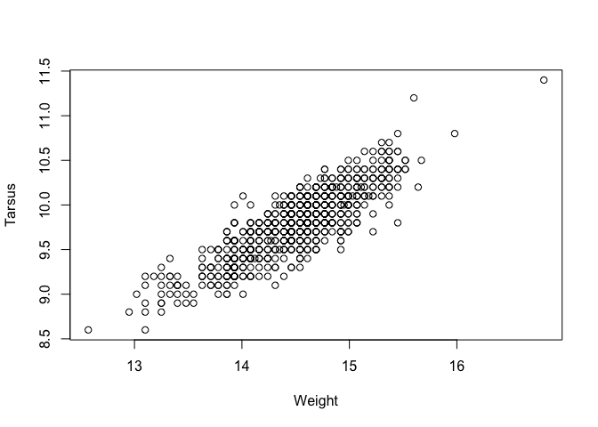
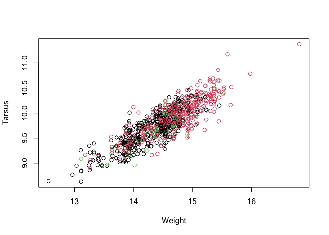
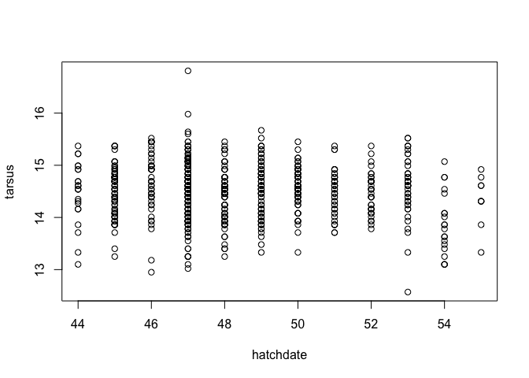
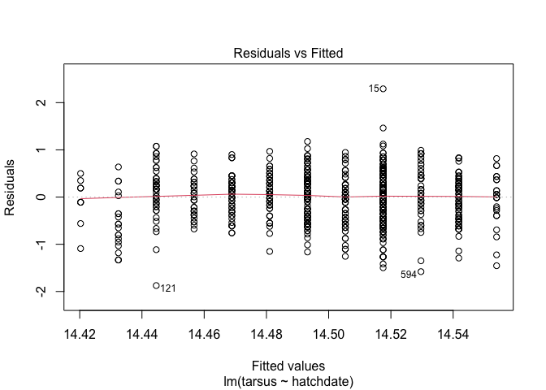
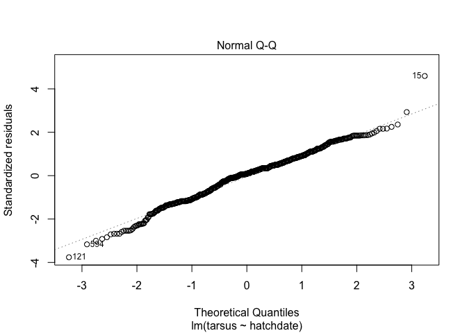
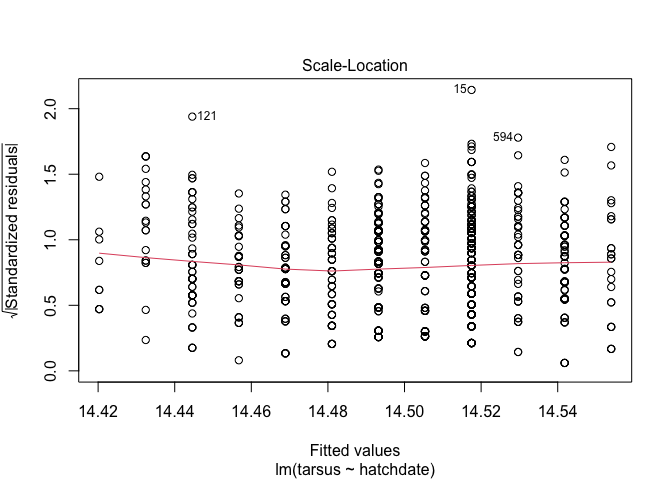
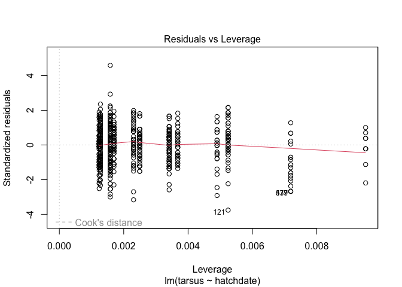
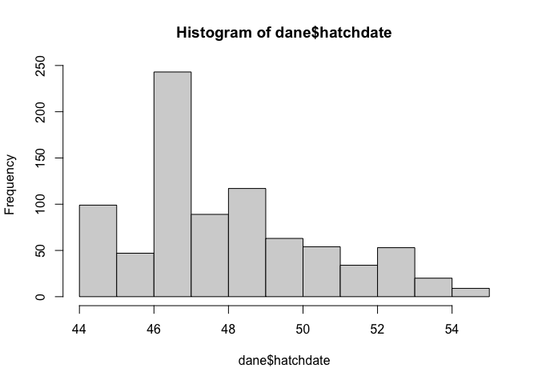
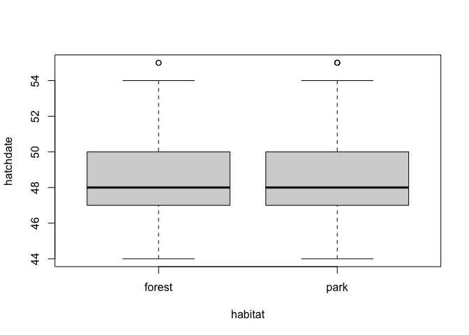
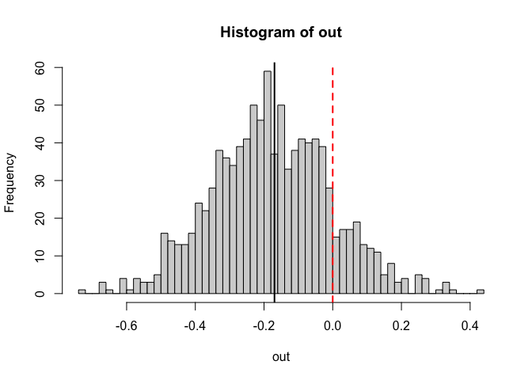

-   [Zanim zaczniemy](#zanim-zaczniemy)
    -   [0. Przydatne zasoby pomocowe w pracy z `R` - część
        druga](#0-przydatne-zasoby-pomocowe-w-pracy-z-r---część-druga)
-   [A. `tidyverse` oraz `dplyr` - “porządne
    dane”](#a-tidyverse-oraz-dplyr---porządne-dane)
    -   [1. Filtrowanie danych: `filter()`](#1-filtrowanie-danych-filter)
    -   [2. Sortowanie za pomocą
        `arrange()`](#2-sortowanie-za-pomocą-arrange)
    -   [3. Selekcja zmiennych dzięki
        `select()`](#3-selekcja-zmiennych-dzięki-select)
    -   [4. Tworzenie nowych zmiennych dzięki
        `mutate()`](#4-tworzenie-nowych-zmiennych-dzięki-mutate)
    -   [5. Grupowanie obserwacji przez
        `group_by()`](#5-grupowanie-obserwacji-przez-group_by)
    -   [6. Podsumowanie z `summarise()`](#6-podsumowanie-z-summarise)
    -   [7. Szerokie i długie zestawy
        danych](#7-szerokie-i-długie-zestawy-danych)
-   [B. Prosta statystyka](#b-prosta-statystyka)
    -   [1. Czy samce są większe od
        samic?](#1-czy-samce-są-większe-od-samic)
    -   [2. Czy samic lub samców jest więcej w lesie/w
        parku?](#2-czy-samic-lub-samców-jest-więcej-w-lesiew-parku)
    -   [3. Czy długość skoku zależy od daty wyklucia? Regresja
        prosta](#3-czy-długość-skoku-zależy-od-daty-wyklucia-regresja-prosta)
-   [C. Expressem przez
    *bootstrapping*](#c-expressem-przez-bootstrapping)

# Zanim zaczniemy

## 0. Przydatne zasoby pomocowe w pracy z `R` - część druga

-   [Podręcznik `tidyverse`](https://r4ds.had.co.nz/)
-   [`dplyr`
    cheat-sheet](https://raw.githubusercontent.com/rstudio/cheatsheets/main/data-transformation.pdf)
-   [Tidy data
    cheat-sheet](https://raw.githubusercontent.com/rstudio/cheatsheets/main/tidyr.pdf)
-   [Automatyzacja z
    `purrr`](https://raw.githubusercontent.com/rstudio/cheatsheets/main/purrr.pdf)
-   [Ściąga z obsługi dat i czasu w
    `lubridate`](https://raw.githubusercontent.com/rstudio/cheatsheets/main/lubridate.pdf)
-   [Podsumowania danych z
    `overvieR`](https://raw.githubusercontent.com/rstudio/cheatsheets/main/overviewR.pdf)
-   [Jak uczyć
    `R`?](https://raw.githubusercontent.com/rstudio/cheatsheets/main/teachR.pdf)
-   [Ściąga z podstawowych pojęć
    statystycznych](https://stanford.edu/~shervine/teaching/cme-106/cheatsheet-statistics)
-   [Wybór testu
    statystycznego](https://towardsdatascience.com/demystifying-statistical-analysis-1-a-handy-cheat-sheet-b6229bf992cf)
-   [Ściąga z wyrażeń
    regularnych](https://www.rexegg.com/regex-quickstart.html)

------------------------------------------------------------------------

# A. `tidyverse` oraz `dplyr` - “porządne dane”

Ekosystem `tidyverse` to niejako “państwo w państwie” - rodzaj dialektu
`R` w mocny sposób ingerujący w sposób, w jaki obsługiwane są pewne
stałe elementy języka. Podstawowa rola `tidyverse` to stworzenie
wspólnego i spójnego języka, w którym można opisywać standardowe
struktury danych (`tibble`, `dplyr`), automatyzować funkcje i działania
(`purrr`) oraz standardowo wizualizować dane w oparciu o gramatykę
grafiki (`ggplot2`).


## 1. Filtrowanie danych: `filter()`

Filtrowanie odbywa się za pomocą par `zmienna OPERATOR warunek` -
podobnie jak przy filtrowaniu za pomocą indeksów. `dplyr` upraszcza
wszystko pozwalając nam bezpośrednio odwoływać się do nazw zmiennych.

Przefiltrujmy `dane` tak, by wyświetlić tylko potomstwo matki nr.
*R187528*:

``` r
dane <- read.table(file = "BTdata.csv",
                   sep = ",", header = T,
                   stringsAsFactors = T)

filter(dane, dam == "R187528")
```

    ##   tarsus     back     dam fosternest hatchdate  sex weight habitat bill_length bill_depth
    ## 1  14.46 549.6392 R187528      A2602        45  Fem    9.7  forest      11.565      0.631
    ## 2  14.61 549.6629 R187528      A2602        45  Fem   10.0  forest      11.737      0.668
    ## 3  14.16 549.3603 R187528      A2602        45  Fem    9.4    park      11.378      0.583
    ## 4  14.08 552.7623 R187528      A2602        45  Fem    9.4  forest      11.261      0.603
    ## 5  14.08 552.5236 R187528      A2602        45  Fem    9.5    park      11.296      0.593
    ## 6  14.77 550.0366 R187528      A1302        45 Male   10.1    park      11.825      0.652
    ## 7  14.01 551.5308 R187528      A1302        45  Fem    9.7    park      11.225      0.631
    ## 8  15.07 549.1769 R187528      A1302        45 Male   10.1    park      12.100      0.684

Czy wszystkie młode wychowywały się w jednym gnieździe (`fosternest`)?

``` r
unique(filter(dane, dam == "R187528")$fosternest)
```

    ## [1] A2602 A1302
    ## 104 Levels: A1002 A102 A1202 A1302 A1602 A1802 A18B02 A2202 A22B02 A2302 A2502 A2602 A2702 A302 A502 A602 ... H702

Wybierzmy spośród tych piskląt tylko takie, których skok przekracza
14.50 mm, lub masa przekracza, lub jest równa, 9.5 g:

``` r
filter(dane, dam == "R187528" & (tarsus > 14.50 | weight >= 9.5))
```

    ##   tarsus     back     dam fosternest hatchdate  sex weight habitat bill_length bill_depth
    ## 1  14.46 549.6392 R187528      A2602        45  Fem    9.7  forest      11.565      0.631
    ## 2  14.61 549.6629 R187528      A2602        45  Fem   10.0  forest      11.737      0.668
    ## 3  14.08 552.5236 R187528      A2602        45  Fem    9.5    park      11.296      0.593
    ## 4  14.77 550.0366 R187528      A1302        45 Male   10.1    park      11.825      0.652
    ## 5  14.01 551.5308 R187528      A1302        45  Fem    9.7    park      11.225      0.631
    ## 6  15.07 549.1769 R187528      A1302        45 Male   10.1    park      12.100      0.684

**Zadanie** Wybierz wszystkie obserwacje, które są samicami i mają kolor
płaszcza (`back`) o dominancie barwnej 550 nm (w zaokrągleniu w dół do
liczb całkowitych; użyj `floor()`), oraz wykluły się (`hatchdate`) przed
dniem 45 (15 maja). Ile jest takich obserwacji?

**Spodziewany wynik**

    ##   tarsus     back     dam fosternest hatchdate sex weight habitat bill_length bill_depth
    ## 1  14.31 550.0810 R187517       C602        44 Fem    9.5    park      11.434      0.629
    ## 2  15.22 550.1262 R187517       C602        44 Fem   10.1    park      12.206      0.696
    ## 3  14.61 550.2081 R187517       C602        44 Fem    9.5  forest      11.698      0.644
    ## 4  14.54 550.1580 R187517       C602        44 Fem    9.8    park      11.620      0.573
    ## 5  14.99 550.6216 R187517      C2202        44 Fem   10.3    park      12.042      0.679
    ## 6  14.69 550.4395 R187398       C602        44 Fem   10.1  forest      11.801      0.638
    ## 7  14.99 550.3093 R187517      C2202        44 Fem   10.4    park      12.021      0.677

    ## [1] 7

**Zadanie** Zmodyfikuj powyższy filtr, by wyciągnąć samice o danej
dominancie barwnej *LUB* te wyklute przed 15 maja. Ile jest takich
obserwacji?

**Spodziewany wynik**

    ## [1] 90

◼

## 2. Sortowanie za pomocą `arrange()`

Posortujmy dane mające dominantę barwną 550 nm (jak wyżej) oraz wyklute
przed 15 maja wg długości skoku.

``` r
dane2 <- filter(dane, floor(back) == 550 & hatchdate < 45)
arrange(dane2, tarsus)
```

    ##    tarsus     back     dam fosternest hatchdate  sex weight habitat bill_length bill_depth
    ## 1   14.16 550.4797 R187398       C602        44 Male    9.6  forest      11.295      0.644
    ## 2   14.27 550.5134 R046108       C402        44  UNK    9.6  forest      11.403      0.598
    ## 3   14.31 550.0810 R187517       C602        44  Fem    9.5    park      11.434      0.629
    ## 4   14.54 550.1580 R187517       C602        44  Fem    9.8    park      11.620      0.573
    ## 5   14.54 550.2464 R187517      C2202        44 Male    9.8  forest      11.644      0.654
    ## 6   14.61 550.2081 R187517       C602        44  Fem    9.5  forest      11.698      0.644
    ## 7   14.61 550.2466 R187517      C2202        44 Male    9.8    park      11.623      0.622
    ## 8   14.69 550.4395 R187398       C602        44  Fem   10.1  forest      11.801      0.638
    ## 9   14.69 550.3631 R187398       C602        44 Male    9.8  forest      11.719      0.679
    ## 10  14.99 550.6216 R187517      C2202        44  Fem   10.3    park      12.042      0.679
    ## 11  14.99 550.3093 R187517      C2202        44  Fem   10.4    park      12.021      0.677
    ## 12  15.22 550.1262 R187517       C602        44  Fem   10.1    park      12.206      0.696

Zmodyfikujmy sortowanie tak, by uporządkowanie według długości skoku
odbywało się *w obrębie* każdej matki genetycznej (`dam`).

``` r
arrange(dane2, dam, tarsus)
```

    ##    tarsus     back     dam fosternest hatchdate  sex weight habitat bill_length bill_depth
    ## 1   14.27 550.5134 R046108       C402        44  UNK    9.6  forest      11.403      0.598
    ## 2   14.16 550.4797 R187398       C602        44 Male    9.6  forest      11.295      0.644
    ## 3   14.69 550.4395 R187398       C602        44  Fem   10.1  forest      11.801      0.638
    ## 4   14.69 550.3631 R187398       C602        44 Male    9.8  forest      11.719      0.679
    ## 5   14.31 550.0810 R187517       C602        44  Fem    9.5    park      11.434      0.629
    ## 6   14.54 550.1580 R187517       C602        44  Fem    9.8    park      11.620      0.573
    ## 7   14.54 550.2464 R187517      C2202        44 Male    9.8  forest      11.644      0.654
    ## 8   14.61 550.2081 R187517       C602        44  Fem    9.5  forest      11.698      0.644
    ## 9   14.61 550.2466 R187517      C2202        44 Male    9.8    park      11.623      0.622
    ## 10  14.99 550.6216 R187517      C2202        44  Fem   10.3    park      12.042      0.679
    ## 11  14.99 550.3093 R187517      C2202        44  Fem   10.4    park      12.021      0.677
    ## 12  15.22 550.1262 R187517       C602        44  Fem   10.1    park      12.206      0.696

**Zadanie** Posortuj cały zestaw danych według wagi ciała, a następnie
według gniazda fosternest. Alfabetycznie - jakie gniazda wypadają w
najniższej kategorii wagowej? (Spróbuj wyświetlić tylko pierwsze wiersze
posortowanego zestawu danych, reszty nie potrzebujesz - np. 10-20
pierwszych).

**Spodziewany efekt**

    ##    tarsus     back     dam fosternest hatchdate  sex weight habitat bill_length bill_depth
    ## 1   13.10 549.4057 R186912      B1102        54  Fem    8.6    park      10.467      0.584
    ## 2   12.57 551.1584 R186908      B1602        53  Fem    8.6    park      10.071      0.574
    ## 3   13.10 549.2661 R187539       A102        47  Fem    8.8  forest      10.416      0.573
    ## 4   13.25 548.5838 R186912      B1102        54  Fem    8.8    park      10.559      0.526
    ## 5   12.95 550.3171 R187523      E2002        46  Fem    8.8    park      10.332      0.517
    ## 6   13.10 551.0305 R046109       C402        44  Fem    8.9    park      10.448      0.587
    ## 7   13.25 550.9402 R187557      F1902        47 Male    8.9  forest      10.600      0.580
    ## 8   13.55 551.3757 R187557      F2102        47  Fem    8.9    park      10.885      0.597
    ## 9   13.40 549.0100 R187588      F2402        47  Fem    8.9    park      10.674      0.577
    ## 10  13.48 548.0596 K983388      H1302        48  Fem    8.9  forest      10.783      0.620
    ## 11  13.25 549.0567   Fem20      H1302        48  Fem    8.9  forest      10.558      0.548
    ## 12  13.40 549.0138 R187527      A1802        45  Fem    9.0    park      10.772      0.593
    ## 13  13.02 554.1662 R187562      A2302        47  Fem    9.0  forest      10.441      0.632
    ## 14  13.25 550.1252 R187562       A602        47  Fem    9.0    park      10.616      0.601
    ## 15  13.55 549.6995 R187902      B1102        54  UNK    9.0  forest      10.850      0.577
    ## 16  13.86 549.4298 R187595      C2402        48  Fem    9.0  forest      11.034      0.570
    ## 17  13.33 548.9120 R186907      E1002        53  Fem    9.0    park      10.648      0.600
    ## 18  13.86 548.7900 R187531      F1702        46  Fem    9.0  forest      11.106      0.599
    ## 19  13.48 550.5093 R187916      G1602        49  Fem    9.0    park      10.798      0.604
    ## 20  13.78 549.4879 R187931      G2202        49  Fem    9.0    park      11.008      0.647

**Zadanie** Zmodyfikuj powyższe wyszukiwanie zmieniając cechę na skok,
oraz sortując malejąco (użyj modyfikatora `desc` na zmiennej `tarsus`).

**Spodziewany wynik**

    ##    tarsus     back     dam fosternest hatchdate  sex weight habitat bill_length bill_depth
    ## 1   16.81 548.3708 R187545      D1002        47 Male   11.4    park      13.399      0.797
    ## 2   15.98 549.7797 R187537      A2702        47 Male   10.8    park      12.828      0.690
    ## 3   15.67 550.5012 R187914       G602        49 Male   10.5    park      12.535      0.711
    ## 4   15.64 550.5361 R187292      E1802        47 Male   10.2  forest      12.471      0.709
    ## 5   15.60 550.4936 R187155      F2402        47 Male   11.2    park      12.477      0.696
    ## 6   15.52 551.3060 R186908      B1602        53  UNK   10.4  forest      12.391      0.693
    ## 7   15.52 549.4172 R186908      B1702        53 Male   10.4    park      12.418      0.674
    ## 8   15.52 550.8471 R187030      C1302        46 Male   10.5  forest      12.403      0.697
    ## 9   15.52 551.7863 R187590       D202        49 Male   10.5  forest      12.394      0.725
    ## 10  15.45 548.3911 R187030      C1302        46  Fem   10.2  forest      12.348      0.675
    ## 11  15.45 549.9689 R187030      C1302        46 Male   10.6  forest      12.324      0.706
    ## 12  15.45 550.7465 R187927       D402        50 Male    9.8    park      12.298      0.671
    ## 13  15.45 551.0630 R187577      E1802        47 Male   10.4    park      12.358      0.682
    ## 14  15.45 550.6196 R187521      E2002        46 Male   10.4    park      12.345      0.624
    ## 15  15.45 549.8546 R187399       E402        47 Male   10.4    park      12.350      0.669
    ## 16  15.45 552.1680 R187531      F1702        46 Male   10.4  forest      12.378      0.669
    ## 17  15.45 549.6147 R187030      F1702        46 Male   10.6    park      12.424      0.675
    ## 18  15.45 548.6120 R187030      F1702        46 Male   10.3  forest      12.384      0.696
    ## 19  15.45 547.8379   Fem20      H1302        48 Male   10.8    park      12.389      0.728
    ## 20  15.37 549.5868 R187515      A1802        45 Male   10.5    park      12.289      0.633

◼

## 3. Selekcja zmiennych dzięki `select()`

`select()` pozwala wybierać pojedyncze kolumny z danych, albo za pomocą
ich pełnej nazwy albo za pomocą modyfikatorów dopasowujących kolumny do
zadanych warunków:

-   `starts_with()` - dopasowuje kolumna na podstawie początkowych
    znaków
-   `ends_with()` - podobnie, jak wyżej, ale dla znaków końcowych
-   `contains()` - dopasowuje na podstawie ciągu znaków zawartego gdzieś
    w nazwie kolumny
-   `matches()` - dopasowuje kolumny na podstawie wyrażenia regularnego
    (patrz linki na górze)

Wybierz z zestawu danych kolumny od 1 do 4 oraz 8 (we wszystkich
przykładach wyświetlamy pierwszych 20 wierszy za pomocą `head()`):

``` r
head(select(dane, 1:4, 8),
     20)
```

    ##    tarsus     back     dam fosternest habitat
    ## 1   13.55 551.3757 R187557      F2102    park
    ## 2   15.07 549.0884 R187559      F1902  forest
    ## 3   14.99 550.1739 R187568       A602  forest
    ## 4   14.69 550.3067 R187518      A1302  forest
    ## 5   14.46 549.6392 R187528      A2602  forest
    ## 6   13.93 551.8693 R187945      C2302  forest
    ## 7   13.93 549.4878    Fem3      C1902    park
    ## 8   15.45 548.3911 R187030      C1302  forest
    ## 9   14.31 550.0810 R187517       C602    park
    ## 10  14.46 549.8523 R187523      B2202  forest
    ## 11  14.99 547.7403 R186902      B1402  forest
    ## 12  14.08 548.9847 R187400      B1002    park
    ## 13  14.77 551.1920 R187932       B502    park
    ## 14  13.63 549.2743 R187582      D1202  forest
    ## 15  16.81 548.3708 R187545      D1002    park
    ## 16  14.24 551.1921 R187546       D902    park
    ## 17  14.92 551.5066 R187590       D202  forest
    ## 18  14.46 549.7494 R187548       E902    park
    ## 19  15.37 552.3874 R187594       E302  forest
    ## 20  13.40 549.0100 R187588      F2402    park

Wybierz kolumny zawierające pomiary strukturalne (skok oraz dwa pomiary
dzioba):

``` r
head(select(dane, tarsus, starts_with("bill")),
     20)
```

    ##    tarsus bill_length bill_depth
    ## 1   13.55      10.885      0.597
    ## 2   15.07      12.056      0.682
    ## 3   14.99      12.000      0.673
    ## 4   14.69      11.733      0.639
    ## 5   14.46      11.565      0.631
    ## 6   13.93      11.165      0.626
    ## 7   13.93      11.154      0.591
    ## 8   15.45      12.348      0.675
    ## 9   14.31      11.434      0.629
    ## 10  14.46      11.564      0.609
    ## 11  14.99      11.977      0.636
    ## 12  14.08      11.251      0.685
    ## 13  14.77      11.828      0.638
    ## 14  13.63      10.904      0.612
    ## 15  16.81      13.399      0.797
    ## 16  14.24      11.409      0.679
    ## 17  14.92      11.929      0.700
    ## 18  14.46      11.512      0.669
    ## 19  15.37      12.259      0.641
    ## 20  13.40      10.674      0.577

Przenieś kolumnę `hatchdate` na sam koniec tabeli:

``` r
head(select(dane, -hatchdate, everything(), hatchdate),
     20)
```

    ##    tarsus     back     dam fosternest  sex weight habitat bill_length bill_depth hatchdate
    ## 1   13.55 551.3757 R187557      F2102  Fem    8.9    park      10.885      0.597        47
    ## 2   15.07 549.0884 R187559      F1902 Male   10.5  forest      12.056      0.682        47
    ## 3   14.99 550.1739 R187568       A602 Male    9.9  forest      12.000      0.673        47
    ## 4   14.69 550.3067 R187518      A1302 Male    9.7  forest      11.733      0.639        45
    ## 5   14.46 549.6392 R187528      A2602  Fem    9.7  forest      11.565      0.631        45
    ## 6   13.93 551.8693 R187945      C2302  Fem    9.3  forest      11.165      0.626        49
    ## 7   13.93 549.4878    Fem3      C1902 Male    9.3    park      11.154      0.591        47
    ## 8   15.45 548.3911 R187030      C1302  Fem   10.2  forest      12.348      0.675        46
    ## 9   14.31 550.0810 R187517       C602  Fem    9.5    park      11.434      0.629        44
    ## 10  14.46 549.8523 R187523      B2202  Fem    9.6  forest      11.564      0.609        46
    ## 11  14.99 547.7403 R186902      B1402 Male   10.0  forest      11.977      0.636        52
    ## 12  14.08 548.9847 R187400      B1002  Fem    9.7    park      11.251      0.685        47
    ## 13  14.77 551.1920 R187932       B502 Male    9.9    park      11.828      0.638        49
    ## 14  13.63 549.2743 R187582      D1202 Male    9.2  forest      10.904      0.612        48
    ## 15  16.81 548.3708 R187545      D1002 Male   11.4    park      13.399      0.797        47
    ## 16  14.24 551.1921 R187546       D902  Fem    9.8    park      11.409      0.679        47
    ## 17  14.92 551.5066 R187590       D202  Fem   10.1  forest      11.929      0.700        49
    ## 18  14.46 549.7494 R187548       E902  Fem    9.6    park      11.512      0.669        48
    ## 19  15.37 552.3874 R187594       E302 Male   10.4  forest      12.259      0.641        49
    ## 20  13.40 549.0100 R187588      F2402  Fem    8.9    park      10.674      0.577        47

**Zadanie** Usuń z tabeli danych kolumny z pomiarami morfometrycznymi
(skok, waga, dziób).

**Spodziewany wynik**

    ##        back     dam fosternest hatchdate  sex weight habitat
    ## 1  551.3757 R187557      F2102        47  Fem    8.9    park
    ## 2  549.0884 R187559      F1902        47 Male   10.5  forest
    ## 3  550.1739 R187568       A602        47 Male    9.9  forest
    ## 4  550.3067 R187518      A1302        45 Male    9.7  forest
    ## 5  549.6392 R187528      A2602        45  Fem    9.7  forest
    ## 6  551.8693 R187945      C2302        49  Fem    9.3  forest
    ## 7  549.4878    Fem3      C1902        47 Male    9.3    park
    ## 8  548.3911 R187030      C1302        46  Fem   10.2  forest
    ## 9  550.0810 R187517       C602        44  Fem    9.5    park
    ## 10 549.8523 R187523      B2202        46  Fem    9.6  forest
    ## 11 547.7403 R186902      B1402        52 Male   10.0  forest
    ## 12 548.9847 R187400      B1002        47  Fem    9.7    park
    ## 13 551.1920 R187932       B502        49 Male    9.9    park
    ## 14 549.2743 R187582      D1202        48 Male    9.2  forest
    ## 15 548.3708 R187545      D1002        47 Male   11.4    park
    ## 16 551.1921 R187546       D902        47  Fem    9.8    park
    ## 17 551.5066 R187590       D202        49  Fem   10.1  forest
    ## 18 549.7494 R187548       E902        48  Fem    9.6    park
    ## 19 552.3874 R187594       E302        49 Male   10.4  forest
    ## 20 549.0100 R187588      F2402        47  Fem    8.9    park

**Zadanie** Pozostaw w tabeli tylko kolumny zawierające w nazwie
przynajmniej jedno “e”.

**Spodziewany wynik**

    ##    fosternest hatchdate  sex weight bill_length bill_depth
    ## 1       F2102        47  Fem    8.9      10.885      0.597
    ## 2       F1902        47 Male   10.5      12.056      0.682
    ## 3        A602        47 Male    9.9      12.000      0.673
    ## 4       A1302        45 Male    9.7      11.733      0.639
    ## 5       A2602        45  Fem    9.7      11.565      0.631
    ## 6       C2302        49  Fem    9.3      11.165      0.626
    ## 7       C1902        47 Male    9.3      11.154      0.591
    ## 8       C1302        46  Fem   10.2      12.348      0.675
    ## 9        C602        44  Fem    9.5      11.434      0.629
    ## 10      B2202        46  Fem    9.6      11.564      0.609
    ## 11      B1402        52 Male   10.0      11.977      0.636
    ## 12      B1002        47  Fem    9.7      11.251      0.685
    ## 13       B502        49 Male    9.9      11.828      0.638
    ## 14      D1202        48 Male    9.2      10.904      0.612
    ## 15      D1002        47 Male   11.4      13.399      0.797
    ## 16       D902        47  Fem    9.8      11.409      0.679
    ## 17       D202        49  Fem   10.1      11.929      0.700
    ## 18       E902        48  Fem    9.6      11.512      0.669
    ## 19       E302        49 Male   10.4      12.259      0.641
    ## 20      F2402        47  Fem    8.9      10.674      0.577

◼

## 4. Tworzenie nowych zmiennych dzięki `mutate()`

Stwórz zmienną *bill_ratio* będącą stosunkiem długości dzioba do jego
głębokości. Użyj do tego skróconego zestawu `dane2`, w którym
pozostawisz tylko kolumny morfometryczne oraz ID matki (`dam`) oraz
gniazdo (`fosternest`):

``` r
dane2 <- select(dane, dam, fosternest, tarsus, weight, starts_with("bill"))
head(mutate(dane2, bill_ratio = round(bill_length/bill_depth, 3)),
     20)
```

    ##        dam fosternest tarsus weight bill_length bill_depth bill_ratio
    ## 1  R187557      F2102  13.55    8.9      10.885      0.597     18.233
    ## 2  R187559      F1902  15.07   10.5      12.056      0.682     17.677
    ## 3  R187568       A602  14.99    9.9      12.000      0.673     17.831
    ## 4  R187518      A1302  14.69    9.7      11.733      0.639     18.362
    ## 5  R187528      A2602  14.46    9.7      11.565      0.631     18.328
    ## 6  R187945      C2302  13.93    9.3      11.165      0.626     17.835
    ## 7     Fem3      C1902  13.93    9.3      11.154      0.591     18.873
    ## 8  R187030      C1302  15.45   10.2      12.348      0.675     18.293
    ## 9  R187517       C602  14.31    9.5      11.434      0.629     18.178
    ## 10 R187523      B2202  14.46    9.6      11.564      0.609     18.989
    ## 11 R186902      B1402  14.99   10.0      11.977      0.636     18.832
    ## 12 R187400      B1002  14.08    9.7      11.251      0.685     16.425
    ## 13 R187932       B502  14.77    9.9      11.828      0.638     18.539
    ## 14 R187582      D1202  13.63    9.2      10.904      0.612     17.817
    ## 15 R187545      D1002  16.81   11.4      13.399      0.797     16.812
    ## 16 R187546       D902  14.24    9.8      11.409      0.679     16.803
    ## 17 R187590       D202  14.92   10.1      11.929      0.700     17.041
    ## 18 R187548       E902  14.46    9.6      11.512      0.669     17.208
    ## 19 R187594       E302  15.37   10.4      12.259      0.641     19.125
    ## 20 R187588      F2402  13.40    8.9      10.674      0.577     18.499

**Zadanie** Za pomocą funkcji `paste()` stwórz zmienną zawierającą
kombinację ID matki (`dam`) i gniazda wychowywania (`fosternest`).
Nazwij tą zmienną “crossfoster”.

**Spodziewany wynik**

    ##        dam fosternest tarsus weight bill_length bill_depth   crossfoster
    ## 1  R187557      F2102  13.55    8.9      10.885      0.597 R187557_F2102
    ## 2  R187559      F1902  15.07   10.5      12.056      0.682 R187559_F1902
    ## 3  R187568       A602  14.99    9.9      12.000      0.673  R187568_A602
    ## 4  R187518      A1302  14.69    9.7      11.733      0.639 R187518_A1302
    ## 5  R187528      A2602  14.46    9.7      11.565      0.631 R187528_A2602
    ## 6  R187945      C2302  13.93    9.3      11.165      0.626 R187945_C2302
    ## 7     Fem3      C1902  13.93    9.3      11.154      0.591    Fem3_C1902
    ## 8  R187030      C1302  15.45   10.2      12.348      0.675 R187030_C1302
    ## 9  R187517       C602  14.31    9.5      11.434      0.629  R187517_C602
    ## 10 R187523      B2202  14.46    9.6      11.564      0.609 R187523_B2202
    ## 11 R186902      B1402  14.99   10.0      11.977      0.636 R186902_B1402
    ## 12 R187400      B1002  14.08    9.7      11.251      0.685 R187400_B1002
    ## 13 R187932       B502  14.77    9.9      11.828      0.638  R187932_B502
    ## 14 R187582      D1202  13.63    9.2      10.904      0.612 R187582_D1202
    ## 15 R187545      D1002  16.81   11.4      13.399      0.797 R187545_D1002
    ## 16 R187546       D902  14.24    9.8      11.409      0.679  R187546_D902
    ## 17 R187590       D202  14.92   10.1      11.929      0.700  R187590_D202
    ## 18 R187548       E902  14.46    9.6      11.512      0.669  R187548_E902
    ## 19 R187594       E302  15.37   10.4      12.259      0.641  R187594_E302
    ## 20 R187588      F2402  13.40    8.9      10.674      0.577 R187588_F2402

◼

## 5. Grupowanie obserwacji przez `group_by()`

Grupowanie pozwala stworzyć w zestawie danych “podzbiory” traktowane
jako oddzielne pule przy liczeniu określonych podsumowań.

Porównaj taką operację:

``` r
head(mutate(dane2, mean_tars = mean(tarsus)),
     20)
```

    ##        dam fosternest tarsus weight bill_length bill_depth mean_tars
    ## 1  R187557      F2102  13.55    8.9      10.885      0.597   14.5005
    ## 2  R187559      F1902  15.07   10.5      12.056      0.682   14.5005
    ## 3  R187568       A602  14.99    9.9      12.000      0.673   14.5005
    ## 4  R187518      A1302  14.69    9.7      11.733      0.639   14.5005
    ## 5  R187528      A2602  14.46    9.7      11.565      0.631   14.5005
    ## 6  R187945      C2302  13.93    9.3      11.165      0.626   14.5005
    ## 7     Fem3      C1902  13.93    9.3      11.154      0.591   14.5005
    ## 8  R187030      C1302  15.45   10.2      12.348      0.675   14.5005
    ## 9  R187517       C602  14.31    9.5      11.434      0.629   14.5005
    ## 10 R187523      B2202  14.46    9.6      11.564      0.609   14.5005
    ## 11 R186902      B1402  14.99   10.0      11.977      0.636   14.5005
    ## 12 R187400      B1002  14.08    9.7      11.251      0.685   14.5005
    ## 13 R187932       B502  14.77    9.9      11.828      0.638   14.5005
    ## 14 R187582      D1202  13.63    9.2      10.904      0.612   14.5005
    ## 15 R187545      D1002  16.81   11.4      13.399      0.797   14.5005
    ## 16 R187546       D902  14.24    9.8      11.409      0.679   14.5005
    ## 17 R187590       D202  14.92   10.1      11.929      0.700   14.5005
    ## 18 R187548       E902  14.46    9.6      11.512      0.669   14.5005
    ## 19 R187594       E302  15.37   10.4      12.259      0.641   14.5005
    ## 20 R187588      F2402  13.40    8.9      10.674      0.577   14.5005

z taką:

``` r
dane3 <- group_by(dane2, dam)
head(mutate(dane3, mean_tars = mean(tarsus)),
     20)
```

    ## # A tibble: 20 × 7
    ## # Groups:   dam [20]
    ##    dam     fosternest tarsus weight bill_length bill_depth mean_tars
    ##    <fct>   <fct>       <dbl>  <dbl>       <dbl>      <dbl>     <dbl>
    ##  1 R187557 F2102        13.6    8.9        10.9      0.597      13.9
    ##  2 R187559 F1902        15.1   10.5        12.1      0.682      14.8
    ##  3 R187568 A602         15.0    9.9        12        0.673      14.3
    ##  4 R187518 A1302        14.7    9.7        11.7      0.639      14.5
    ##  5 R187528 A2602        14.5    9.7        11.6      0.631      14.4
    ##  6 R187945 C2302        13.9    9.3        11.2      0.626      14.7
    ##  7 Fem3    C1902        13.9    9.3        11.2      0.591      14.5
    ##  8 R187030 C1302        15.4   10.2        12.3      0.675      15.2
    ##  9 R187517 C602         14.3    9.5        11.4      0.629      14.8
    ## 10 R187523 B2202        14.5    9.6        11.6      0.609      14.2
    ## 11 R186902 B1402        15.0   10          12.0      0.636      14.2
    ## 12 R187400 B1002        14.1    9.7        11.3      0.685      14.7
    ## 13 R187932 B502         14.8    9.9        11.8      0.638      14.2
    ## 14 R187582 D1202        13.6    9.2        10.9      0.612      14.5
    ## 15 R187545 D1002        16.8   11.4        13.4      0.797      14.7
    ## 16 R187546 D902         14.2    9.8        11.4      0.679      14.6
    ## 17 R187590 D202         14.9   10.1        11.9      0.7        15.0
    ## 18 R187548 E902         14.5    9.6        11.5      0.669      14.2
    ## 19 R187594 E302         15.4   10.4        12.3      0.641      14.7
    ## 20 R187588 F2402        13.4    8.9        10.7      0.577      14.3

Aby lepiej zobaczyć co właściwie się tutaj stało - posortujmy wynikową
tabelę wg ID matki:

``` r
dane3 <- group_by(dane2, dam)
dane3 <- mutate(dane3, mean_tars = mean(tarsus))
arrange(dane3, dam)
```

    ## # A tibble: 828 × 7
    ## # Groups:   dam [106]
    ##    dam   fosternest tarsus weight bill_length bill_depth mean_tars
    ##    <fct> <fct>       <dbl>  <dbl>       <dbl>      <dbl>     <dbl>
    ##  1 Fem2  H702         14.5   10          11.6      0.645      14.4
    ##  2 Fem2  H702         13.8    9.5        11.1      0.619      14.4
    ##  3 Fem2  A18B02       14.4    9.5        11.5      0.634      14.4
    ##  4 Fem2  A18B02       14.7    9.5        11.8      0.658      14.4
    ##  5 Fem2  A18B02       14.8    9.8        11.8      0.607      14.4
    ##  6 Fem20 H1102        13.9    9.4        11.1      0.567      14.5
    ##  7 Fem20 H1102        14.5    9.9        11.6      0.665      14.5
    ##  8 Fem20 H1102        14.8    9.9        11.9      0.643      14.5
    ##  9 Fem20 H1102        14.1    9.4        11.2      0.591      14.5
    ## 10 Fem20 H1102        14.6    9.8        11.7      0.643      14.5
    ## # … with 818 more rows

Czy zauważyłeś zmianę tabeli danych na nowy typ obiektu zwany `tibble`?

Wykonanie powyższej serii operacji bardzo ułatwia użycie tzw. operatora
**pipe**, pozwalającego łączyć dłuższe ciągi operacji w jeden spójny
“potok”:

``` r
group_by(dane2, dam) %>%
  mutate(mean_tars = mean(tarsus)) %>%
  arrange(dam)
```

    ## # A tibble: 828 × 7
    ## # Groups:   dam [106]
    ##    dam   fosternest tarsus weight bill_length bill_depth mean_tars
    ##    <fct> <fct>       <dbl>  <dbl>       <dbl>      <dbl>     <dbl>
    ##  1 Fem2  H702         14.5   10          11.6      0.645      14.4
    ##  2 Fem2  H702         13.8    9.5        11.1      0.619      14.4
    ##  3 Fem2  A18B02       14.4    9.5        11.5      0.634      14.4
    ##  4 Fem2  A18B02       14.7    9.5        11.8      0.658      14.4
    ##  5 Fem2  A18B02       14.8    9.8        11.8      0.607      14.4
    ##  6 Fem20 H1102        13.9    9.4        11.1      0.567      14.5
    ##  7 Fem20 H1102        14.5    9.9        11.6      0.665      14.5
    ##  8 Fem20 H1102        14.8    9.9        11.9      0.643      14.5
    ##  9 Fem20 H1102        14.1    9.4        11.2      0.591      14.5
    ## 10 Fem20 H1102        14.6    9.8        11.7      0.643      14.5
    ## # … with 818 more rows

**Zadanie** Korzystając z operatora `%>%` zmodyfikuj powyższy ciąg tak,
by na końcu powstała tabela o następujących właściwościach:

1.  grupowanie ze względu na `fosternest`;
2.  obliczenie średniej wagi piskląt w obrębie każdego gniazda
    wychowywania;
3.  usunięcie z tabeli zmiennych niepotrzebnych (cechy dzioba)
4.  obliczenie stosunku wagi średniej w danym gnieździe do średniej wagi
    w całej populacji. (*Uwaga!* Ten etap wymaga usunięcia grupowania za
    pomocą funkcji `ungroup()`)

Aby wyświetlić więcej niż 10 wierszy tabeli dodaj do potoku funkcji
`print()` z opcją `n = 30` (jeśli chcesz wyświetlić 30 wierszy).
Dlaczego w trakcie obliczeń musimy zastosować `ungroup()`? Co się
stanie, jeśli tego nie zrobimy?

**Spodziewany wynik**

    ## # A tibble: 828 × 6
    ##    dam     fosternest tarsus weight mean_weight mean_ratio
    ##    <fct>   <fct>       <dbl>  <dbl>       <dbl>      <dbl>
    ##  1 R187537 A1002        14.7   10          9.64      0.985
    ##  2 R187537 A1002        14.8    9.8        9.64      0.985
    ##  3 R187537 A1002        14.9    9.7        9.64      0.985
    ##  4 R187537 A1002        14.5    9.6        9.64      0.985
    ##  5 R187563 A1002        13.2    9.3        9.64      0.985
    ##  6 R187563 A1002        13.6    9.2        9.64      0.985
    ##  7 R187563 A1002        14.0    9.2        9.64      0.985
    ##  8 R187563 A1002        14.7   10.1        9.64      0.985
    ##  9 R187563 A1002        14.4    9.9        9.64      0.985
    ## 10 R187539 A102         14.2    9.8        9.67      0.987
    ## 11 R187539 A102         14.1    9.5        9.67      0.987
    ## 12 R187539 A102         15.1   10.1        9.67      0.987
    ## 13 R187539 A102         13.1    8.8        9.67      0.987
    ## 14 R187566 A102         14.6    9.4        9.67      0.987
    ## 15 R187566 A102         14.7    9.9        9.67      0.987
    ## 16 R187566 A102         14.4    9.6        9.67      0.987
    ## 17 R187566 A102         14.5    9.8        9.67      0.987
    ## 18 R187566 A102         15.1   10.1        9.67      0.987
    ## 19 R186910 A1202        14.5   10.2        9.7       0.991
    ## 20 R186910 A1202        13.5    9.1        9.7       0.991
    ## 21 R186910 A1202        14.8   10.4        9.7       0.991
    ## 22 R186910 A1202        14.1    9.2        9.7       0.991
    ## 23 R186910 A1202        15.1   10.3        9.7       0.991
    ## 24 R186910 A1202        14.1    9.5        9.7       0.991
    ## 25 R186910 A1202        13.9    9.2        9.7       0.991
    ## 26 R187518 A1302        14.7    9.7        9.84      1.00 
    ## 27 R187518 A1302        14.8   10.1        9.84      1.00 
    ## 28 R187518 A1302        14.1    9.4        9.84      1.00 
    ## 29 R187518 A1302        14.6    9.9        9.84      1.00 
    ## 30 R187518 A1302        14.1    9.7        9.84      1.00 
    ## # … with 798 more rows

◼

## 6. Podsumowanie z `summarise()`

Przefiltruj `dane` tak, by zostały w nich tylko ptaki ze znaną płcią
(`sex == "Male"` lub `sex == "Fem"`) i podsumuj je wyliczając dla
obserwacji średnią długość skoku, liczbę obserwacji oraz błąd
standardowy skoku (liczony jako *SD/sqrt(N)*):

``` r
dane %>%
  filter(sex != "UNK") %>%
  summarise(mean_t = mean(tarsus),
            N = n(),
            se_t = sd(tarsus)/sqrt(n()))
```

    ##     mean_t   N       se_t
    ## 1 14.50553 781 0.01797891

**Zadanie** Powtórz powyższe obliczenia, ale dla ptaków w każdej
możliwej kombinacji `sex` oraz `habitat` (tzn. samce w lesie, samce w
parku, etc.)

**Spodziewany wynik**

    ## `summarise()` has grouped output by 'sex'. You can override using the `.groups` argument.

    ## # A tibble: 4 × 5
    ## # Groups:   sex [2]
    ##   sex   habitat mean_t     N   se_t
    ##   <fct> <fct>    <dbl> <int>  <dbl>
    ## 1 Fem   forest    14.3   188 0.0334
    ## 2 Fem   park      14.3   185 0.0343
    ## 3 Male  forest    14.7   205 0.0325
    ## 4 Male  park      14.7   203 0.0325

◼

## 7. Szerokie i długie zestawy danych

Oryginalny zestaw `dane` jest typu “długiego”: każda obserwacja to jeden
osobnik, a zmienne kategoryczne zajmują po jednej kolumnie zawierającej
przypisania każdego osobnika do określonej kategorii. Często jednak
dane, które dostajemy są typu “szerokiego” (np. grupy eksperymentalne
czy płcie znajdują się w osobnych kolumnach). Między tymi dwoma typami
danych można sprawnie się przemieszczać za pomocą funkcji
`pivot_wider()` i `pivot_longer()`.

By dowiedzieć się o nich nieco więcej - zajrzyj tutaj:

``` r
vignette("pivot")
```

Stwórzmy przykładowy zestaw danych zawierający średnie ciężary piskląt i
ich wariancje według płci, pogrupowane według `fosternest`:

``` r
dane_l <- dane %>%
  filter(sex != "UNK") %>%
  group_by(fosternest, sex) %>%
  summarise(mean_w = mean(weight), var_w = var(weight))
```

    ## `summarise()` has grouped output by 'fosternest'. You can override using the `.groups` argument.

Taki zestaw danych w formie długiej możemy przerobić na szeroki tworząc
osobne kolumny dla samców i samic w danym gnieździe.

``` r
dane_l %>%
  pivot_wider(names_from = sex, values_from = mean_w)
```

    ## # A tibble: 201 × 4
    ## # Groups:   fosternest [104]
    ##    fosternest   var_w   Fem  Male
    ##    <fct>        <dbl> <dbl> <dbl>
    ##  1 A1002      0.139    9.57 NA   
    ##  2 A1002      0.07    NA     9.8 
    ##  3 A102       0.249    9.48 NA   
    ##  4 A102       0.0770  NA     9.82
    ##  5 A1202      0.0433   9.27 NA   
    ##  6 A1202      0.00500 NA    10.4 
    ##  7 A1302      0        9.7  NA   
    ##  8 A1302      0.0817  NA     9.88
    ##  9 A1602      0.0960   9.5  NA   
    ## 10 A1602      0.180   NA     9.7 
    ## # … with 191 more rows

Powyższa komenda nie zadziałała tak, jak chcemy, bo pozostawiliśmy w
danych kolumnę z wariancją, zawierającą unikatowe wpisy “dublujące”
wiersze z każdym `fosternest`. Musimy albo się tej kolumny pozbyć, albo
też uwzględnić ją w `pivot_wider`:

``` r
dane_l %>%
  select(-var_w) %>%
  pivot_wider(names_from = sex, values_from = mean_w)
```

    ## # A tibble: 104 × 3
    ## # Groups:   fosternest [104]
    ##    fosternest   Fem  Male
    ##    <fct>      <dbl> <dbl>
    ##  1 A1002       9.57  9.8 
    ##  2 A102        9.48  9.82
    ##  3 A1202       9.27 10.4 
    ##  4 A1302       9.7   9.88
    ##  5 A1602       9.5   9.7 
    ##  6 A1802       9.6   9.95
    ##  7 A18B02     10     9.72
    ##  8 A2202       9.48 10   
    ##  9 A22B02      9.33  9.48
    ## 10 A2302       9.57  9.7 
    ## # … with 94 more rows

``` r
dane_l %>%
  pivot_wider(names_from = sex, values_from = c(mean_w, var_w))
```

    ## # A tibble: 104 × 5
    ## # Groups:   fosternest [104]
    ##    fosternest mean_w_Fem mean_w_Male var_w_Fem var_w_Male
    ##    <fct>           <dbl>       <dbl>     <dbl>      <dbl>
    ##  1 A1002            9.57        9.8     0.139     0.07   
    ##  2 A102             9.48        9.82    0.249     0.0770 
    ##  3 A1202            9.27       10.4     0.0433    0.00500
    ##  4 A1302            9.7         9.88    0         0.0817 
    ##  5 A1602            9.5         9.7     0.0960    0.180  
    ##  6 A1802            9.6         9.95    0.260     0.605  
    ##  7 A18B02          10           9.72    0.0200    0.0870 
    ##  8 A2202            9.48       10       0.192     0.167  
    ##  9 A22B02           9.33        9.48    0.0233    0.0692 
    ## 10 A2302            9.57        9.7     0.171     0.07   
    ## # … with 94 more rows

Zapiszmy dane w nowym obiekcie `dane_w`.

``` r
dane_w <- dane_l %>%
  select(-var_w) %>%
  pivot_wider(names_from = sex, values_from = mean_w)
```

**Zadanie** Spróbuj odwrócić działanie zamieniając “szeroki” styl danych
na “długi” - korzystając z funkcji `pivot_longer()`. Nazwij zmienną
“płeć” `animal_sex`, a zmienną z ciężarem ciała - ’body_weight\`.

**Spodziewany wynik**

    ## # A tibble: 208 × 3
    ## # Groups:   fosternest [104]
    ##    fosternest animal_sex body_weight
    ##    <fct>      <chr>            <dbl>
    ##  1 A1002      Fem               9.57
    ##  2 A1002      Male              9.8 
    ##  3 A102       Fem               9.48
    ##  4 A102       Male              9.82
    ##  5 A1202      Fem               9.27
    ##  6 A1202      Male             10.4 
    ##  7 A1302      Fem               9.7 
    ##  8 A1302      Male              9.88
    ##  9 A1602      Fem               9.5 
    ## 10 A1602      Male              9.7 
    ## # … with 198 more rows

# B. Prosta statystyka

## 1. Czy samce są większe od samic?

W `R` proste testy statystyczne wykonujemy za pomocą serii funkcji z
rodziny `__.test` - np. takich:

| Funkcja          | Test                  | Zastosowanie                                              |
|------------------|-----------------------|-----------------------------------------------------------|
| `t.test()`       | test *t*-Studenta     | porównywanie średnich                                     |
| `var.test()`     | test *F*              | porównywanie wariancji (zmienności)                       |
| `cor.test()`     | test korelacji        | testowanie siły związku między zmiennymi                  |
| `chisq.test()`   | test *χ*<sup>2</sup>  | testowanie zmiennych kategorycznych i tabel wielopolowych |
| `kruskal.test()` | test Kruskall-Wallisa | nieparametryczne porównywanie grup                        |
| `wilcox.test`    | test Wilcoxona        | nieparametryczny test par wiązanych                       |

Sprawdźmy za pomocą testu korelacji czy waga piskląt związana jest
istotnie z ich długością skoku. Jaka jest: wartość *p* testu, obliczona
korelacja i jej 95% przedział ufności? Czy odrzucasz hipotezę zerową?
Jaka ona jest?

``` r
test1 <- cor.test(dane$tarsus, dane$weight)
test1
```

    ## 
    ##  Pearson's product-moment correlation
    ## 
    ## data:  dane$tarsus and dane$weight
    ## t = 48.044, df = 826, p-value < 2.2e-16
    ## alternative hypothesis: true correlation is not equal to 0
    ## 95 percent confidence interval:
    ##  0.8391000 0.8751343
    ## sample estimates:
    ##       cor 
    ## 0.8581706

``` r
test1$p.value
```

    ## [1] 2.096071e-241

Prosty wykres rozrzutu dobrze obrazuje otrzymany wynik:

``` r
plot(dane$tarsus, dane$weight,
     xlab = "Weight", ylab = "Tarsus")
```

<!-- -->

**Zadanie** Wiedząc, że opcja wykresu `col` może m.in. przyjmować
wartości będące zmiennymi kategorycznymi - jak spróbujesz dodać do
wykresy informację o płci, zmieniającą kolor obserwacji w zależności od
płci? **Wskazówka** Zamiast `dane$zmienna` - użyj
`jitter(dane$zmienna, 3)`.

**Sugerowany wynik**

<!-- -->

**Zadanie** Z wykresu jasno wynika, że samce powinny być większe od
samic pod względem zarówno masy, jak i skoku. Przetestujmy tą różnicę za
pomocą testu *t*-Studenta. Wykonaj go ekstrahując z danych skok samic, a
potem samców (za pomocą funkcji `subset()`, lub w inny znany Ci sposób).
Dla przypomnienia: `subset(dane, habitat == "forest")$weight` pozwoliłby
wyciągnąć z danych wagi ptaków żyjących w lesie. Wykonaj go w podobny
sposób, jak `cor.test()`. Jaka jest Twoja decyzja: odrzucasz czy
przyjmujesz hipotezę zerową o braku różnic między płciami?

**Sugerowany wynik**

    ## 
    ##  Welch Two Sample t-test
    ## 
    ## data:  subset(dane, sex == "Male")$tarsus and subset(dane, sex == "Fem")$tarsus
    ## t = 11.759, df = 773.68, p-value < 2.2e-16
    ## alternative hypothesis: true difference in means is not equal to 0
    ## 95 percent confidence interval:
    ##  0.3250593 0.4553372
    ## sample estimates:
    ## mean of x mean of y 
    ##  14.69189  14.30169

W przypadku danych w formacie “długim” posługiwanie się funkcją
`t.test()` jest znacznie łatwiejsze w konwencji tzw. formuły. *Formuła*
to rodzaj wyrażenia matematycznego, które pozwala zapisać zależności
istniejące między zmienną/zmiennymi zależną/zależnymi i
niezależną/niezależnymi. W przypadku prostej zależności, gdzie mamy
jedną zmienną zależną `y` (np. skok) i jedną zmienną niezależną `x` (np.
płeć) - formułę możemy zapisać jako `y ~ x`.

**Zadanie** Powtórz powyższy test *t*-Studenta używają notacji formuły
zamiast dwóch osobnych wektorów zawierających dane samic i samców. Aby
konwencja ta zadziałała będziesz potrzebować wyrażenia opisującego
zależność skoku od płci (`tarsus ~ sex`) oraz dodatkowej opcji `data` w
`t.test()` wskazującej na to z jakiego obiektu pochodzą dane (zajrzyj do
`?t.test()` w razie wątpliwości). **Uwaga!** W dalszym ciągu musisz
usunąć z danych obserwacje `sex == "UNK"` - w teście *t*-Studenta możemy
porównywać tylko 2 grupy.

**Sugerowany wynik**

    ## 
    ##  Welch Two Sample t-test
    ## 
    ## data:  tarsus by sex
    ## t = -11.759, df = 773.68, p-value < 2.2e-16
    ## alternative hypothesis: true difference in means between group Fem and group Male is not equal to 0
    ## 95 percent confidence interval:
    ##  -0.4553372 -0.3250593
    ## sample estimates:
    ##  mean in group Fem mean in group Male 
    ##           14.30169           14.69189

**Zadanie** Przeprowadzany test *t*-Studenta zakłada, że wariancje
porównywanych grupo są różne. Przeprowadzając test funkcją `var.test()`
zweryfikuj to założenie, testując hipotezę zerową, że wariancje są
równe. Składnia testu jest bardzo podobna do tej użytej powyżej z
wykorzystaniem formuły.

**Sugerowany wynik**

    ## 
    ##  F test to compare two variances
    ## 
    ## data:  tarsus by sex
    ## F = 0.98626, num df = 372, denom df = 407, p-value = 0.8928
    ## alternative hypothesis: true ratio of variances is not equal to 1
    ## 95 percent confidence interval:
    ##  0.808562 1.204097
    ## sample estimates:
    ## ratio of variances 
    ##          0.9862598

◼

## 2. Czy samic lub samców jest więcej w lesie/w parku?

Aby odpowiedzieć na to pytanie - potrzebujemy podsumowania zliczającego
samce i samice w dwóch rodzajach siedliska. Najłatwiej uzyskać takie
podsumowanie stosując funkcję `table()`:

``` r
dane2 <- filter(dane, sex != "UNK") %>% gdata::drop.levels()
sex_hab <- table(dane2$sex, dane2$habitat)
sex_hab
```

    ##       
    ##        forest park
    ##   Fem     188  185
    ##   Male    205  203

**Zadanie** Wiedząc, że funkcja `chisq.test` potrafi jako jeden z
argumentów przyjmować całą tabelę wielopolową - przeprowadź test
chi-kwadrat hipotezy badającej zależność występowania ptaków w 2
siedliskach w zależności od płci. Czy zależność ta jest istotna? Co
znajduje się w zbiorze `stdres` powstałego obiektu?

**Spodziewany wynik**

    ## 
    ##  Pearson's Chi-squared test with Yates' continuity correction
    ## 
    ## data:  sex_hab
    ## X-squared = 0, df = 1, p-value = 1

    ##       
    ##             forest        park
    ##   Fem   0.04384568 -0.04384568
    ##   Male -0.04384568  0.04384568

◼

## 3. Czy długość skoku zależy od daty wyklucia? Regresja prosta

Sprawdźmy to najpierw wizualnie:

``` r
plot(tarsus ~ hatchdate, data = dane)
```

<!-- -->

Nie wygląda to na zbyt silną zależność - możemy jednak sprawdzić to
formalnie za pomocą modelu liniowego w najprostszej jego wersji. Model
liniowy, jaki będziemy testować wygląda następująco:

*y*<sub>*i*</sub> = *a* + *b**x*<sub>*i*</sub> + *e*<sub>*i*</sub>
czyli

*t**a**r**s**u**s*<sub>*i*</sub> = *a* + *b* \* *h**a**t**c**h**d**a**t**e*<sub>*i*</sub> + *e*<sub>*i*</sub>
Do jego obliczenia służy funkcja `lm()` (**l**inear **m**odel) - co
zaskakujące przyjmuje ona argumenty w sposób bardzo podobny do np.
`t.test()` (korzystając z konwencji formuły).

**Zadanie** Stosując analogię wywołania funkcji `t.test()`, użyj `lm()`
by przetestować zależność długości skoku sikory modrej od daty klucia
(`tarsus ~ hatchdate`). W pierwszym kroku stwórz obiekt `model`
zawierający wynik działania funkcji `lm()`. W drugim kroku użyj
`summary()` by podejrzeć wynik działania obliczeń.

**Sugerowany wynik**

    ## 
    ## Call:
    ## lm(formula = tarsus ~ hatchdate, data = dane)
    ## 
    ## Residuals:
    ##     Min      1Q  Median      3Q     Max 
    ## -1.8746 -0.3471  0.0468  0.3011  2.2925 
    ## 
    ## Coefficients:
    ##             Estimate Std. Error t value Pr(>|t|)    
    ## (Intercept) 15.08869    0.33443  45.117   <2e-16 ***
    ## hatchdate   -0.01215    0.00690  -1.761   0.0786 .  
    ## ---
    ## Signif. codes:  0 '***' 0.001 '**' 0.01 '*' 0.05 '.' 0.1 ' ' 1
    ## 
    ## Residual standard error: 0.4996 on 826 degrees of freedom
    ## Multiple R-squared:  0.003741,   Adjusted R-squared:  0.002535 
    ## F-statistic: 3.102 on 1 and 826 DF,  p-value: 0.07858

Przyjrzyj się wykresom, które powstają dzięki wywołaniu funkcji

``` r
plot(model)
```

<!-- --><!-- --><!-- --><!-- -->

Pozwalają one ocenić, czy nasz model statystyczny spełnia założenia
regresji prostej. Który z wykresów najlepiej oddaje test wizualny
założenia zakładającego normalność wartości resztkowych modelu?

◼

# C. Expressem przez *bootstrapping*

Do tej pory do naszych analiz wykorzystywaliśmy metody parametryczne -
możemy jednak spróbować wykorzystać inną, prostszą metodę, która pozwoli
nam uwolnić się od ograniczeń rozkładowych naszych danych. Spójrzmy na
przykład na rozkład zmiennej `hatchdate` - nie jest on najpiękniejszy i
na pierwszy rzut oka nie przypomina on zgrabnego rozkładu normalnego:

``` r
hist(dane$hatchdate, 15)
```

<!-- -->

Spróbujmy skonstruować test oparty na bootstrappingu, którym sprawdzimy
czy ptaki z lasu (`forest`) różnią się pod kątem daty klucia od ptaków z
parków (`park`). Szybki rzut oka na wykres pudełkowy nie wskazuje na
zbyt wielkie różnice.

``` r
plot(hatchdate ~ habitat, data = dane)
```

<!-- -->

1.  Do skonstruowania bootstrappingu wykorzystamy pętlę `for`, która
    pozwala powtarzać jakąś operację wiele razy. Jeśli chcielibyśmy np.
    wydrukować na ekranie (`print()`) jakiś tekst pięć razy - moglibyśmy
    osiągnąć to w następujący sposób:

``` r
for(i in 1:5) {
  print("Tekst najbardziej oryginalny!")
}
```

    ## [1] "Tekst najbardziej oryginalny!"
    ## [1] "Tekst najbardziej oryginalny!"
    ## [1] "Tekst najbardziej oryginalny!"
    ## [1] "Tekst najbardziej oryginalny!"
    ## [1] "Tekst najbardziej oryginalny!"

Zauważ, że pętla for wykorzystuje jakąś zmienną (tutaj `i`), zmieniając
jej wartość w zadanym zakresie (tutaj `1:5`) i za każdym razem (dla
każ∂ego `i`) wykonując jakieś działania ujęte wewnątrz `{}`.

2.  Potrzebna nam będzie również metoda losowego wybierania pewnych
    wierszy z naszych oryginalnych danych - ze zwracaniem. Idealnie do
    tego nadaje się funkcja `sample()`. Zobaczmy, jak losuje ona zadaną
    liczbę wartości (10) z podanej listy (liczby 1 do 20), ze zwracaniem
    (`replace = T`):

``` r
sample(1:20, size = 10, replace = T)
```

    ##  [1]  4 10 16  3  1  3  9 14 17 14

**Uwaga!** Funkcja ta używa generatora liczb pseudolosowych - więc u
każdego wynik tej operacji będzie inny!

3.  Wreszcie - musimy mieć naszą statystykę testową. Niech będzie nią
    różnica między średnią datą klucia w sikor leśnych i parkowych
    *d*<sub>0</sub> - jeśli wynosi ona zero, ptaki mają identyczne daty
    klucia:

``` r
d0 <- mean(filter(dane, habitat == "forest")$hatchdate) -
  mean(filter(dane, habitat == "park")$hatchdate)
d0
```

    ## [1] -0.1695764

Ujemna różnica wskazuje na nieco wyższą wartość (późniejsze klucie) w
parku - pytanie, czy istotnie późniejsze?

Oto co powinna robić nasza procedura bootstrappingu:

-   Krok 1: wylosuj z zestawu danych k = 828 obserwacji (wierszy) ze
    zwracaniem (tyle wierszy składa się na oryginalny zestaw danych).
-   Krok 2: dla każdego z tych wylosowanych zestawów policz jego własną
    statystykę `d` - różnicę w średniej dacie klucia między lasem i
    parkiem.
-   Krok 3: Powtórz całą procedurę N = 1000 razy (jest to arbitralna
    wielkość, im więcej - tym lepiej). Za każdym razem zapisz wynik do
    zbiorczego obiekty `out`.
-   Krok 4: Skonstruuj rozkład statystyki `d` i zobacz gdzie wypada w
    niej jej oryginalna (oparta na wejściowych danych) wartość `d0`.

``` r
N <- 1000 # liczba zakładanych powtórzeń
k <- nrow(dane) # wielkość oryginalnego zbioru danych

# oryginalna statystyka testowa
d0 <- mean(filter(dane, habitat == "forest")$hatchdate) -
  mean(filter(dane, habitat == "park")$hatchdate)

# obiekt wynikowy przygotowany na N=1000 końcowych wartości
out <- numeric(N)

for(i in 1:N) {
  
  # losujemy 828 wierszy, ze zwracaniem
  # a oryginalnej puli unikatowych 828 wierszy danych
  rows <- sample(1:k, size = k, replace = T)
  
  # tworzymy tymczasowe dane wewnątrz pętli
  # zawierające tylko wylosowane wiersze
  temp_dane <- dane[rows, ]
  
  # oblicza na podstawie tak przygotowanych danych
  # tymczasową statystykę testową dla powtórzenia
  # nr i pętli
  d_temp <- mean(filter(temp_dane, habitat == "forest")$hatchdate) -
    mean(filter(temp_dane, habitat == "park")$hatchdate)
  
  # zapisujemy wyliczoną statystykę
  # do zmiennej out w miejscu i
  out[i] <- d_temp
  
}
```

Wyświetlmy rozkład symulowanej statystyki `d` oraz położenie `d0` na
rozkładzie:

``` r
hist(out, 50)
abline(v = d0, lwd = 2)
abline(v = 0, col = "red", lwd = 2, lty = 2)
```

<!-- -->

Jak podejdziesz to odpowiedzi na pytanie - czy ta symulacja wskazuje na
istotną statystycznie różnicę między symulowaną statystyką a wartością
zero?
