-   [Zanim zaczniemy](#zanim-zaczniemy)
    -   [0. Przydatne zasoby pomocowe w pracy z `R` - część
        trzecia](#0-przydatne-zasoby-pomocowe-w-pracy-z-r---część-trzecia)
-   [A. Regresja, ANOVA + ANCOVA](#a-regresja-anova-ancova)
    -   [1. Regresja wielokrotna](#1-regresja-wielokrotna)
    -   [2. Regresja wielokrotna *via* seleckja
        modeli](#2-regresja-wielokrotna-via-seleckja-modeli)
    -   [3. ANOVA](#3-anova)
-   [B. Model uogólniony](#b-model-uogólniony)
    -   [1. Regresja logistyczna - GLM](#1-regresja-logistyczna---glm)
-   [C. Model mieszany](#c-model-mieszany)
    -   [1. Czy skok jest
        odziedziczalny?](#1-czy-skok-jest-odziedziczalny)
    -   [2. Czy temperatura różnie wpływ na tempo wzrostu u różnych
        gatunków
        plnaktonu?](#2-czy-temperatura-różnie-wpływ-na-tempo-wzrostu-u-różnych-gatunków-plnaktonu)
-   [D. Expressem przez
    *bootstrapping*](#d-expressem-przez-bootstrapping)

# Zanim zaczniemy

## 0. Przydatne zasoby pomocowe w pracy z `R` - część trzecia

-   [Modele liniowe w ekologii -
    przegląd](https://www.sciencedirect.com/science/article/abs/pii/S0169534709000196)
-   [Dlaczego nie musimy zagnieżdzać
    zmiennych?](https://besjournals.onlinelibrary.wiley.com/doi/full/10.1111/j.2041-210x.2012.00251.x)
-   [Równoważność metod LM oraz prostych testów
    statystycznych](https://lindeloev.github.io/tests-as-linear/)
-   [Modele mieszane z
    `lmer()`](https://cran.r-project.org/web/packages/lme4/vignettes/lmer.pdf)
-   [“Statistical rethinking” - książka o modelach liniowych no.
    1](https://bookdown.org/content/4857/)
-   [Linear models in R -
    wstęp](https://ucdavis-bioinformatics-training.github.io/2019-March-Bioinformatics-Prerequisites/thursday/linear_models.html)
-   [Wszystko co należy wiedzieć o
    GLMM](https://bbolker.github.io/mixedmodels-misc/glmmFAQ.html)

------------------------------------------------------------------------

``` r
library(tidyverse)
library(MuMIn)
library(lme4)
library(lmerTest)
library(sjPlot)

dane <- read_csv("BTdata.csv", 
                 col_types = cols(sex = col_factor(levels = c("Fem", "Male", "UNK")),
                                  habitat = col_factor(levels = c("forest", "park"))))
dane <- filter(dane, sex != "UNK")
```

# A. Regresja, ANOVA + ANCOVA

## 1. Regresja wielokrotna

We wszystkich modelach liniowych tworzonych w `R` stosujemy konwencję
formuły do zapisania zależności między zmiennymi w modelu. Oto kilka
podstawowych elementów formuły, wraz z ich interpretacją:

| Formuła             | Znaczenie                                                                                                                                       |
|---------------------|-------------------------------------------------------------------------------------------------------------------------------------------------|
| `y ~ x`             | Regresja prosta (`x` ciągłe) lub jednokierunkowa ANOVA (`x` kategoryczne); jeśli `x` ma 2 poziomy taka notacja da wynik identyczny z `t.test()` |
| `y ~ x + z`         | Regresja wielokrotna (`x` i `z` ciągłe); dwukierunkowa ANOVA (`x` i `z` kategoryczne); ANCOVA (jedna zmienna ciągła, druga kategoryczna)        |
| `y ~ x * z`         | Model liniowy z interakcją `x`×`y`                                                                                                              |
| `y ~ x + z + x:z`   | Alternatywny zapis poprzedniego modelu                                                                                                          |
| `y ~ (x + z + a)^2` | Model z 3 czynnikami, i ich wszystkimi interakcjami 2 stopnia (zapis równoważny `x + z + a + x:a + x:z + z:a`)                                  |
| `y ~ x * z * a`     | Model z 3 czynnikami i ich wszystkimi interakcjami (łącznie z `x:z:a`)                                                                          |
| `y ~ x/z`           | Model ze zmienną `z` zagnieżdżoną w `x`                                                                                                         |
| `y ~ x + (1|z)`     | Model z efektem losowym `z` (notacja `lmer()` oraz `lme()`)                                                                                     |

**Zadanie** Opierając się na prostej regresji skonstruuj model, w którym
na `tarsus` potencjalnie wpływają: `hatchdate`, `sex`, `habitat`,
interakcja `habitat`×`hatchdate`, interakcja `sex`×`hatchdate`. Zapisz
go w nowym obiekcie - czy którykolwiek czynnik modelu jest istotny
statystycznie?

**Oczekiwany wynik**

    ## 
    ## Call:
    ## lm(formula = tarsus ~ hatchdate + habitat + sex + habitat:hatchdate + 
    ##     hatchdate:sex, data = dane)
    ## 
    ## Residuals:
    ##      Min       1Q   Median       3Q      Max 
    ## -1.71722 -0.29330  0.05528  0.30670  2.09627 
    ## 
    ## Coefficients:
    ##                        Estimate Std. Error t value Pr(>|t|)    
    ## (Intercept)           15.231391   0.565077  26.955   <2e-16 ***
    ## hatchdate             -0.019726   0.011697  -1.686   0.0921 .  
    ## habitatpark           -0.524629   0.649435  -0.808   0.4194    
    ## sexMale               -0.003442   0.648839  -0.005   0.9958    
    ## hatchdate:habitatpark  0.011810   0.013430   0.879   0.3795    
    ## hatchdate:sexMale      0.008137   0.013417   0.606   0.5444    
    ## ---
    ## Signif. codes:  0 '***' 0.001 '**' 0.01 '*' 0.05 '.' 0.1 ' ' 1
    ## 
    ## Residual standard error: 0.4631 on 775 degrees of freedom
    ## Multiple R-squared:  0.1561, Adjusted R-squared:  0.1506 
    ## F-statistic: 28.66 on 5 and 775 DF,  p-value: < 2.2e-16

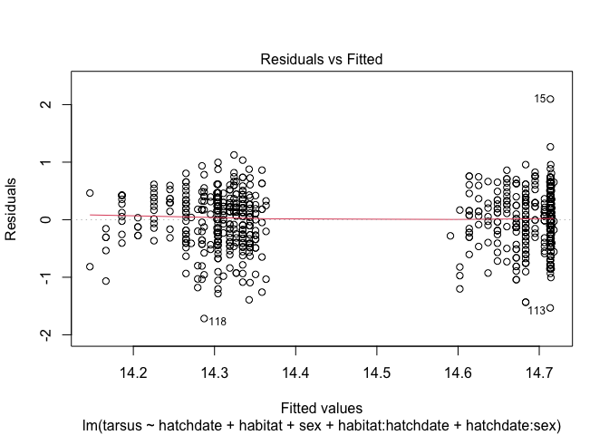<!-- -->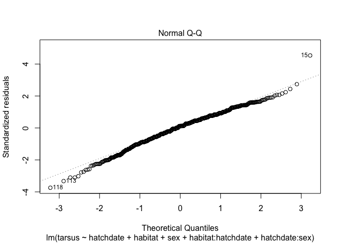<!-- -->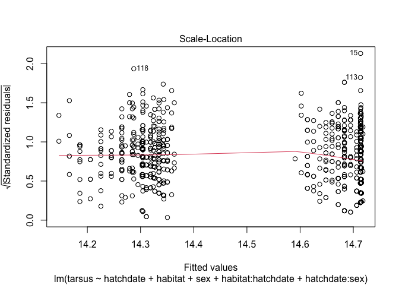<!-- -->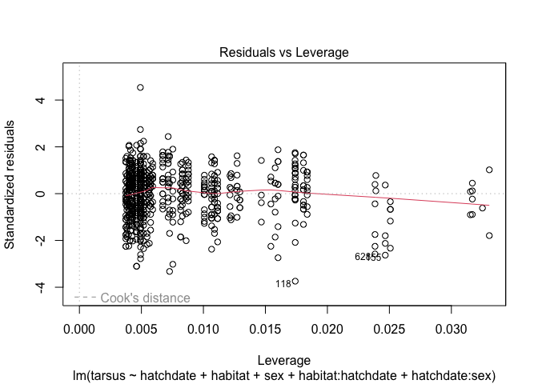<!-- -->

Uprość model usuwając kolejno nieistotne interakcje. Jaka jest
ostateczna interpretacja finalnego modelu?

**Oczekiwany wynik**

    ## 
    ## Call:
    ## lm(formula = tarsus ~ hatchdate + habitat + sex + habitat:hatchdate, 
    ##     data = dane)
    ## 
    ## Residuals:
    ##      Min       1Q   Median       3Q      Max 
    ## -1.73620 -0.28877  0.05101  0.30354  2.09101 
    ## 
    ## Coefficients:
    ##                        Estimate Std. Error t value Pr(>|t|)    
    ## (Intercept)           15.030980   0.458192  32.805   <2e-16 ***
    ## hatchdate             -0.015579   0.009487  -1.642    0.101    
    ## habitatpark           -0.519466   0.649114  -0.800    0.424    
    ## sexMale                0.389543   0.033161  11.747   <2e-16 ***
    ## hatchdate:habitatpark  0.011705   0.013423   0.872    0.383    
    ## ---
    ## Signif. codes:  0 '***' 0.001 '**' 0.01 '*' 0.05 '.' 0.1 ' ' 1
    ## 
    ## Residual standard error: 0.4629 on 776 degrees of freedom
    ## Multiple R-squared:  0.1557, Adjusted R-squared:  0.1513 
    ## F-statistic: 35.77 on 4 and 776 DF,  p-value: < 2.2e-16

    ## 
    ## Call:
    ## lm(formula = tarsus ~ hatchdate + habitat + sex, data = dane)
    ## 
    ## Residuals:
    ##      Min       1Q   Median       3Q      Max 
    ## -1.70922 -0.29145  0.05238  0.31820  2.08274 
    ## 
    ## Coefficients:
    ##              Estimate Std. Error t value Pr(>|t|)    
    ## (Intercept) 14.749240   0.324830  45.406   <2e-16 ***
    ## hatchdate   -0.009733   0.006711  -1.450    0.147    
    ## habitatpark  0.045817   0.033155   1.382    0.167    
    ## sexMale      0.389645   0.033156  11.752   <2e-16 ***
    ## ---
    ## Signif. codes:  0 '***' 0.001 '**' 0.01 '*' 0.05 '.' 0.1 ' ' 1
    ## 
    ## Residual standard error: 0.4628 on 777 degrees of freedom
    ## Multiple R-squared:  0.1548, Adjusted R-squared:  0.1516 
    ## F-statistic: 47.45 on 3 and 777 DF,  p-value: < 2.2e-16

◼

## 2. Regresja wielokrotna *via* seleckja modeli

Aby przeprowadzić selekcję modeli musimy najpierw ponownie policzyć
najbardziej złożony model - tzw. model maksymalny.

``` r
model0 <- lm(tarsus ~ hatchdate + habitat + sex + habitat:hatchdate + hatchdate:sex,
             data = dane, na.action = 'na.fail')
```

Funkcja `dredge()` w pakiecie `MuMIn` przeprowadza automatyczną selekcję
modeli, wraz z dopasowaniem modeli zagnieżdżonych w głównym modelu
stworzonym powyżej.

**Zadanie** Spróbuj wykonać taką selekcję, zapisując jej wynik do
obiektu `model_sel`. Następnie zobacz jak wygląda powstały w ten sposób
obiekt.

**Oczekiwany wynik**

    ## Fixed term is "(Intercept)"

    ## 0 : lm(formula = tarsus ~ 1, data = dane, na.action = "na.fail")
    ## 1 : lm(formula = tarsus ~ habitat + 1, data = dane, na.action = "na.fail")
    ## 2 : lm(formula = tarsus ~ hatchdate + 1, data = dane, na.action = "na.fail")
    ## 3 : lm(formula = tarsus ~ habitat + hatchdate + 1, data = dane, na.action = "na.fail")
    ## 4 : lm(formula = tarsus ~ sex + 1, data = dane, na.action = "na.fail")
    ## 5 : lm(formula = tarsus ~ habitat + sex + 1, data = dane, na.action = "na.fail")
    ## 6 : lm(formula = tarsus ~ hatchdate + sex + 1, data = dane, na.action = "na.fail")
    ## 7 : lm(formula = tarsus ~ habitat + hatchdate + sex + 1, data = dane, 
    ##     na.action = "na.fail")
    ## 11 : lm(formula = tarsus ~ habitat + hatchdate + habitat:hatchdate + 
    ##     1, data = dane, na.action = "na.fail")
    ## 15 : lm(formula = tarsus ~ habitat + hatchdate + sex + habitat:hatchdate + 
    ##     1, data = dane, na.action = "na.fail")
    ## 22 : lm(formula = tarsus ~ hatchdate + sex + hatchdate:sex + 1, data = dane, 
    ##     na.action = "na.fail")
    ## 23 : lm(formula = tarsus ~ habitat + hatchdate + sex + hatchdate:sex + 
    ##     1, data = dane, na.action = "na.fail")
    ## 31 : lm(formula = tarsus ~ habitat + hatchdate + sex + habitat:hatchdate + 
    ##     hatchdate:sex + 1, data = dane, na.action = "na.fail")

    ## Global model call: lm(formula = tarsus ~ hatchdate + habitat + sex + habitat:hatchdate + 
    ##     hatchdate:sex, data = dane, na.action = "na.fail")
    ## ---
    ## Model selection table 
    ##    (Int) hbt       htc sex hbt:htc htc:sex df   logLik   AICc  delta weight
    ## 5  14.30                 +                  3 -506.383 1018.8   0.00  0.191
    ## 7  14.75     -0.009317   +                  4 -505.416 1018.9   0.09  0.183
    ## 8  14.75   + -0.009733   +                  5 -504.458 1019.0   0.20  0.173
    ## 6  14.28   +             +                  4 -505.513 1019.1   0.28  0.166
    ## 16 15.03   + -0.015580   +       +          6 -504.075 1020.3   1.46  0.092
    ## 23 14.95     -0.013380   +               +  5 -505.234 1020.5   1.75  0.080
    ## 24 14.94   + -0.013750   +               +  6 -504.279 1020.7   1.87  0.075
    ## 32 15.23   + -0.019730   +       +       +  7 -503.890 1021.9   3.13  0.040
    ## 1  14.51                                    2 -570.153 1144.3 125.52  0.000
    ## 3  14.99     -0.010100                      3 -569.187 1144.4 125.61  0.000
    ## 4  14.99   + -0.010530                      4 -568.345 1144.7 125.94  0.000
    ## 2  14.48   +                                3 -569.394 1144.8 126.02  0.000
    ## 12 15.29   + -0.016650           +          5 -567.988 1146.1 127.26  0.000
    ## Models ranked by AICc(x)

Jak zinterpretujesz powstałe rezultaty? Który model jest najlepszy? Czy
jest to wiodące prowadzenie na tle innych modeli?

**Zadanie** Użyj funkcji `model_avg()` by przeprowadzić uśrednianie
modeli mieszczących się w zakresie deltaAICc \<= 2
(`subset = delta <= 2`). Czy wyniki są bardziej jednoznaczne?

**Oczekiwany wynik**

    ## 
    ## Call:
    ## model.avg(object = model_sel, subset = delta <= 2)
    ## 
    ## Component model call: 
    ## lm(formula = tarsus ~ <7 unique rhs>, data = dane, na.action = na.fail)
    ## 
    ## Component models: 
    ##      df  logLik    AICc delta weight
    ## 3     3 -506.38 1018.80  0.00   0.20
    ## 23    4 -505.42 1018.88  0.09   0.19
    ## 123   5 -504.46 1018.99  0.20   0.18
    ## 13    4 -505.51 1019.08  0.28   0.17
    ## 1234  6 -504.08 1020.26  1.46   0.10
    ## 235   5 -505.23 1020.55  1.75   0.08
    ## 1235  6 -504.28 1020.67  1.87   0.08
    ## 
    ## Term codes: 
    ##           habitat         hatchdate               sex habitat:hatchdate     hatchdate:sex 
    ##                 1                 2                 3                 4                 5 
    ## 
    ## Model-averaged coefficients:  
    ## (full average) 
    ##                        Estimate Std. Error Adjusted SE z value Pr(>|z|)    
    ## (Intercept)           14.638242   0.416181    0.416533  35.143   <2e-16 ***
    ## sexMale                0.327314   0.298596    0.298956   1.095    0.274    
    ## hatchdate             -0.007211   0.008631    0.008638   0.835    0.404    
    ## habitatpark           -0.030388   0.258184    0.258431   0.118    0.906    
    ## habitatpark:hatchdate  0.001122   0.005398    0.005403   0.208    0.836    
    ## hatchdate:sexMale      0.001295   0.006144    0.006151   0.211    0.833    
    ##  
    ## (conditional average) 
    ##                        Estimate Std. Error Adjusted SE z value Pr(>|z|)    
    ## (Intercept)           14.638242   0.416181    0.416533  35.143   <2e-16 ***
    ## sexMale                0.327314   0.298596    0.298956   1.095    0.274    
    ## hatchdate             -0.011481   0.008341    0.008353   1.375    0.169    
    ## habitatpark           -0.057619   0.353305    0.353648   0.163    0.871    
    ## habitatpark:hatchdate  0.011705   0.013423    0.013444   0.871    0.384    
    ## hatchdate:sexMale      0.008035   0.013418    0.013439   0.598    0.550    
    ## ---
    ## Signif. codes:  0 '***' 0.001 '**' 0.01 '*' 0.05 '.' 0.1 ' ' 1

◼

## 3. ANOVA

Zaimportuj do `R` dane `pg.csv`.

**Zadanie** Korzystając z funkcji `lm()` skonstruuj model, w którym
zmienną zależną jest `weight` a niezależnymi `group` oraz `mod`. Jak
wyglądają wyniki takiego modelu?

**Oczekiwany wynik**

    ## 
    ## Call:
    ## lm(formula = weight ~ group + mod, data = plantgr)
    ## 
    ## Residuals:
    ##     Min      1Q  Median      3Q     Max 
    ## -0.9710 -0.3765 -0.0330  0.2100  1.2600 
    ## 
    ## Coefficients:
    ##             Estimate Std. Error t value Pr(>|t|)    
    ## (Intercept)   5.1410     0.2280  22.550   <2e-16 ***
    ## grouptrt1    -0.3710     0.2792  -1.329   0.1955    
    ## grouptrt2     0.4940     0.2792   1.769   0.0886 .  
    ## modN         -0.2180     0.2280  -0.956   0.3478    
    ## ---
    ## Signif. codes:  0 '***' 0.001 '**' 0.01 '*' 0.05 '.' 0.1 ' ' 1
    ## 
    ## Residual standard error: 0.6244 on 26 degrees of freedom
    ## Multiple R-squared:  0.2891, Adjusted R-squared:  0.2071 
    ## F-statistic: 3.525 on 3 and 26 DF,  p-value: 0.02881

**Zadanie** Poarównaj uzyskany output z wynikiem użycia w podobny sposób
funkcji `aov()`.

**Oczekiwany wynik**

    ##             Df Sum Sq Mean Sq F value Pr(>F)  
    ## group        2  3.766  1.8832   4.831 0.0164 *
    ## mod          1  0.356  0.3564   0.914 0.3478  
    ## Residuals   26 10.136  0.3898                 
    ## ---
    ## Signif. codes:  0 '***' 0.001 '**' 0.01 '*' 0.05 '.' 0.1 ' ' 1

Czy dodanie do modelu interakcji `group:mod` wyjaśnia dodatkową
zmienność modelu? **Wskazówka** *R*<sup>2</sup> modelu policzonego za
pomocą funkcji `aov()` można podejrzeć stosując
`summary.lm(model)$r.squared`.

**Oczekiwany wynik**

    ##             Df Sum Sq Mean Sq F value Pr(>F)  
    ## group        2  3.766  1.8832   5.401 0.0116 *
    ## mod          1  0.356  0.3564   1.022 0.3221  
    ## group:mod    2  1.768  0.8839   2.535 0.1003  
    ## Residuals   24  8.368  0.3487                 
    ## ---
    ## Signif. codes:  0 '***' 0.001 '**' 0.01 '*' 0.05 '.' 0.1 ' ' 1

    ## [1] 0.2891461

    ## [1] 0.4131247

**Zadanie** Czy model z interakcją spełnia założenia modelu liniowego?

**Oczekiwany wynik**
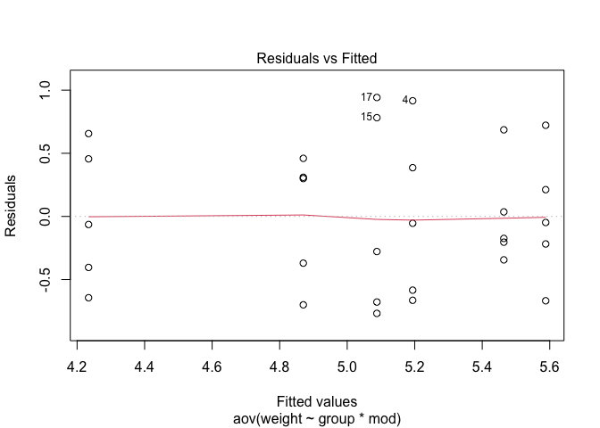<!-- -->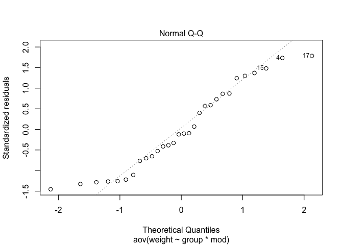<!-- -->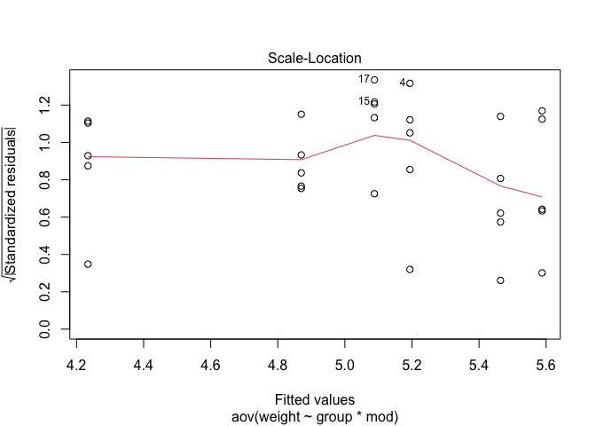<!-- -->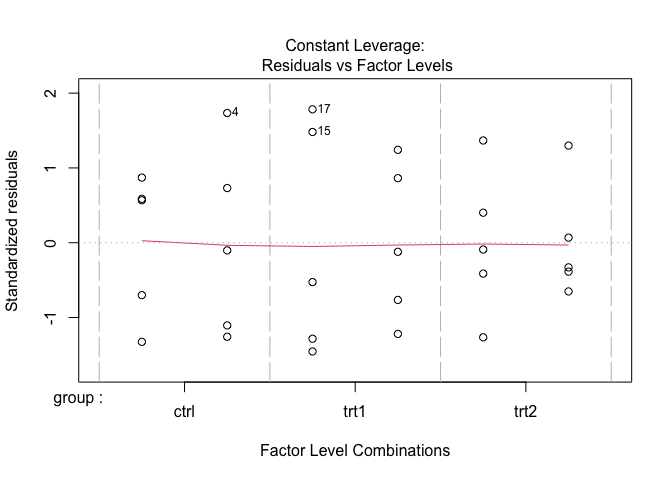<!-- -->

◼

# B. Model uogólniony

## 1. Regresja logistyczna - GLM

Zaimportuj dane `BTEPC.txt` do obiektu `btepc`. Zmienne `MAGEO` i
`FAGEO` powinny mieć charakter kategoryczny (`factor`). Jakiego rodzaju
zmienne znajdują się w pliku?

**Zadanie** Skonstruuj wykres pokazujący zależność `FEPC` od `MTAR`.

**Oczekiwany wynik**
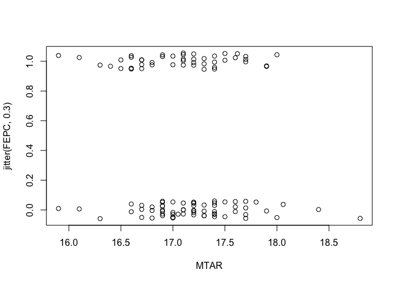<!-- -->

**Zadanie** Skonstruuj model testujący wpływ interakcji długości skoku
partnera socjalnego (`MTAR`) i wieku samicy (`FAGEO`) na
prawdopodobieństwo “skoku-w-bok” u sikory modrej. Pamiętaj o zmianie
rodziny rozkładów dla modelu GLM.

**Spodziewany wynik**

    ## 
    ## Call:
    ## glm(formula = FEPC ~ MTAR * FAGEO, family = "binomial", data = btepc)
    ## 
    ## Deviance Residuals: 
    ##    Min      1Q  Median      3Q     Max  
    ## -1.194  -1.134  -0.595   1.197   1.925  
    ## 
    ## Coefficients:
    ##             Estimate Std. Error z value Pr(>|z|)  
    ## (Intercept)  -1.9114     9.3003  -0.206   0.8372  
    ## MTAR          0.1083     0.5448   0.199   0.8424  
    ## FAGEO2       36.0285    17.7443   2.030   0.0423 *
    ## MTAR:FAGEO2  -2.1401     1.0384  -2.061   0.0393 *
    ## ---
    ## Signif. codes:  0 '***' 0.001 '**' 0.01 '*' 0.05 '.' 0.1 ' ' 1
    ## 
    ## (Dispersion parameter for binomial family taken to be 1)
    ## 
    ##     Null deviance: 149.53  on 109  degrees of freedom
    ## Residual deviance: 139.68  on 106  degrees of freedom
    ##   (4 obserwacje zostały skasowane z uwagi na braki w nich zawarte)
    ## AIC: 147.68
    ## 
    ## Number of Fisher Scoring iterations: 4

Poniższy kod pozwala zobaczyć przewidywania modelu na realnej,
biologicznej skali prawdopodobieństwa.

``` r
plot_model(model6, type = "int")
```

    ## Data were 'prettified'. Consider using `terms="MTAR [all]"` to get smooth plots.

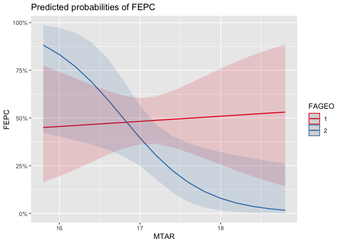<!-- -->

◼

# C. Model mieszany

## 1. Czy skok jest odziedziczalny?

Aby przetestować genetyczną komponentę cechy zmierzonej w ramach
eksperymentu genetycznego wykorzystującego *cross-fostering* należy
zbadań model zawierający efekty losowe gniazda wychowywania i gniazda
genetycznego (rodziny, matki genetycznej). Czynniki takie typowo
analizujemy jako efekty losowe - model musi więc mieć charakter
mieszany.

Załaduj dane `BTdata.csv`, zadbaj by `fosternest` oraz `dam` miały
charakter czynników kategorycznych (`factor`).

``` r
dane$fosternest <- as.factor(dane$fosternest)
dane$dam <- as.factor(dane$dam)
```

Model dopasujemy w funkcji `lmer()` z pakietu `lme4` - zawierać ona
będzie czynnik ustalony płci oraz czynniki losowe `fosternest` i `dam`.

**Zadanie** Wiedząc, że w `lmer()` czynnik losowy dodajemy wg konwencji
`(1|nazwa_czynnika)` - skonstruuj i policz odpowiedni model. Gdzie w
jego podsumowaniu znajdują się informacje o efektach losowych? Czy model
spełnia założenia modelu liniowego?

**Spodziewany wynik**
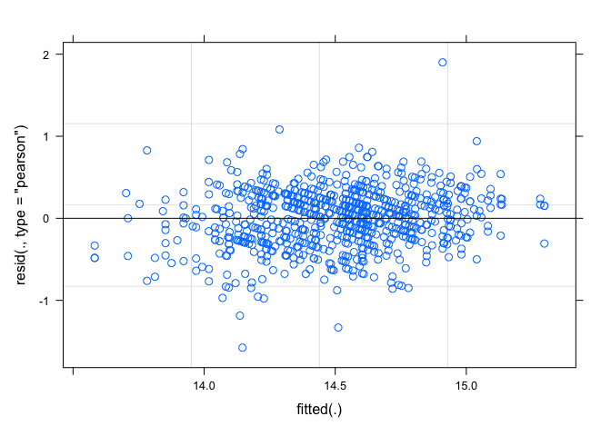<!-- -->

    ## Linear mixed model fit by REML. t-tests use Satterthwaite's method ['lmerModLmerTest']
    ## Formula: tarsus ~ sex + (1 | fosternest) + (1 | dam)
    ##    Data: dane
    ## 
    ## REML criterion at convergence: 890.9
    ## 
    ## Scaled residuals: 
    ##     Min      1Q  Median      3Q     Max 
    ## -4.1407 -0.6128  0.0703  0.6250  4.9918 
    ## 
    ## Random effects:
    ##  Groups     Name        Variance Std.Dev.
    ##  dam        (Intercept) 0.05401  0.2324  
    ##  fosternest (Intercept) 0.01621  0.1273  
    ##  Residual               0.14495  0.3807  
    ## Number of obs: 781, groups:  dam, 106; fosternest, 104
    ## 
    ## Fixed effects:
    ##              Estimate Std. Error        df t value Pr(>|t|)    
    ## (Intercept)  14.29877    0.03338 169.96645  428.33   <2e-16 ***
    ## sexMale       0.38518    0.02890 700.38893   13.33   <2e-16 ***
    ## ---
    ## Signif. codes:  0 '***' 0.001 '**' 0.01 '*' 0.05 '.' 0.1 ' ' 1
    ## 
    ## Correlation of Fixed Effects:
    ##         (Intr)
    ## sexMale -0.456

**Zadanie** Aby przetestować czy czynnik losowy jest istotny
statystycznie oblicz konkurencyjny model pozbawiony czynnika rodzica
genetycznego (`dam`) i porównaj go z wcześniejszym modelem za pomocą
funkcji `anova()`. Który model ma niższe *AIC* i jest tym samym lepszy?
Czy różnica jest istotna statystycznie?

**Spodziewany wynik**

    ## refitting model(s) with ML (instead of REML)

    ## Data: dane
    ## Models:
    ## model8: tarsus ~ sex + (1 | fosternest)
    ## model7: tarsus ~ sex + (1 | fosternest) + (1 | dam)
    ##        npar    AIC    BIC  logLik deviance Chisq Df Pr(>Chisq)    
    ## model8    4 971.80 990.45 -481.90   963.80                        
    ## model7    5 890.44 913.75 -440.22   880.44 83.36  1  < 2.2e-16 ***
    ## ---
    ## Signif. codes:  0 '***' 0.001 '**' 0.01 '*' 0.05 '.' 0.1 ' ' 1

◼

## 2. Czy temperatura różnie wpływ na tempo wzrostu u różnych gatunków plnaktonu?

Załaduj dane `PLD.txt` do obiektu `pld`. Przyjrzyj się strukturze
danych. Zamień kolumnę `species` na `factor`:

``` r
pld$species <- as.factor(pld$species)
```

**Zadanie** Stwórz model mieszany analizujący zależność długości okresu
larwalnego (PLD) od temperatury u różnych gatunków bezkręgowców. Użyj
`species` jako efektu losowego, zlogarytmuj w modelu zmienną zależną i
niezależną. Czy zmienność między gatunkami jest duża, czy mała?

**Spodziewany wynik**

    ## Linear mixed model fit by REML. t-tests use Satterthwaite's method ['lmerModLmerTest']
    ## Formula: log(pld) ~ log(temp) + (1 | species)
    ##    Data: pld
    ## 
    ## REML criterion at convergence: 220.9
    ## 
    ## Scaled residuals: 
    ##      Min       1Q   Median       3Q      Max 
    ## -2.75675 -0.49022 -0.00731  0.47073  2.94018 
    ## 
    ## Random effects:
    ##  Groups   Name        Variance Std.Dev.
    ##  species  (Intercept) 0.78083  0.8836  
    ##  Residual             0.04207  0.2051  
    ## Number of obs: 214, groups:  species, 72
    ## 
    ## Fixed effects:
    ##             Estimate Std. Error       df t value Pr(>|t|)    
    ## (Intercept)   6.1661     0.1746 209.0718   35.32   <2e-16 ***
    ## log(temp)    -1.1508     0.0493 152.1852  -23.34   <2e-16 ***
    ## ---
    ## Signif. codes:  0 '***' 0.001 '**' 0.01 '*' 0.05 '.' 0.1 ' ' 1
    ## 
    ## Correlation of Fixed Effects:
    ##           (Intr)
    ## log(temp) -0.798

**Zadanie** Uzupełnij model możliwością zmiennych międzygatunkowo
nachyleń zależności `pld~temp` zamieniając `1` w definicji efektu
losowego na `1+log(temp)`. Który model jest lepszy?

    ## Linear mixed model fit by REML. t-tests use Satterthwaite's method ['lmerModLmerTest']
    ## Formula: log(pld) ~ log(temp) + (1 + log(temp) | species)
    ##    Data: pld
    ## 
    ## REML criterion at convergence: 184.7
    ## 
    ## Scaled residuals: 
    ##     Min      1Q  Median      3Q     Max 
    ## -2.7463 -0.4046  0.0015  0.4255  3.8863 
    ## 
    ## Random effects:
    ##  Groups   Name        Variance Std.Dev. Corr 
    ##  species  (Intercept) 4.35612  2.0871        
    ##           log(temp)   0.28894  0.5375   -0.92
    ##  Residual             0.02035  0.1426        
    ## Number of obs: 214, groups:  species, 72
    ## 
    ## Fixed effects:
    ##             Estimate Std. Error       df t value Pr(>|t|)    
    ## (Intercept)  7.07746    0.29590 58.36905   23.92   <2e-16 ***
    ## log(temp)   -1.43319    0.08364 53.21283  -17.14   <2e-16 ***
    ## ---
    ## Signif. codes:  0 '***' 0.001 '**' 0.01 '*' 0.05 '.' 0.1 ' ' 1
    ## 
    ## Correlation of Fixed Effects:
    ##           (Intr)
    ## log(temp) -0.943

    ## refitting model(s) with ML (instead of REML)

    ## Data: pld
    ## Models:
    ## model9: log(pld) ~ log(temp) + (1 | species)
    ## model10: log(pld) ~ log(temp) + (1 + log(temp) | species)
    ##         npar    AIC    BIC   logLik deviance  Chisq Df Pr(>Chisq)    
    ## model9     4 222.02 235.48 -107.010   214.02                         
    ## model10    6 190.79 210.98  -89.394   178.79 35.232  2  2.236e-08 ***
    ## ---
    ## Signif. codes:  0 '***' 0.001 '**' 0.01 '*' 0.05 '.' 0.1 ' ' 1

Poniższa funkcja (szczegółami zajmiemy się jutro) ilustruje badane dane,
pokazując zależności `log(pld)~log(temp)` dla wszystkich obecnych w
danych gatunków:

``` r
library(ggplot2)
qplot(x = log(temp), y = log(pld),
      data = pld, col = species, ) +
  geom_smooth(method = "lm", se = F) +
  theme_bw() + theme(legend.position="none")
```

    ## `geom_smooth()` using formula 'y ~ x'

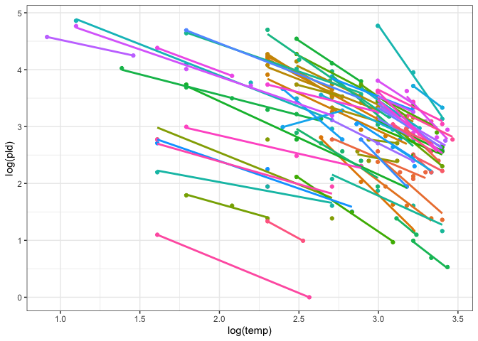<!-- -->

◼

# D. Expressem przez *bootstrapping*

Do tej pory do naszych analiz wykorzystywaliśmy metody parametryczne -
możemy jednak spróbować wykorzystać inną, prostszą metodę, która pozwoli
nam uwolnić się od ograniczeń rozkładowych naszych danych. Spójrzmy na
przykład na rozkład zmiennej `hatchdate` - nie jest on najpiękniejszy i
na pierwszy rzut oka nie przypomina on zgrabnego rozkładu normalnego:

``` r
hist(dane$hatchdate, 15)
```

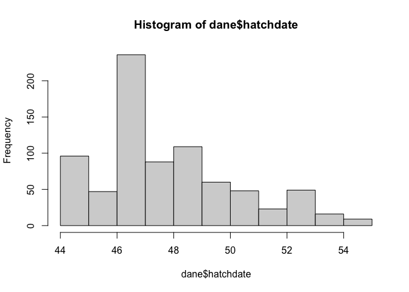<!-- -->

Spróbujmy skonstruować test oparty na bootstrappingu, którym sprawdzimy
czy ptaki z lasu (`forest`) różnią się pod kątem daty klucia od ptaków z
parków (`park`). Szybki rzut oka na wykres pudełkowy nie wskazuje na
zbyt wielkie różnice.

``` r
plot(hatchdate ~ habitat, data = dane)
```

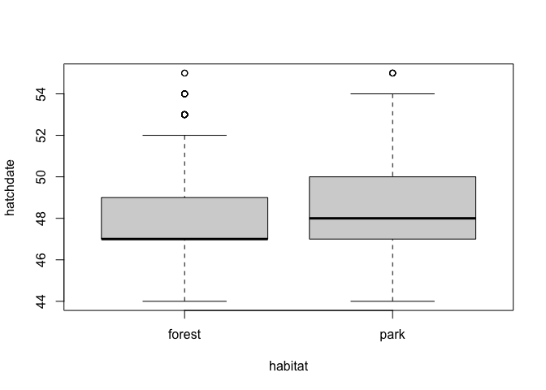<!-- -->

1.  Do skonstruowania bootstrappingu wykorzystamy pętlę `for`, która
    pozwala powtarzać jakąś operację wiele razy. Jeśli chcielibyśmy np.
    wydrukować na ekranie (`print()`) jakiś tekst pięć razy - moglibyśmy
    osiągnąć to w następujący sposób:

``` r
for(i in 1:5) {
  print("Tekst najbardziej oryginalny!")
}
```

    ## [1] "Tekst najbardziej oryginalny!"
    ## [1] "Tekst najbardziej oryginalny!"
    ## [1] "Tekst najbardziej oryginalny!"
    ## [1] "Tekst najbardziej oryginalny!"
    ## [1] "Tekst najbardziej oryginalny!"

Zauważ, że pętla for wykorzystuje jakąś zmienną (tutaj `i`), zmieniając
jej wartość w zadanym zakresie (tutaj `1:5`) i za każdym razem (dla
każ∂ego `i`) wykonując jakieś działania ujęte wewnątrz `{}`.

2.  Potrzebna nam będzie również metoda losowego wybierania pewnych
    wierszy z naszych oryginalnych danych - ze zwracaniem. Idealnie do
    tego nadaje się funkcja `sample()`. Zobaczmy, jak losuje ona zadaną
    liczbę wartości (10) z podanej listy (liczby 1 do 20), ze zwracaniem
    (`replace = T`):

``` r
sample(1:20, size = 10, replace = T)
```

    ##  [1] 10  1 13 14  1 15 12 18 16 11

**Uwaga!** Funkcja ta używa generatora liczb pseudolosowych - więc u
każdego wynik tej operacji będzie inny!

3.  Wreszcie - musimy mieć naszą statystykę testową. Niech będzie nią
    różnica między średnią datą klucia w sikor leśnych i parkowych
    *d*<sub>0</sub> - jeśli wynosi ona zero, ptaki mają identyczne daty
    klucia:

``` r
d0 <- mean(filter(dane, habitat == "forest")$hatchdate) -
  mean(filter(dane, habitat == "park")$hatchdate)
d0
```

    ## [1] -0.2214331

Ujemna różnica wskazuje na nieco wyższą wartość (późniejsze klucie) w
parku - pytanie, czy istotnie późniejsze?

Oto co powinna robić nasza procedura bootstrappingu:

-   Krok 1: wylosuj z zestawu danych k = 781 obserwacji (wierszy) ze
    zwracaniem (tyle wierszy składa się na oryginalny zestaw danych).
-   Krok 2: dla każdego z tych wylosowanych zestawów policz jego własną
    statystykę `d` - różnicę w średniej dacie klucia między lasem i
    parkiem.
-   Krok 3: Powtórz całą procedurę N = 1000 razy (jest to arbitralna
    wielkość, im więcej - tym lepiej). Za każdym razem zapisz wynik do
    zbiorczego obiekty `out`.
-   Krok 4: Skonstruuj rozkład statystyki `d` i zobacz gdzie wypada w
    niej jej oryginalna (oparta na wejściowych danych) wartość `d0`.

``` r
N <- 1000 # liczba zakładanych powtórzeń
k <- nrow(dane) # wielkość oryginalnego zbioru danych

# oryginalna statystyka testowa
d0 <- mean(filter(dane, habitat == "forest")$hatchdate) -
  mean(filter(dane, habitat == "park")$hatchdate)

# obiekt wynikowy przygotowany na N=1000 końcowych wartości
out <- numeric(N)

for(i in 1:N) {
  
  # losujemy 828 wierszy, ze zwracaniem
  # a oryginalnej puli unikatowych 828 wierszy danych
  rows <- sample(1:k, size = k, replace = T)
  
  # tworzymy tymczasowe dane wewnątrz pętli
  # zawierające tylko wylosowane wiersze
  temp_dane <- dane[rows, ]
  
  # oblicza na podstawie tak przygotowanych danych
  # tymczasową statystykę testową dla powtórzenia
  # nr i pętli
  d_temp <- mean(filter(temp_dane, habitat == "forest")$hatchdate) -
    mean(filter(temp_dane, habitat == "park")$hatchdate)
  
  # zapisujemy wyliczoną statystykę
  # do zmiennej out w miejscu i
  out[i] <- d_temp
  
}
```

Wyświetlmy rozkład symulowanej statystyki `d` oraz położenie `d0` na
rozkładzie:

``` r
hist(out, 50)
abline(v = d0, lwd = 2)
abline(v = 0, col = "red", lwd = 2, lty = 2)
```

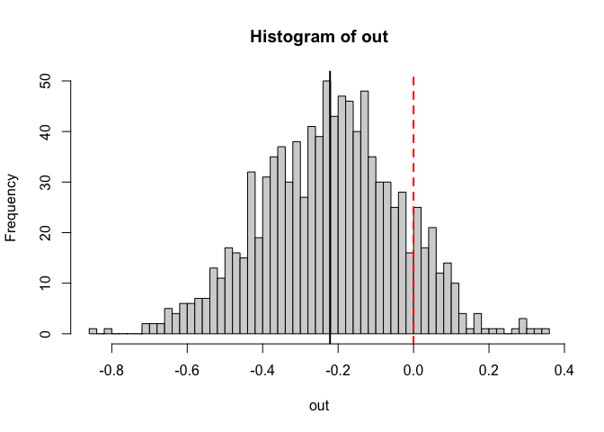<!-- -->

Jak podejdziesz to odpowiedzi na pytanie - czy ta symulacja wskazuje na
istotną statystycznie różnicę między symulowaną statystyką a wartością
zero?

◼
