-   [Zanim zaczniemy](#zanim-zaczniemy)
    -   [0. Przydatne zasoby pomocowe w pracy z `R` - część
        czwarta](#0-przydatne-zasoby-pomocowe-w-pracy-z-r---część-czwarta)
-   [A. Proste wykresy w R](#a-proste-wykresy-w-r)
    -   [1. Podstawy](#1-podstawy)
    -   [2. Histogram](#2-histogram)
    -   [3. Boxplot](#3-boxplot)
-   [B. `ggplot2`](#b-ggplot2)
    -   [1. Scatterplot](#1-scatterplot)
    -   [2. Kolory w `ggplot2`](#2-kolory-w-ggplot2)
    -   [3. Zagadnienia zaawansowane](#3-zagadnienia-zaawansowane)

# Zanim zaczniemy

## 0. Przydatne zasoby pomocowe w pracy z `R` - część czwarta

-   [Kolory w R](http://www.stat.columbia.edu/~tzheng/files/Rcolor.pdf)
-   [`ggplot2` - książka](https://ggplot2-book.org)
-   [Galeria wykresów R](https://r-graph-gallery.com)
-   [Awesome dataviz in
    R](https://krzjoa.github.io/awesome-r-dataviz/#/)
-   [Nowoczesna grafika w
    R](https://web.stanford.edu/class/bios221/book/Chap-Graphics.html)
-   [Wykresy w R wg
    Quick-R](https://www.statmethods.net/graphs/index.html)
-   [Elementy graficzne wykresów w
    R](https://r-graph-gallery.com/6-graph-parameters-reminder.html)

------------------------------------------------------------------------

# A. Proste wykresy w R

Załaduj poniższe dane - tym razem umieszczone online:

``` r
data_chol <- read.table('https://raw.githubusercontent.com/wbabik/Practical_computing/teaching/Class_10/data/Cholesterol_Age_R.csv',
                        sep = ';', header = T,
                        stringsAsFactors = T)

head(data_chol)
```

    ##   ID Before After4weeks After8weeks Margarine AgeGroup
    ## 1  1   6.42        5.83        5.75         B    Young
    ## 2  2   6.76        6.20        6.13         A    Young
    ## 3  3   6.56        5.83        5.71         B    Young
    ## 4  4   4.80        4.27        4.15         A    Young
    ## 5  5   8.43        7.71        7.67         B    Young
    ## 6  6   7.49        7.12        7.05         A   Middle

``` r
summary(data_chol)
```

    ##        ID            Before       After4weeks     After8weeks    Margarine   AgeGroup
    ##  Min.   : 1.00   Min.   :3.910   Min.   :3.700   Min.   :3.660   A:9       Middle:6  
    ##  1st Qu.: 5.25   1st Qu.:5.740   1st Qu.:5.175   1st Qu.:5.210   B:9       Old   :7  
    ##  Median : 9.50   Median :6.500   Median :5.830   Median :5.730             Young :5  
    ##  Mean   : 9.50   Mean   :6.408   Mean   :5.842   Mean   :5.779                       
    ##  3rd Qu.:13.75   3rd Qu.:7.218   3rd Qu.:6.730   3rd Qu.:6.688                       
    ##  Max.   :18.00   Max.   :8.430   Max.   :7.710   Max.   :7.670

## 1. Podstawy

**Zadanie** Kierując się jego elementami, spróbuj odtworzyć poniższy
wykres za pomocą funkcji `plot()`. W razie potrzeby zajrzyj do `?plot`.

**Oczekiwany wynik**
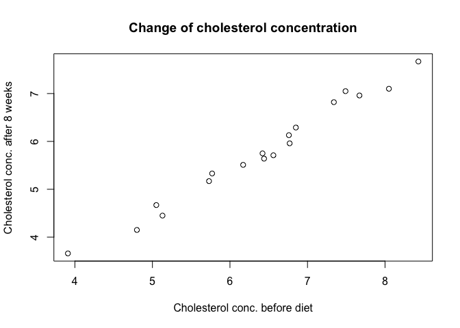<!-- -->

**Zadanie** Zmodyfikuj odpowiednie opcje funkcji `plot()` tak, by
spróbować odtworzyć poniższy wykres. Listę najważniejszych elementów
graficznych wraz z ich możliwymi wartościami znajdziesz np.
[tutaj](https://r-graph-gallery.com/6-graph-parameters-reminder.html).

**Oczekiwany wynik**
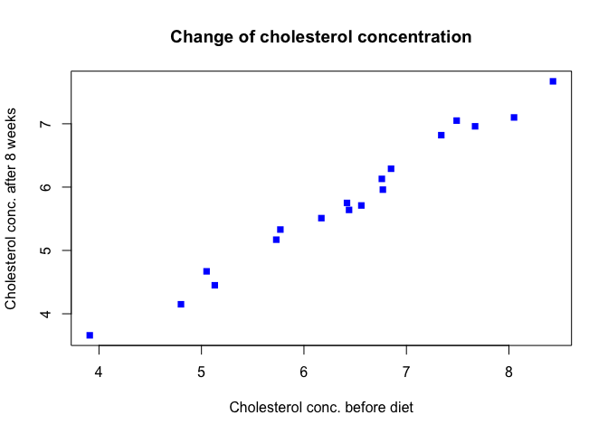<!-- -->

**Zadanie** Wiesz już, że przypisanie do opcji `col` zmiennej typu
`factor` koduje jje poziomy na wykresie kolorystycznie:

``` r
plot(After8weeks ~ Before, data = data_chol,
     xlab = "Cholesterol conc. before diet",
     ylab = "Cholesterol conc. after 8 weeks",
     main = "Change of cholesterol concentration",
     pch = 15, col = data_chol$AgeGroup)
```

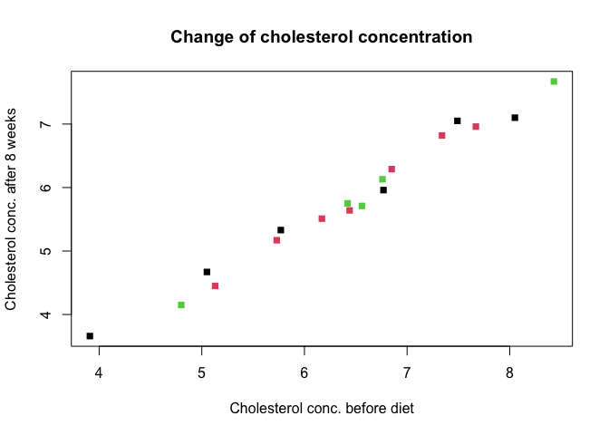<!-- -->

Użyj wywołania `data_chol$AgeGroup` jako *indeksu* odwołującego się w
argumencie `col` do wektora zawierającego następujące wartości
kolorystyczne: `c("pink", "chartreuse", "brown")`. Za pomocą tej
konwencji możesz wybierac kolory przypisane do kolejnych poziomów
zmiennej kategorycznej. Odcieniem jakiego koloru jest “chartreuse”?

**Oczekiwany wynik**
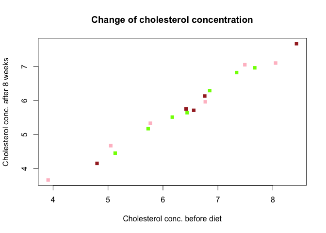<!-- -->

◼

## 2. Histogram

Histogram tworzymy za pomocą funkcji `hist()` przyjmującej jako argument
jedną zmienną, której wykres chcemy sporządzić.

**Zadanie** Wygeneruj 100 obserwacji wylosowanych z rozkładu normalnego
o średniej 50 i odchyleniu standardowym 25:

``` r
xx <- rnorm(100, mean = 50, sd = 25)
```

Następnie stwórz dwa poniższe histogramy dla powstałego obiektu `xx`.

**Oczekiwany wynik**
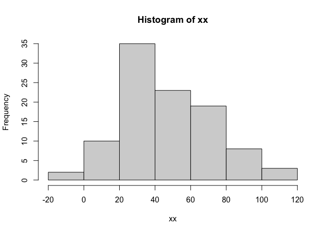<!-- -->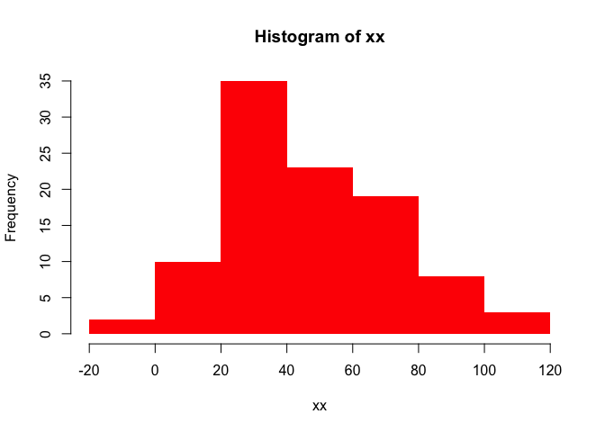<!-- -->

Za pomocą funkcji `density()` możesz dodać do histogramu przybliżony
kształt odpowiadającej mu gęstości rozkładu prawdopodobieństwa. Co w
poniższym przykładzie oznacza liczba 20 oraz dlaczego opcja `freq` musi
mieć wartość `F`?

``` r
hist(xx, 20, freq = F)
lines(density(xx), col = 'red', lwd = 2)
```

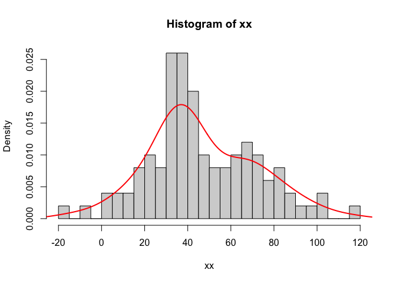<!-- -->

◼

## 3. Boxplot

Jeśli na wykresie zmienna `x` będzie miała charakter kategoryczny -
powstanie tzw. *boxplot*.

**Zadanie** Korzystając z funkcji `plot()` wygeneruj poniższy wykres.

**Oczekiwany wynik**
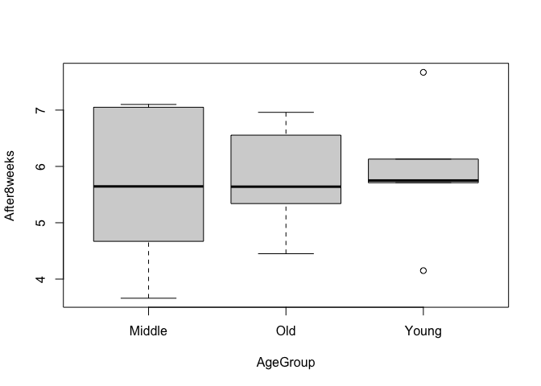<!-- -->

Co oznaczają widoczne na wykresie kropki (`?boxplot`)?

◼

# B. `ggplot2`

Funckja `ggplot2` daje znacznie więcej kontroli nad parametrami
graficznymi oraz wyglądem wykresu. Jednocześnie wykorzystuje on
niezwykle sprawną i skuteczną metodę “gramatyki obrazu” (*the grammar of
graphics*). Wykres `ggplot2` zawsze ma w uproszczeniu podobną strukturę:

    mygraph <- ggplot(data = MYDATA,
    mapping = aes(x = VAR1, y = VAR2, ...)) +
    geom_1(OPTIONS) +
    geom_2(OPTIONS)

    plot(mygraph)

    graph2 <- mygraph + geom_3
    plot(graph2)

Wykres taki zawiera kilka elementów:

-   `data` określa źródło używanych danych;
-   `mapping` określa które zmienne zostają przypisane do elementów
    wykresu (np. współrzędnych osi `x`, `y`, kolorów, kształtów, etc.);
-   `geom_...` to dodawane warstwami elementy, które bazując na
    `mapping` tworząd kolejne warstwy wizualne złożomne z obiektów
    geometruycznych (np. `geom_point()` dodaje punkty;
    `geom_histogram()` dodaje histogram; `geom_errorbar()` dodaje wąsy
    błędów);
-   wykresy można wzbogacać kolejnymi warstwami dodawanymi poprzez
    operator `+`.

Przeanalizuj poniższy wykres oraz sposób jego powstania:

``` r
library(ggplot2)

plot1 <- ggplot(data = data_chol,
                mapping = aes(x = Before, y = After8weeks)) +
  geom_point(color = 'blue', shape = 15, cex = 3)
plot1
```

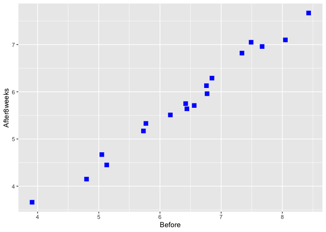<!-- -->

## 1. Scatterplot

**Zadanie** “Dodaj” do poprzedniego wykresu nowy temat kolorystyczny
(wypróbuj dwie możliwości: `theme_classic()` i `theme_bw()`). Czym
różnią się użyte tematy? Co stanie się, gdy do wykresu dodasz kolejny
element: `theme(text = element_text(size = 20))`?

**Oczekiwany wynik**
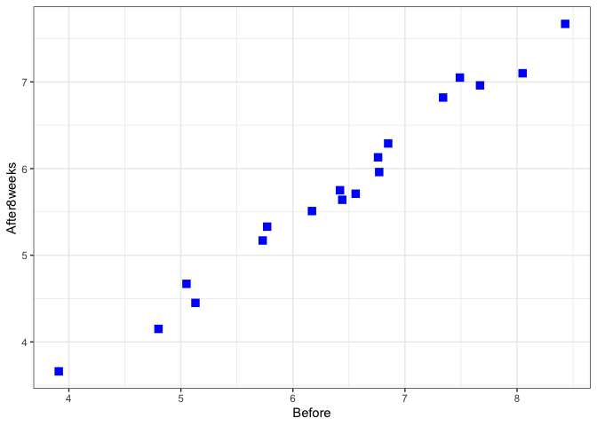<!-- -->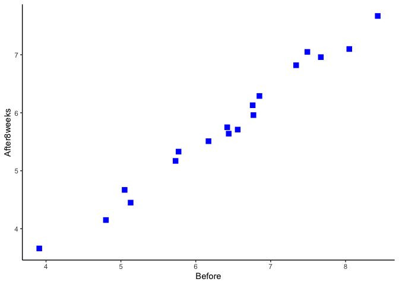<!-- -->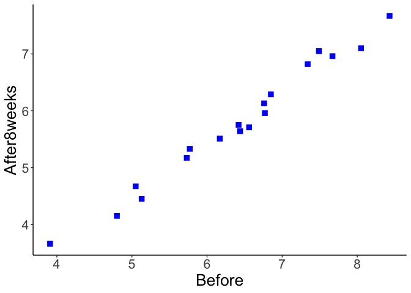<!-- -->

**Zadanie** Rozszerzając powyższy wykres - dodaj do niego
`geom_smooth()` wybierając `lm` jako metodę prezentowania linii trendu.

**Oczekiwany wynik**

    ## `geom_smooth()` using formula 'y ~ x'

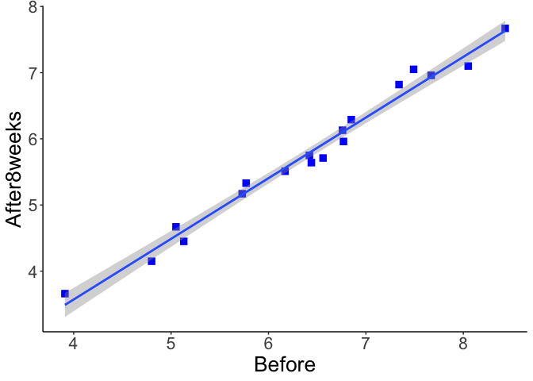<!-- -->

## 2. Kolory w `ggplot2`

**Zadanie** Jak zmieni się wygląd powyższego wykresu, jeśli do `mapping`
dodamy `color` i przypiszemy do niego zmienną kategoryczną `AgeGroup`?

**Oczekiwany wynik**

    ## `geom_smooth()` using formula 'y ~ x'

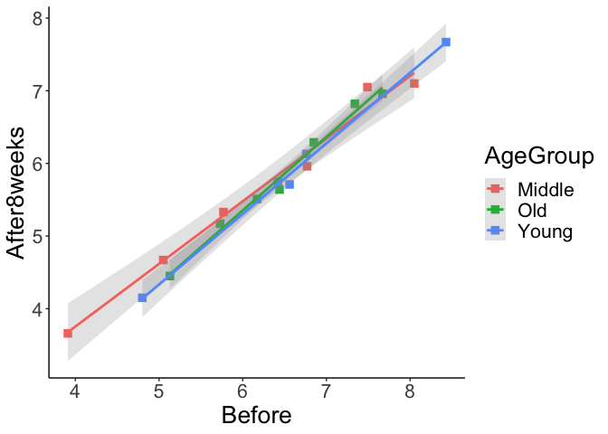<!-- -->

**Zadanie** Dodaj do powyższego wykresu warstwę `labs()` dzięki której
nadasz osiom `x` oraz `y`, a także wymiarowi `color` odpowiednie opisy i
etykiety.

**Oczekiwany wynik**

    ## `geom_smooth()` using formula 'y ~ x'

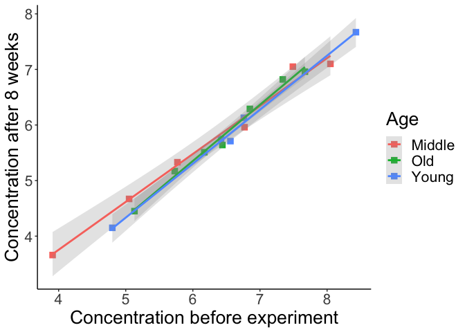<!-- -->

## 3. Zagadnienia zaawansowane

-   W pakiecie `ggplot2` łatwo można połączyć kilka wykresów w jedną
    spójną siatkę:

``` r
#install.packages("ggpubr")
library(ggpubr)
```

    ## 
    ## Dołączanie pakietu: 'ggpubr'

    ## Następujący obiekt został zakryty z 'package:ape':
    ## 
    ##     rotate

``` r
plot1 <- ggplot(data = data_chol,
                mapping = aes(x = Before, y = After8weeks)) +
  geom_point(color = 'blue', shape = 15, cex = 3) + theme_classic() +
  theme(text = element_text(size = 12))

plot2 <- ggplot(data = data_chol,
                mapping = aes(x = Before, y = ..density..)) +
  geom_histogram(fill = 'white', color = 'black', bins = 10) +
  geom_density(color = 'red', fill = 'red', alpha = 0.15) +
  theme_classic() +
  theme(text = element_text(size = 12))

plot3 <- ggplot(data = data_chol,
                mapping = aes(x = Before, y = After4weeks, color = AgeGroup)) +
  geom_point(shape = 15, cex = 3) + theme_classic() +
  geom_smooth(method = 'lm', alpha = 0.25) +
  theme(text = element_text(size = 12))

plot4 <- ggplot(data = data_chol,
                mapping = aes(x = After4weeks, y = After8weeks, color = AgeGroup)) +
  geom_point(shape = 15, cex = 3) + theme_classic() +
  geom_smooth(method = 'lm', alpha = 0.25) +
  theme(text = element_text(size = 12))

gridplot <- ggarrange(plot1, plot2, plot3, plot4,
                      labels = c('A', 'B', 'C', 'D'),
                      legend = 'bottom', common.legend = T)
```

    ## `geom_smooth()` using formula 'y ~ x'

    ## `geom_smooth()` using formula 'y ~ x'
    ## `geom_smooth()` using formula 'y ~ x'

``` r
gridplot
```

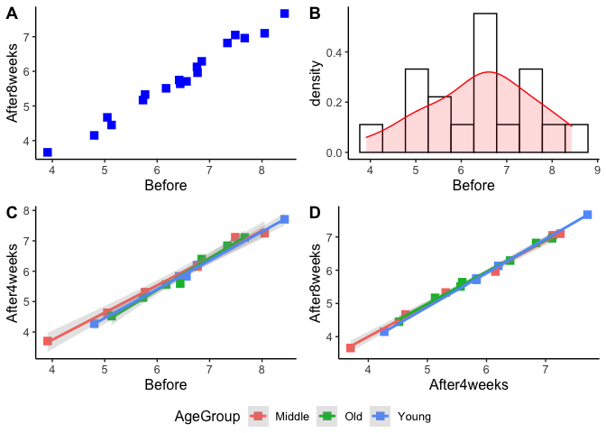<!-- -->

-   Mariaż wykresu typu *boxplot* i *scatterplot*:

``` r
data_chol2 <- read.table('https://raw.githubusercontent.com/szymekdr/Practical_computing/teaching/Class_10/data/Diet_R.csv',
                        sep = ',', header = T,
                        stringsAsFactors = T)

head(data_chol2)
```

    ##   Person gender Age Height pre.weight Diet weight6weeks
    ## 1     25     NA  41    171         60    2         60.0
    ## 2     26     NA  32    174        103    2        103.0
    ## 3      1      0  22    159         58    1         54.2
    ## 4      2      0  46    192         60    1         54.0
    ## 5      3      0  55    170         64    1         63.3
    ## 6      4      0  33    171         64    1         61.1

``` r
summary(data_chol2)
```

    ##      Person          gender            Age            Height        pre.weight          Diet        weight6weeks   
    ##  Min.   : 1.00   Min.   :0.0000   Min.   :16.00   Min.   :141.0   Min.   : 58.00   Min.   :1.000   Min.   : 53.00  
    ##  1st Qu.:20.25   1st Qu.:0.0000   1st Qu.:32.25   1st Qu.:164.2   1st Qu.: 66.00   1st Qu.:1.000   1st Qu.: 61.85  
    ##  Median :39.50   Median :0.0000   Median :39.00   Median :169.5   Median : 72.00   Median :2.000   Median : 68.95  
    ##  Mean   :39.50   Mean   :0.4342   Mean   :39.15   Mean   :170.8   Mean   : 72.53   Mean   :2.038   Mean   : 68.68  
    ##  3rd Qu.:58.75   3rd Qu.:1.0000   3rd Qu.:46.75   3rd Qu.:174.8   3rd Qu.: 78.00   3rd Qu.:3.000   3rd Qu.: 73.83  
    ##  Max.   :78.00   Max.   :1.0000   Max.   :60.00   Max.   :201.0   Max.   :103.00   Max.   :3.000   Max.   :103.00  
    ##                  NA's   :2

``` r
plot3 <- ggplot(data = data_chol2, mapping = aes(x = as.factor(Diet),
                                            color = as.factor(gender),
                                            y = weight6weeks,
                                            fill = as.factor(gender))) +
  geom_boxplot(alpha = 0.3, outlier.shape = NA) + 
  theme_classic() +
  geom_point(color = "black",
             position = position_jitterdodge(jitter.width = 0.1),
             size = 3, alpha = 0.5, stroke = 0) +
  theme(text = element_text(size = 25)) +
  labs(x = "Diet type", y = "Weight after 6 weeks",
       color = "Gender", fill = "Gender")

plot3
```

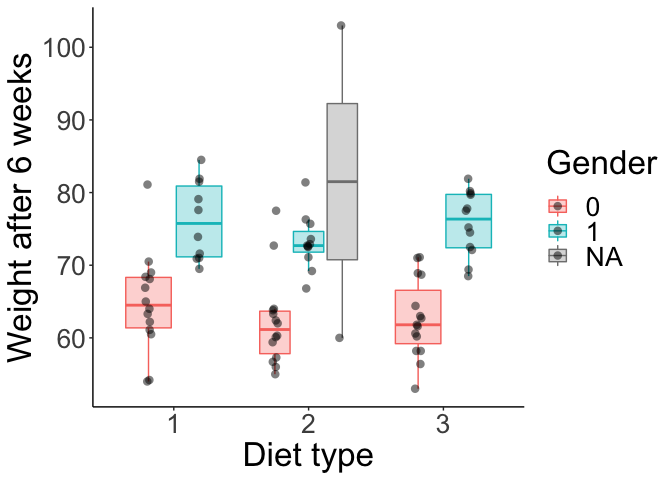<!-- -->

-   Modyfikowanie skal i przypisywanie kolorów:

``` r
# prosty wykres z domyślnym mapowaniem kolorów
myplot <- ggplot(data = data_chol2,
                 mapping = aes(x = Height, y = weight6weeks,
                               colour = as.factor(Diet))) +
  geom_point() +
  geom_smooth(method = "lm") +
  theme_classic() +
  theme(text = element_text(size = 20)) +
  labs(x = "Height", y = "Weight after 6 weeks", colour = "Diet type", title = "Height vs. weight")
myplot
```

    ## `geom_smooth()` using formula 'y ~ x'

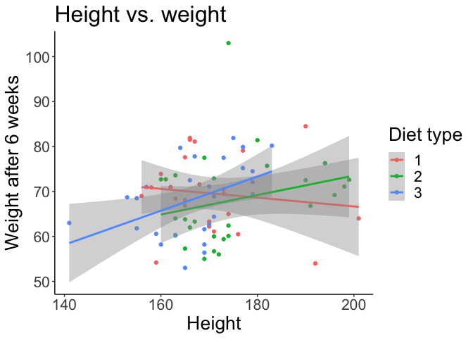<!-- -->

``` r
myplot <- ggplot(data = data_chol2,
                 mapping = aes(x = Height, y = weight6weeks,
                               colour = as.factor(Diet))) +
  geom_point() +
  geom_smooth(method = "lm") +
  theme_classic() +
  theme(text = element_text(size = 20), legend.position = "bottom") +
  labs(x = "Height", y = "Weight after 6 weeks",
       colour = "Diet type", title = "Height vs. weight") +
  # podmiana kolorów oraz zmiana nazw kategorii w legendzie koloru
  scale_colour_manual(values = c('purple', 'orange', 'darkgrey'),
                      labels = c('vegan', 'lacto-ovo', 'vegetarian'))
myplot
```

    ## `geom_smooth()` using formula 'y ~ x'

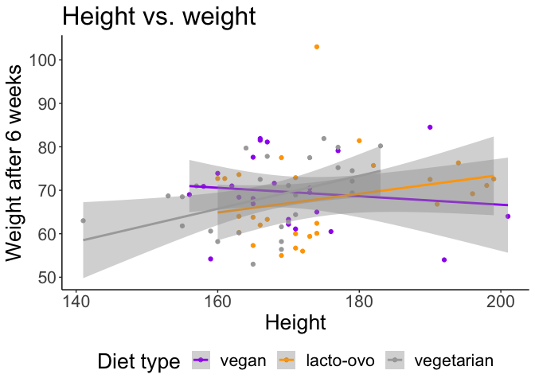<!-- -->
